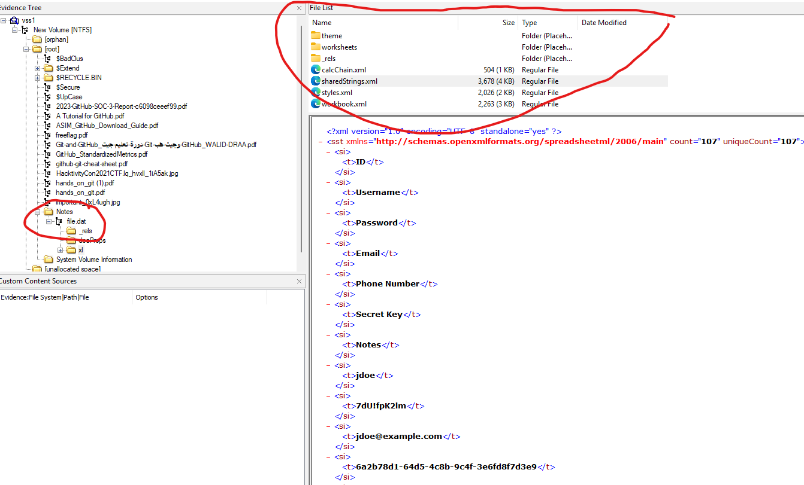

# Batman: The dark knight

## Information:
We are given a file called batman.001

## Hint:
The author droped an hint mentionning `Alternate Data Stream manipulation`
The description also tell us that the file was deleted 

So what is this file:
```
file batman.001
batman.001: DOS/MBR boot sector, code offset 0x52+2, OEM-ID "NTFS    ", sectors/cluster 8, Media descriptor 0xf8, sectors/track 63, heads 255, hidden sectors 124803072, dos < 4.0 BootSector (0x80), FAT (1Y bit by descriptor); NTFS, sectors/track 63, sectors 1021951, $MFT start cluster 42581, $MFTMirror start cluster 2, bytes/RecordSegment 2^(-1*246), clusters/index block 1, serial number 0bad6a0f0d6a0ae57; contains bootstrap BOOTMG
```

As usual launching up autopsy.
And... nothing of interest.


> What I find annoying with autopsy, it make you downlaod the file while trying to view it. So I also used FTK Imager

Since nothing of interest came out with autopsy I ran foremost

```
Foremost version 1.5.7 by Jesse Kornblum, Kris Kendall, and Nick Mikus
Audit File

Foremost started at Fri Dec 27 12:30:33 2024
Invocation: foremost -v -t all -i batman.001 -o output_foremost/ 
Output directory: ctf/0xl4ugh/batman_the_dark_knight/output_foremost
Configuration file: /etc/foremost.conf
------------------------------------------------------------------
File: batman.001
Start: Fri Dec 27 12:30:33 2024
Length: 499 MB (523239424 bytes)
 
Num	 Name (bs=512)	       Size	 File Offset	 Comment 

0:	00014752.jpg 	     116 KB 	    7553024 	 
1:	00022416.jpg 	      60 KB 	   11477330 	 
2:	00029490.jpg 	      19 KB 	   15099071 	 
3:	00031408.jpg 	     160 KB 	   16080896 	 
4:	00097576.xlsx 	      11 KB 	   49958912 	 
5:	00011392.png 	       1 MB 	    5832704 	  (961 x 1024)
6:	00014992.png 	       2 MB 	    7675904 	  (1792 x 1024)
7:	00020768.pdf 	     823 KB 	   10633216 	  (PDF is Linearized)
8:	00022416.pdf 	     360 KB 	   11476992 	 
9:	00023144.pdf 	     837 KB 	   11849728 	 
10:	00026000.pdf 	     837 KB 	   13312000 	 
11:	00027680.pdf 	      30 KB 	   14172160 	 
12:	00027744.pdf 	     787 KB 	   14204928 	 
13:	00029320.pdf 	     397 KB 	   15011840 	 
14:	00030120.pdf 	     245 KB 	   15421440 	 
15:	00030616.pdf 	     395 KB 	   15675392 	  (PDF is Linearized)
Finish: Fri Dec 27 12:30:40 2024

16 FILES EXTRACTED
	
jpg:= 4
zip:= 1
png:= 2
pdf:= 9
------------------------------------------------------------------

Foremost finished at Fri Dec 27 12:30:40 2024
```

```
This file was not in my previous analysis
4:	00097576.xlsx 	      11 KB 	   49958912 	 
```
It contains sensitive information but nothing leads me to the hint with alternate data stream as Foremost does not extract them


I'm missing something... and with some help this was it: https://learn.microsoft.com/en-us/windows-server/storage/file-server/volume-shadow-copy-service

Lets do some more analysis in the file and yet once again installing MAOR lib
```bash
sudo apt install libvshadow-utils
```

And eureka

```bash
 vshadowinfo batman.001
vshadowinfo 20190323

Volume Shadow Snapshot information:
        Number of stores:       1

Store: 1
        Identifier              : 8994d3df-a125-11ef-8f98-000c298d92b2
        Shadow copy set ID      : 27df9245-037b-4e41-b0e9-d49666d0b0c2
        Creation time           : Dec 03, 2024 18:31:08.172409500 UTC
        Shadow copy ID          : 4cf97c73-7179-425e-960d-3e8c94c1ba43
        Volume size             : 499 MiB (523239424 bytes)
        Attribute flags         : 0x0002001d
```
```bash
sudo vshadowmount batman.001 /mnt/vss
```

```bash
# ls
vss1

file vss1 
vss1: DOS/MBR boot sector, code offset 0x52+2, OEM-ID "NTFS    ", sectors/cluster 8, Media descriptor 0xf8, sectors/track 63, heads 255, hidden sectors 124803072, dos < 4.0 BootSector (0x80), FAT (1Y bit by descriptor); NTFS, sectors/track 63, sectors 1021951, $MFT start cluster 42581, $MFTMirror start cluster 2, bytes/RecordSegment 2^(-1*246), clusters/index block 1, serial number 0bad6a0f0d6a0ae57; contains bootstrap BOOTMGR
```

Ok lets load it up in FTKImager



The file.dat is there (which wasnt there before), but since its an archive (the big circle) FTK Image show me its content and not its alternate data stream
So I wasted some more time there, and finally loaded it up in autopsy again


There ya go


```
[ZoneTransfer]
ZoneId=3
ReferrerU.l=h.tps://git.github.io/30522d384a465f3e4237306a63624a4429217456477161414a424a616c673f5b2232413f543258533f54276058314f54/
HostU.l=h.tps://git.github.io/30522d384a465f3e4237306a63624a4429217456477161414a424a616c673f5b2232413f543258533f54276058314f54/
```
That "github" link is VERY suspicious indeed

Time to go to my favorite cook, cyberchef

This is definately HEX which lead to:
```
0R-8JF_>B70jcbJD)!tVGqaAJBJalg?["2A?T2XS?T'`X1OT
```
And after messing around, it was base85

```
0xL4ugh{1_4dm17_y0u_h4v3_w0n_7h3_64m3}
```