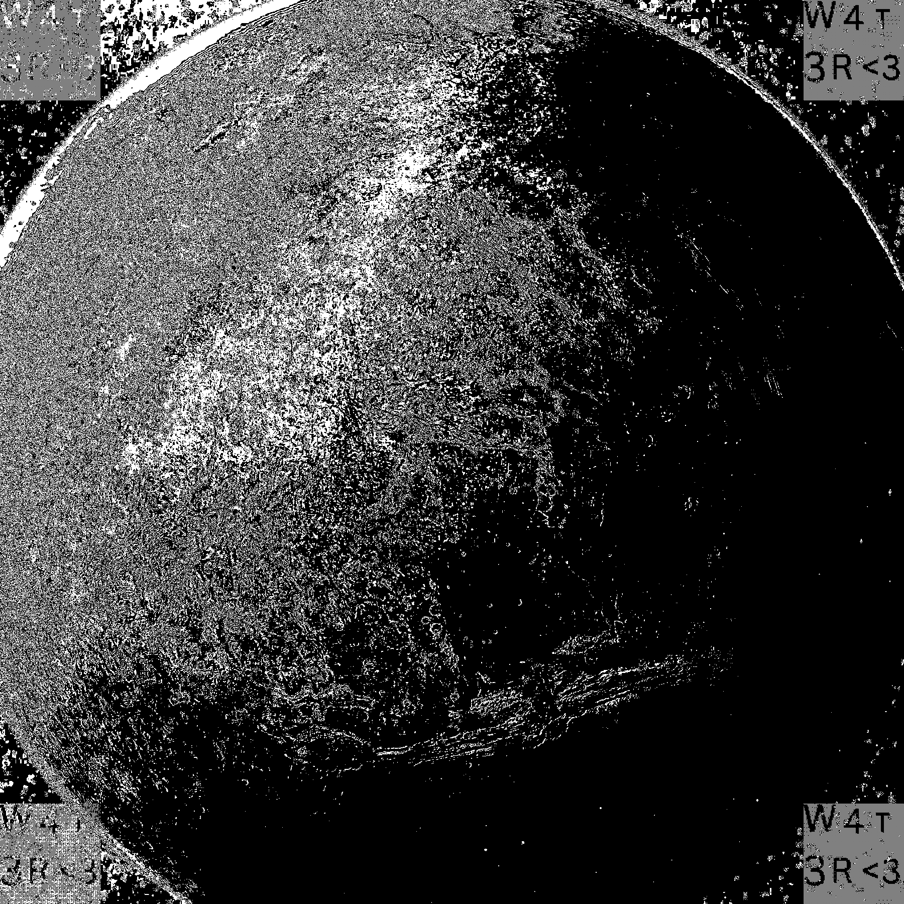

# Water on mars:

### Information:

⚠️ I have solved this in an unintended way. I will try to solve it the proper way and update the solution here

I have simply ran my "stegoCheckList"

- strings: nothing
- binwalk: nothing
- stegoveritas: Oops!

`Flag: 4T${W4t3r<3}`
