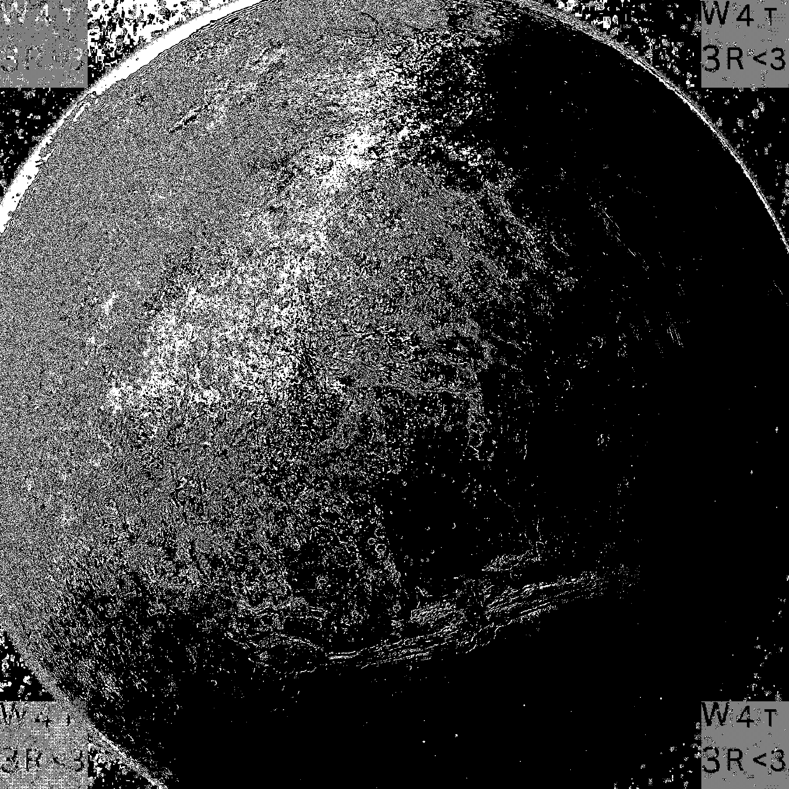

# Water on mars:

### Information:

⚠️ J'ai résolut ceci d'une mauvaise façon. L'auteur ma contacter et m'a mentionner qu'il avait fait une erreur.
Je ferai une tentative de le résoudre de la bonne façôn et je metterai à jour cette solution

J'ai simplement fais ma "stegoCheckList"

- strings: rien
- binwalk: rien
- stegoveritas: Oops!

`Flag: 4T${W4t3r<3}`
