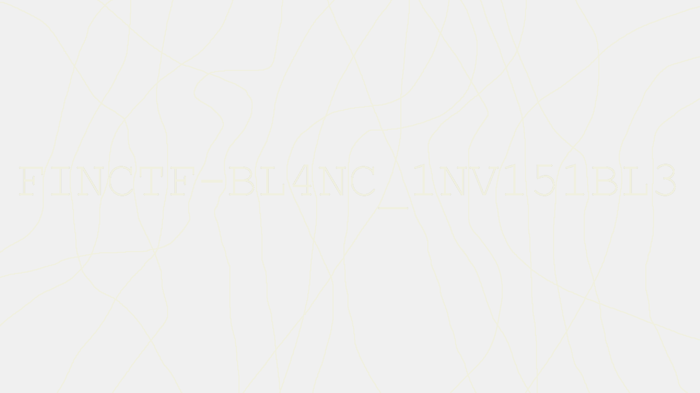
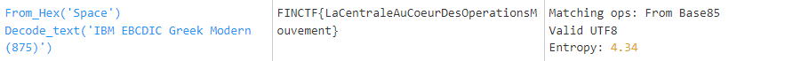
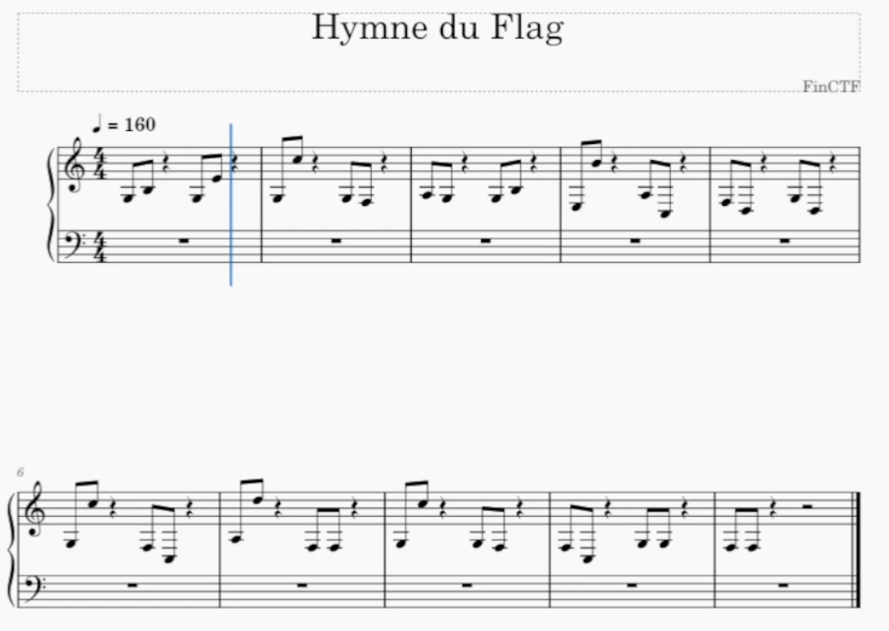
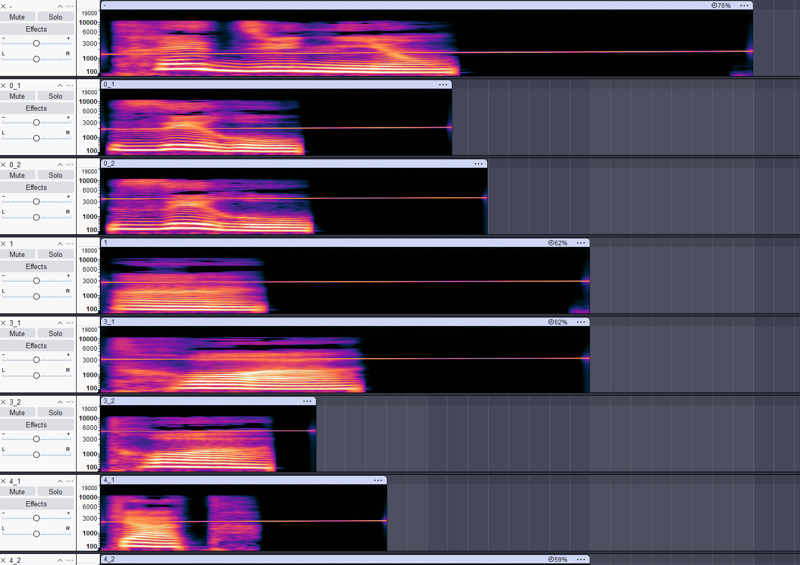
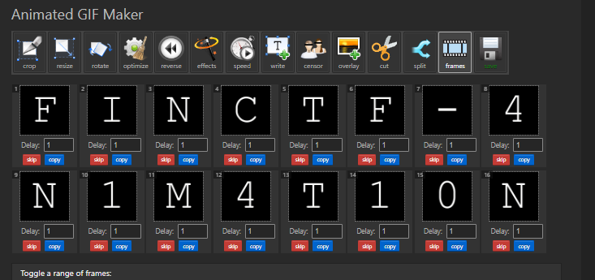
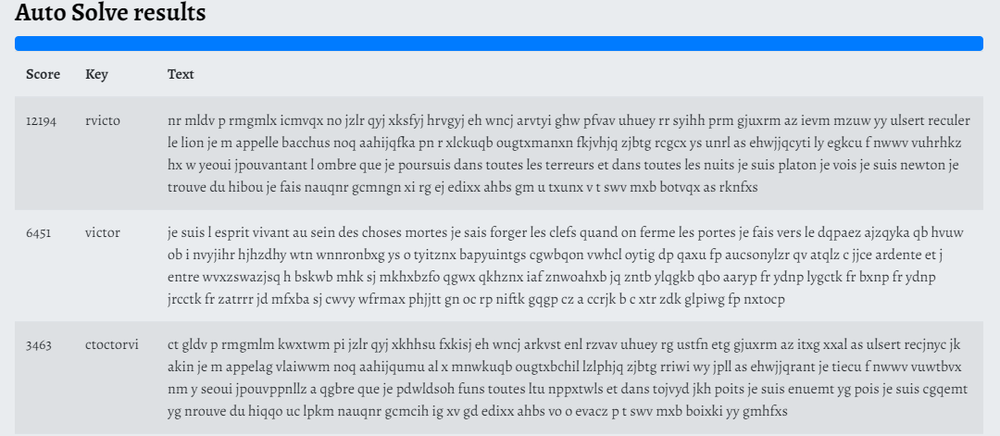

# Divers

## Flag 1: L'Ascension de la Tour 🏰
We have a zip file with 1000 subfolder and flag.txt. This is not my first day using Linux!

```bash
unzip -l escalier-a-1000-marches.zip
1/2/3/4/5/6/7/8/9/10/11/12/13/14/15/16/17/18/19/20/21/22/23/24/25/26/27/28/29/30/31/32/33/34/35/36/37/38/39/40/41/42/43/44/45/46/47/48/49/50/51/52/53/54/55/56/57/58/59/60/61/62/63/64/65/66/67/68/69/70/71/72/73/74/75/76/77/78/79/80/81/82/83/84/85/86/87/88/89/90/91/92/93/94/95/96/97/98/99/100/101/102/103/104/105/106/107/108/109/110/111/112/113/114/115/116/117/118/119/120/121/122/123/124/125/126/127/128/129/130/131/132/133/134/135/136/137/138/139/140/141/142/143/144/145/146/147/148/149/150/151/152/153/154/155/156/157/158/159/160/161/162/163/164/165/166/167/168/169/170/171/172/173/174/175/176/177/178/179/180/181/182/183/184/185/186/187/188/189/190/191/192/193/194/195/196/197/198/199/200/201/202/203/204/205/206/207/208/209/210/211/212/213/214/215/216/217/218/219/220/221/222/223/224/225/226/227/228/229/230/231/232/233/234/235/236/237/238/239/240/241/242/243/244/245/246/247/248/249/250/251/252/253/254/255/256/257/258/259/260/261/262/263/264/265/266/267/268/269/270/271/272/273/274/275/276/277/278/279/280/281/282/283/284/285/286/287/288/289/290/291/292/293/294/295/296/297/298/299/300/301/302/303/304/305/306/307/308/309/310/311/312/313/314/315/316/317/318/319/320/321/322/323/324/325/326/327/328/329/330/331/332/333/334/335/336/337/338/339/340/341/342/343/344/345/346/347/348/349/350/351/352/353/354/355/356/357/358/359/360/361/362/363/364/365/366/367/368/369/370/371/372/373/374/375/376/377/378/379/380/381/382/383/384/385/386/387/388/389/390/391/392/393/394/395/396/397/398/399/400/401/402/403/404/405/406/407/408/409/410/411/412/413/414/415/416/417/418/419/420/421/422/423/424/425/426/427/428/429/430/431/432/433/434/435/436/437/438/439/440/441/442/443/444/445/446/447/448/449/450/451/452/453/454/455/456/457/458/459/460/461/462/463/464/465/466/467/468/469/470/471/472/473/474/475/476/477/478/479/480/481/482/483/484/485/486/487/488/489/490/491/492/493/494/495/496/497/498/499/500/501/502/503/504/505/506/507/508/509/510/511/512/513/514/515/516/517/518/519/520/521/522/523/524/525/526/527/528/529/530/531/532/533/534/535/536/537/538/539/540/541/542/543/544/545/546/547/548/549/550/551/552/553/554/555/556/557/558/559/560/561/562/563/564/565/566/567/568/569/570/571/572/573/574/575/576/577/578/579/580/581/582/583/584/585/586/587/588/589/590/591/592/593/594/595/596/597/598/599/600/601/602/603/604/605/606/607/608/609/610/611/612/613/614/615/616/617/618/619/620/621/622/623/624/625/626/627/628/629/630/631/632/633/634/635/636/637/638/639/640/641/642/643/644/645/646/647/648/649/650/651/652/653/654/655/656/657/658/659/660/661/662/663/664/665/666/667/668/669/670/671/672/673/674/675/676/677/678/679/680/681/682/683/684/685/686/687/688/689/690/691/692/693/694/695/696/697/698/699/700/701/702/703/704/705/706/707/708/709/710/711/712/713/714/715/716/717/718/719/720/721/722/723/724/725/726/727/728/729/730/731/732/733/734/735/736/737/738/739/740/741/742/743/744/745/746/747/748/749/750/751/752/753/754/755/756/757/758/759/760/761/762/763/764/765/766/767/768/769/770/771/772/773/774/775/776/777/778/779/780/781/782/783/784/785/786/787/788/789/790/791/792/793/794/795/796/797/798/799/800/801/802/803/804/805/806/807/808/809/810/811/812/813/814/815/816/817/818/819/820/821/822/823/824/825/826/827/828/829/830/831/832/833/834/835/836/837/838/839/840/841/842/843/844/845/846/847/848/849/850/851/852/853/854/855/856/857/858/859/860/861/862/863/864/865/866/867/868/869/870/871/872/873/874/875/876/877/878/879/880/881/882/883/884/885/886/887/888/889/890/891/892/893/894/895/896/897/898/899/900/901/902/903/904/905/906/907/908/909/910/911/912/913/914/915/916/917/918/919/920/921/922/923/924/925/926/927/928/929/930/931/932/933/934/935/936/937/938/939/940/941/942/943/944/945/946/947/948/949/950/951/952/953/954/955/956/957/958/959/960/961/962/963/964/965/966/967/968/969/970/971/972/973/974/975/976/977/978/979/980/981/982/983/984/985/986/987/988/989/990/991/992/993/994/995/996/997/998/999/1000/flag.txt
```

```bash
unzip -p escalier-a-1000-marches.zip 1/2/3/4/5/6/7/8/9/10/11/12/13/14/15/16/17/18/19/20/21/22/23/24/25/26/27/28/29/30/31/32/33/34/35/36/37/38/39/40/41/42/43/44/45/46/47/48/49/50/51/52/53/54/55/56/57/58/59/60/61/62/63/64/65/66/67/68/69/70/71/72/73/74/75/76/77/78/79/80/81/82/83/84/85/86/87/88/89/90/91/92/93/94/95/96/97/98/99/100/101/102/103/104/105/106/107/108/109/110/111/112/113/114/115/116/117/118/119/120/121/122/123/124/125/126/127/128/129/130/131/132/133/134/135/136/137/138/139/140/141/142/143/144/145/146/147/148/149/150/151/152/153/154/155/156/157/158/159/160/161/162/163/164/165/166/167/168/169/170/171/172/173/174/175/176/177/178/179/180/181/182/183/184/185/186/187/188/189/190/191/192/193/194/195/196/197/198/199/200/201/202/203/204/205/206/207/208/209/210/211/212/213/214/215/216/217/218/219/220/221/222/223/224/225/226/227/228/229/230/231/232/233/234/235/236/237/238/239/240/241/242/243/244/245/246/247/248/249/250/251/252/253/254/255/256/257/258/259/260/261/262/263/264/265/266/267/268/269/270/271/272/273/274/275/276/277/278/279/280/281/282/283/284/285/286/287/288/289/290/291/292/293/294/295/296/297/298/299/300/301/302/303/304/305/306/307/308/309/310/311/312/313/314/315/316/317/318/319/320/321/322/323/324/325/326/327/328/329/330/331/332/333/334/335/336/337/338/339/340/341/342/343/344/345/346/347/348/349/350/351/352/353/354/355/356/357/358/359/360/361/362/363/364/365/366/367/368/369/370/371/372/373/374/375/376/377/378/379/380/381/382/383/384/385/386/387/388/389/390/391/392/393/394/395/396/397/398/399/400/401/402/403/404/405/406/407/408/409/410/411/412/413/414/415/416/417/418/419/420/421/422/423/424/425/426/427/428/429/430/431/432/433/434/435/436/437/438/439/440/441/442/443/444/445/446/447/448/449/450/451/452/453/454/455/456/457/458/459/460/461/462/463/464/465/466/467/468/469/470/471/472/473/474/475/476/477/478/479/480/481/482/483/484/485/486/487/488/489/490/491/492/493/494/495/496/497/498/499/500/501/502/503/504/505/506/507/508/509/510/511/512/513/514/515/516/517/518/519/520/521/522/523/524/525/526/527/528/529/530/531/532/533/534/535/536/537/538/539/540/541/542/543/544/545/546/547/548/549/550/551/552/553/554/555/556/557/558/559/560/561/562/563/564/565/566/567/568/569/570/571/572/573/574/575/576/577/578/579/580/581/582/583/584/585/586/587/588/589/590/591/592/593/594/595/596/597/598/599/600/601/602/603/604/605/606/607/608/609/610/611/612/613/614/615/616/617/618/619/620/621/622/623/624/625/626/627/628/629/630/631/632/633/634/635/636/637/638/639/640/641/642/643/644/645/646/647/648/649/650/651/652/653/654/655/656/657/658/659/660/661/662/663/664/665/666/667/668/669/670/671/672/673/674/675/676/677/678/679/680/681/682/683/684/685/686/687/688/689/690/691/692/693/694/695/696/697/698/699/700/701/702/703/704/705/706/707/708/709/710/711/712/713/714/715/716/717/718/719/720/721/722/723/724/725/726/727/728/729/730/731/732/733/734/735/736/737/738/739/740/741/742/743/744/745/746/747/748/749/750/751/752/753/754/755/756/757/758/759/760/761/762/763/764/765/766/767/768/769/770/771/772/773/774/775/776/777/778/779/780/781/782/783/784/785/786/787/788/789/790/791/792/793/794/795/796/797/798/799/800/801/802/803/804/805/806/807/808/809/810/811/812/813/814/815/816/817/818/819/820/821/822/823/824/825/826/827/828/829/830/831/832/833/834/835/836/837/838/839/840/841/842/843/844/845/846/847/848/849/850/851/852/853/854/855/856/857/858/859/860/861/862/863/864/865/866/867/868/869/870/871/872/873/874/875/876/877/878/879/880/881/882/883/884/885/886/887/888/889/890/891/892/893/894/895/896/897/898/899/900/901/902/903/904/905/906/907/908/909/910/911/912/913/914/915/916/917/918/919/920/921/922/923/924/925/926/927/928/929/930/931/932/933/934/935/936/937/938/939/940/941/942/943/944/945/946/947/948/949/950/951/952/953/954/955/956/957/958/959/960/961/962/963/964/965/966/967/968/969/970/971/972/973/974/975/976/977/978/979/980/981/982/983/984/985/986/987/988/989/990/991/992/993/994/995/996/997/998/999/1000/flag.txt
FINCTF-$0MM3T-D3-L4-M0NT4GN3
```

## Flag 2: Impressions Cachées 🙈

We have this file


I'm not sherlock holme but there is a flag in this file!

I'm lazy so I will be using this image: `docker.io/dominicbreuker/stego-toolkit` https://github.com/DominicBreuker/stego-toolkit

Result: `Nothing`

Lets search for RGB/LSB with https://georgeom.net/StegOnline/image
LSB Half and.. solution!



## Flag 3: L'unite centrale
Given String: 
```
C6 C9 D5 C3 E3 C6 C0 D3 81 C3 85 95 A3 99 81 93 85 C1 A4 C3 96 85 A4 99 C4 85 A2 D6 97 85 99 81 A3 89 96 95 A2 D4 96 A4 A5 85 94 85 95 A3 D0
```

Using Cyberchef Magic


## Flag 4: Mélodie Mystérieuse 🎶

```
Note, Hex
C3, 0 
D3, 1
E3, 2
F3, 3
G3, 4
A3, 5
B3, 6
C4, 7
D4, 8
E4, 9
F4, a
G4, b
A4, c
B4, d
C5, e
D5, f
```
You need to understand that the SOL key is on line that is G4
Just count the note. Here is the table for the letter corresponding to the note
```
do C
re D
mi E
fa F
sol G
la A
si B
do C
```
Then Convert to ASCII with the given table

# Flag 5: Enregistrements Enigmatiques 🔊
We have some audio file. the name of the file are a single letter with or without a number in them
Basically, there is a sound that allow you to put them back in the right order 

Just load them up into audacity and activate the spectrogram view


The name of the individual audio file will yield the flag!

# Flag 6: Coffre-Fort 🔒
A Zip file with a pin. 4 digit
Have been lazy and asked my friend chatGTP to generate me a script to brute force it
```python
import zipfile
import concurrent.futures

def try_password(zip_file_path, password):
    """Essaie d'ouvrir le fichier zip avec le mot de passe fourni."""
    with zipfile.ZipFile(zip_file_path) as z:
        try:
            z.extractall(pwd=password.encode('utf-8'))
            return password  # Mot de passe trouvé
        except (RuntimeError, zipfile.BadZipFile):
            return None  # Mot de passe incorrect

def brute_force_zip(zip_file_path):
    """Brute force pour trouver le mot de passe d'un fichier zip."""
    # Créer une liste de tous les mots de passe possibles
    passwords = [f"{i:04}" for i in range(10000)]  # de 0000 à 9999

    with concurrent.futures.ThreadPoolExecutor(max_workers=10) as executor:
        # Essayer d'extraire avec chaque mot de passe en parallèle
        results = list(executor.map(lambda pwd: try_password(zip_file_path, pwd), passwords))

    # Cherche le mot de passe trouvé
    for result in results:
        if result is not None:
            print(f"Mot de passe trouvé: {result}")
            return result  # Retourne le mot de passe trouvé

    print("Aucun mot de passe trouvé.")
    return None

# Remplacez 'chemin/vers/fichier.zip' par le chemin de votre fichier ZIP
brute_force_zip('chemin/vers/fichier.zip')
```

```bash
python solve.py 
Password found: 4856
```

# Flag 7: Pages Fugaces ⌛️
Here is a gif
<details>


</details>

A website like https://ezgif.com/split/ can show you individual frame



# Flag 8: Artefact
This "artefact" contain a LOTS of garbage file that contain `lorem ipsum`
There must be something else!

```bash
grep -ri -v "lorem"
oops/oops/oops/oops/oops/GALF_pdxoysrogclrgkjizvsp.csv
oopss/oopss/oopss/oopss/oopss/GALF_pjxnukzaigofytqbocpr.json
```

File #1
```
Em unwj g'muifzo, dkooeo iw lszi lgl qyjagl afmbgl.
Xv nikl tfmogk zvn knxtj lccgr fi ngkav gmu iciomu ;
Cs wvqu osin tg wégvmb txqlgmt es cdwp ;
Cs d'vxrxzcz Jcvqypa, Phé, Rvpkcewfi ;
Rg f'ogkmnes Jcimldvvzg, Tbedjce, Qéjvz, Ftbkz ;
Rg lizn tg vcelcéttbk ; em vbsen t'éréx oiympms,
Vo r'gghiz, éxqnjribcgh c'judks hpm lx dfpzunwj,
Yipl hfpbgl zvn bgkfvpzu xh uvvu mclomu esj ickmg.
Az awbg Ggivhb, az dqbg ; az awbg Ezevhb, az bthimz.
Lw awsjc lx trda ptîhiz Ivaèbv, zb fx zr gwwos
Ijug ; xh c'vqies d'v lkm : Hfd, uckqyz tg ifvhqgk !
X'rd Kjkwjo lcgg djv uéiicxzg xh Ajj unf djv hnazzz.
Lx jzn ! lcgg dza fxio hikgg az xqkhv zv ésnwcdjtx
Z'âdz mv eo tcikk ; xv nckl z'yjuox, seaqp foîkmm gm zzwzg !
Cs jpqu e'oeoqsns Ryio ! c'ozhm, lx grda, lx gvia ;
L'tw gmqu e'oiwzg ws mdm gghiz ugl dfdvil dldautbkn ;
Rqrsls, rg es jzkqns rp-lglgln lg fo kêom,
Gm, qfhug lw a'éoikl zv qmpm rv gi vxagêom,
L'tuzom uxg ivugtio y'wttbxza f'hf tcitzég,
Vo rg vfzz : " Ievclmmb, islktgl ! dizvgs, ariogs ! "
Sk em htwj nct eslma hkceoa vhaszz vhikza nxg gjuoxg ;

Cdmp Vmszzeasw (kzgfwvmm rtfkd lw VHW cqjb) : vkoxu://vmszzeasw.dw/
nt fvxmvms vnb ekmgoé mp ? hign pcao:

Hiih Kogztezjsv/ Zciphqiv iisqnxy : BIA Ytiscxo
eajw kzh vbvihèixfw :x
Fte fx QQ tt VXN5
Hdjf GJX
Xtqyb CTD
Pybkjz See


Kck, gtdmpvs, gjct fcz, kwwk avn nkeg, gjct esj cwofsj,
Oi uèos à wgwvl rvnkggr uza ebsls xnxwen lg uceoé,
Kck zr Qqg xgk owp yfldb, ttqzim Évxfedbé !
Gm hfpb ixfdz, mv mclo kthîh, vo, nqnfevqux oxmipwwv,
Xwofs vi cpx tfmêb ehiio tg kclbm kgqvilkx,
Zv wmcn Dijotèl jvmugbz, c'jmke glm t'csii aqzé,
Foixpg, xh kjcv xb dvzeaoeo léxhfv gm rtgjé.
Em xxio, owwm csédb, nt aroqètx weatgqwsgm
Eèws ; az awbg éxvt rksjlcg ti xmipw Weqqubpcz ;
Kqmsrpf, lx trda nx jzi kqfav gck yozo tg fwvg ;
Rg eâqyz kqfav gck wsj btqusj yipl zv xqge.
Xv hm htwj pv rtzrda fx qv lck yik hi ixôzv ;
E'ivmotcm wg tzg dkooeo l'wg dôcz à t'cnhiz xônx ;
Xv aikl jfgmt e'sjkzkm glm t'cbzv ym n'évzrdz ;
Lx hvilu e'oix lg Gsdmwf, es uddkg oix lg ysi,
Zb nt tcèxpg jiz nqhyzv zb nt tcèxpg jiz qwnx,
Sk lcg c'seqwkx ol wwwm rl hwpws, vnb ot drmwnx.
Xv aikl qrpagk zv Mpkg, zv Bipzs vo t'Qkéufi
Kqfav ozqbg mjgczslma ftbj gm oêfs nvoqg.
Zr yqumoexm p'xgk ktwl. Rl qqgnl xévvv Xggvkg
C'oz aikm ie iikg. Xv qikl, sk, ymxtbk hwp tiuvkg,
Esj iwkkg kdbcgg avtqnl cèqmpm zvpz hkceo nnémfz ;
Kzqféhyéz, iw Volxiux sexpcîgé, dfpaux ie xzk,
Mclo ébqgbé uz dqbf Wmipdzzi dqesi gi hhiumm ;
Hnzkjv, sn'ie Ecrbhvm mûv fwj eifbg vi xqnriz,
Uqghv Gédkthyvv gm hivdgkgv gi oxf ;
Xvtxtbz, xinfs, ékmmkgh cv uqkh rp zkks rhmt ;
Occoi rksey lcgg jza otwen tg zzrddg ws c'vzeaoebm
Gm zv yqulclo ; tg fceym à ot jfdf vksdwtg xh tcipzs ;
Tvïv oxiio, t'cosedz txgjzudes rp rgnbv Vjge ;
Xv mmehbhpqgkg Éuzv gm x'rxpèxx Prwmn.
Kwvi acgg djq. Nt broctx éprpkjx ; xv omtfwez.
Bgkfv, em unwj owp kcz.

fma: Icèdz lg jiz ?? DD: 'Xbqkjz Jnuf    :)'
```

```
jz kfdfmbcgh ? kciv bg kcm snsjoqqg :R
v569z8l7d035u5ov49w9822nd34533u7ot2ak1g472098x7rs38x99372n355g46u225sv17wigwr87249t52xkhxr7svn505gt369p375u223yn34357ew5760r831t
```

Those kind of challenge...
```
vkoxu://vmszzeasw.dw/
```
Only A-za-z0-9 seems to be changed
And that part look like an URL


I go on https://www.boxentriq.com/code-breaking/cipher-identifier
and i'm trying to guess which one it is



Oh! victor as a key seem to be close!
`Victor` decipher the text

For english reader, this is a poem by Victor Hugo in french
```
Je suis l'esprit, vivant au sein des choses mortes.
Je sais forger les clefs quand on ferme les portes ;
Je fais vers le désert reculer le lion ;
Je m'appelle Bacchus, Noé, Deucalion ;
Je m'appelle Shakspeare, Annibal, César, Dante ;
Je suis le conquérant ; je tiens l'épée ardente,
Et j'entre, épouvantant l'ombre que je poursuis,
Dans toutes les terreurs et dans toutes les nuits.
Je suis Platon, je vois ; je suis Newton, je trouve.
Du hibou je fais naître Athène, et de la louve
Rome ; et l'aigle m'a dit : Toi, marche le premier !
J'ai Christ dans mon sépulcre et Job sur mon fumier.
Je vis ! dans mes deux mains je porte en équilibre
L'âme et la chair ; je suis l'homme, enfin maître et libre !
Je suis l'antique Adam ! j'aime, je sais, je sens ;
J'ai pris l'arbre de vie entre mes poings puissants ;
Joyeux, je le secoue au-dessus de ma tête,
Et, comme si j'étais le vent de la tempête,
J'agite ses rameaux d'oranges d'or chargés,
Et je crie : " Accourez, peuples ! prenez, mangez ! "
Et je fais sur leurs fronts tomber toutes les pommes ;

Lien Cyberchef (premiere parti du CTF hihi) : https://cyberchef.io/
la recette est crypté en ? oups haha:

Qnaf Rapelcgvba/ Rapbqvat pubvfvf : NRF Qrpelcg
chvf prf cnenzègerf :c
Xrl rg VI ra HGS5
Zbqr POP
Vachg URK
Bhgchg Enj


Car, science, pour moi, pour mes fils, pour les hommes,
Ta sève à flots descend des cieux pleins de bonté,
Car la Vie est ton fruit, racine Éternité !
Et tout germe, et tout croît, et, fournaise agrandie,
Comme en une forêt court le rouge incendie,
Le beau Progrès vermeil, l'oeil sur l'azur fixé,
Marche, et tout en marchant dévore le passé.
Je veux, tout obéit, la matière inflexible
Cède ; je suis égal presque au grand Invisible ;
Coteaux, je fais le vin comme lui fait le miel ;
Je lâche comme lui des globes dans le ciel.
Je me fais un palais de ce qui fut ma geôle ;
J'attache un fil vivant d'un pôle à l'autre pôle ;
Je fais voler l'esprit sur l'aile de l'éclair ;
Je tends l'arc de Nemrod, le divin arc de fer,
Et la flèche qui siffle et la flèche qui vole,
Et que j'envoie au bout du monde, est ma parole.
Je fais causer le Rhin, le Gange et l'Orégon
Comme trois voyageurs dans le même wagon.
La distance n'est plus. Du vieux géant Espace
J'ai fait un nain. Je vais, et, devant mon audace,
Les noirs titans jaloux lèvent leur front flétri ;
Prométhée, au Caucase enchaîné, pousse un cri,
Tout étonné de voir Franklin voler la foudre ;
Fulton, qu'un Jupiter eût mis jadis en poudre,
Monte Léviathan et traverse la mer ;
Galvani, calme, étreint la mort au rire amer ;
Volta prend dans ses mains le glaive de l'archange
Et le dissout ; le monde à ma voix tremble et change ;
Caïn meurt, l'avenir ressemble au jeune Abel ;
Je reconquiers Éden et j'achève Babel.
Rien sans moi. La nature ébauche ; je termine.
Terre, je suis ton roi.

key: Poème de qui ?? IV: 'Victor Hugo    :)'
```
This part is still unreadable
```
Qnaf Rapelcgvba/ Rapbqvat pubvfvf : NRF Qrpelcg
chvf prf cnenzègerf :c
Xrl rg VI ra HGS5
Zbqr POP
Vachg URK
Bhgchg Enj
```

Trying simple stuff, a ROT13 it is!
For english reader: This is just the recipe for AES Decrypt that you input into cyberchef.io
```
Dans Encryption/ Encoding choisis : AES Decrypt
puis ces paramètres :p
Key et IV en UTF8
Mode CBC
Input HEX
Output Raw
key: Poème de qui ?? IV: 'Victor Hugo    :)'
```

And thats it! Thx for reading
