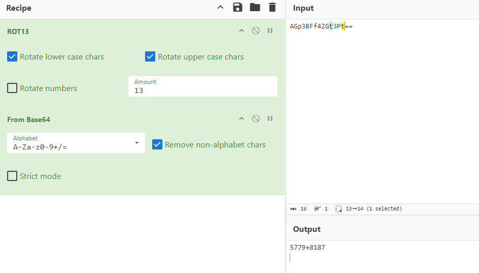

# J4CKP0TTER_B4CKD00R
Available info:
- REDACTED:9002

# Recon + Exploitation
No protocol, lets try `nc` on the $TARGET, I'm greeted with some source code

```bash
#!/usr/bin/bash

cat "${0}"

TITLE="[ -- x -- ]"

encode_char () {
  ASCII=$(printf "%d" "'$1")

  if [[ $ASCII -ge 65 && $ASCII -le 90 ]]; then
    ASCII=$((ASCII+13))
    if [[ $ASCII -gt 90 ]]; then
      OVERFLOW=$((ASCII-91))
      ASCII=$((65+OVERFLOW))
    fi
  fi

  if [[ $ASCII -ge 97 && $ASCII -le 122 ]]; then
    ASCII=$((ASCII+13))
    if [[ $ASCII -gt 122 ]]; then
      OVERFLOW=$((ASCII-123))
      ASCII=$((97+OVERFLOW))
    fi
  fi

  echo "${ASCII}"
}

encode () {
  string=$1
  length=${#string}
  for ((i = 0; i < length; i++)); do
    CHAR="${string:i:1}"
    ASCII=$(encode_char "$CHAR")
    awk "BEGIN{printf \"%c\", ${ASCII}}"
  done
}

main () {
  
  echo "${TITLE/x/J4CKPOTT3R B4CKD00R}"
  echo "${TITLE/x/INITIALISATION}"

  START=$(date +%s)
  for ((i = 0; i < 15; i++)); do

    n1=$((RANDOM % 10000))
    n2=$((RANDOM % 10000))

    expected=$((n1+n2))
    msg=$(echo "$n1+$n2" | base64)
    echo "$(encode "${msg}")"
    read -r

    if [[ "${REPLY}" != "${expected}" ]]; then
      echo "[!] ÉCHEC"
      exit 1
    fi

  done
  END=$(date +%s)
  DELTA=$((END-START))

  [[ $DELTA -lt 15 ]] && cat ./flag.txt || echo "[!] EXPIRÉ"
  
}

main
```

Followed by:
```
[ -- J4CKPOTT3R B4CKD00R -- ]
[ -- INITIALISATION -- ]
AGp3BFf4ZGt3Pt==
```

Some `==` padding, I'm trying to b64 decode it, but it does not work. Probably missing a step. Lets take a look at the source code
```bash
encode_char () {
  ASCII=$(printf "%d" "'$1")

  if [[ $ASCII -ge 65 && $ASCII -le 90 ]]; then
    ASCII=$((ASCII+13))
    if [[ $ASCII -gt 90 ]]; then
      OVERFLOW=$((ASCII-91))
      ASCII=$((65+OVERFLOW))
    fi
  fi

  if [[ $ASCII -ge 97 && $ASCII -le 122 ]]; then
    ASCII=$((ASCII+13))
    if [[ $ASCII -gt 122 ]]; then
      OVERFLOW=$((ASCII-123))
      ASCII=$((97+OVERFLOW))
    fi
  fi

  echo "${ASCII}"
}
```
`ASCII=$((ASCII+13))` + 13 humm! ROT13 maybe?



That was quite fast!

I also understand that I need to answer quickly to those expression.
I already solved something similar in another CTF. Time to write some code!
```python
#!/usr/bin/python3

import base64
import socket
import re

def decode_rot13(text):
    result = []
    for char in text:
        if 'a' <= char <= 'z':
            offset = ord('a')
            result.append(chr((ord(char) - offset + 13) % 26 + offset))
        elif 'A' <= char <= 'Z':
            offset = ord('A')
            result.append(chr((ord(char) - offset + 13) % 26 + offset))
        else:
            result.append(char)
    decoded = ''.join(result)
    print(f"DEBUG: Decoded ROT13: {decoded}")
    return decoded


def process_message(message):
    print(f"DEBUG: Received message: {message}") 
    decoded_message = decode_rot13(message)
    try:
        base64_decoded = base64.b64decode(decoded_message).decode('utf-8')
        print(f"DEBUG: Base64 decoded: {base64_decoded}")
        result = str(eval(base64_decoded)) 
        print(f"DEBUG: Calculated result: {result}")
        return result
    except (base64.binascii.Error, ValueError, SyntaxError, NameError) as e:
        error_message = f"[!] Erreur: {str(e)}"
        print(f"DEBUG: Error occurred: {error_message}")
        return error_message

def main():
    server_address = ('REDACTED', 9002)
    with socket.socket(socket.AF_INET, socket.SOCK_STREAM) as sock:
        print(f"DEBUG: Connecting to {server_address}")
        sock.connect(server_address)
        while True:
            data = sock.recv(4096).decode('utf-8').strip()
            if not data:
                print("DEBUG: No data received, closing connection.")
                break
            print(f"DEBUG: Received data: {data}")
            if re.match(r'^[A-Za-z0-9+/=]+$', data):
                response = process_message(data)
                print(f"DEBUG: Sending response: {response}")
                sock.sendall(response.encode('utf-8') + b'\n')
            else:
                print(f"DEBUG: Line ignored: {data}")

if __name__ == '__main__':
    main()
```

`chmod +x` that thing and magic......
```
DEBUG: Calculated result: 3267
DEBUG: Sending response: 3267
DEBUG: Received data: ZmD5APf5ZwV3Pt==
DEBUG: Received message: ZmD5APf5ZwV3Pt==
DEBUG: Decoded ROT13: MzQ5NCs5MjI3Cg==
DEBUG: Base64 decoded: 3494+9227

DEBUG: Calculated result: 12721
DEBUG: Sending response: 12721
DEBUG: Received data: FINCTF-89e4a65a450fd815747b1d2780e37a
DEBUG: Line ignored: FINCTF-89e4a65a450fd815747b1d2780e37a
DEBUG: No data received, closing connection.
```
