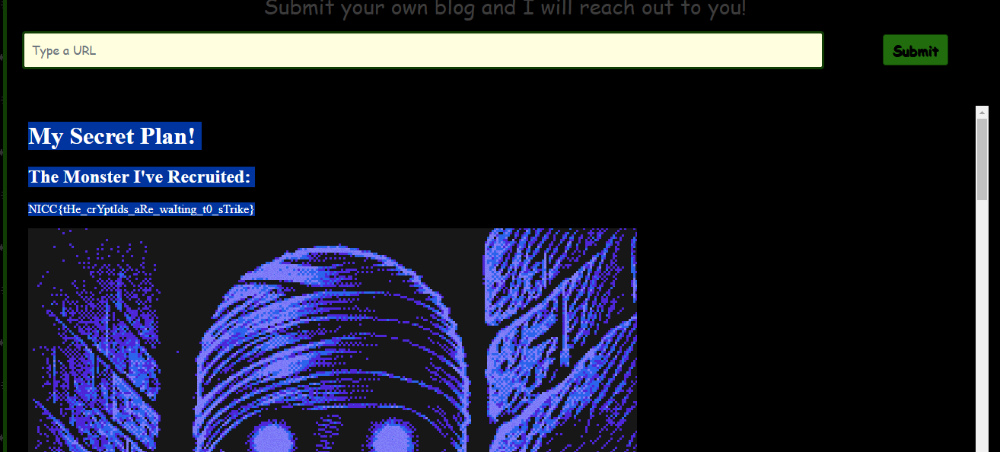

# Paranormal-picture
## Description:
```
One of our recruits is a massive conspiracy theorist. Strangely enough, he has expressed not only that everything is the bite of 87 but also that there's something strange going on in the dark web that involves Dr. Tom Lei. Though he is a little bit nuts, we think he may be on to something. Figure out what's going on before it's too late!
```

## Developper: HackAndQuack https://github.com/hackandquack

Information:
- http://REDACTED
- Code source disponible

```python
from flask import Flask, request, render_template
import os 
import requests

app = Flask(__name__)

def verifyBlog(url):
    blog_list = ["blog","cryptid","real","666",".org"]
    for word in blog_list:
        if word not in url:
            return False
    return True


@app.route('/', methods=['GET', 'POST'])
def index():

    if request.method == 'POST':
        url = request.form['url']
        try:
            result = verifyBlog(url)
            if not result:
                return render_template('index.html', error=f"Please submit a blog!")
        except:
            return render_template('index.html', error=f"Please submit a blog!")

        r = requests.get(url)

        return render_template('index.html', result=r.text)
    return render_template('index.html')


@app.route('/flag')
def flag():
    if request.remote_addr == '::ffff:127.0.0.1' or request.remote_addr == '::1':
        return render_template('flag.html', FLAG=os.environ.get("FLAG"))

    else:
        return render_template('alarm.html'), 403


if __name__ == '__main__':
    app.run(host="::", port=80, threaded=True)
```

On peut voir que uniquement les requetes provenant de local host sont accepter.
La fonction de validation est assez simple a abuser
```python
def verifyBlog(url):
    blog_list = ["blog","cryptid","real","666",".org"]
    for word in blog_list:
        if word not in url:
            return False
    return True
```

Simplement avoir tout les mot-cles dans l'URL
`http://127.0.0.1/flag?cryptid=real666blog.org`

