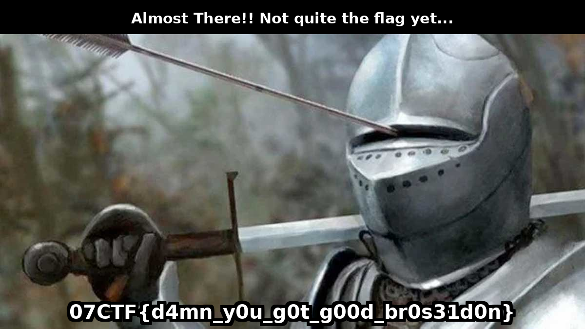

# Title: git gud bro
## Forensics

## Description:
```
Hey, I'm such a smart guy! My precious flag has been cleverly stored in a well-known binary format. However, when I tried to retrieve it... what was it called again? Oh right, source control. Despite my brilliance, even I couldn't manage to recover it. I guess Git wasn't really designed for handling binary files after all. ;(
```

# Step 1 Reconstruct the flag file:
This challenge is overriting the content of flag file with some byte that come from an image.
The best way to do this is using a python script

Here is a python script to do so:
```python
import os
import git

def retrieve_flag_from_git(repo_dir="./handout/", output_file="unpack_flag.png"):
    if not os.path.exists(os.path.join(repo_dir, ".git")):
        print("This is not a git folder")
        return

    repo = git.Repo(repo_dir)

    with open(output_file, "wb") as output_f:
        commits = list(repo.iter_commits('master', paths='flag'))
        
        for commit in reversed(commits):
            file_blob = commit.tree['flag'].data_stream.read()

            output_f.write(file_blob)

            print(f"Adding {commit.hexsha[:7]} Into {output_file}")

    print(f"File {output_file} has been reconstructed from Git history.")

retrieve_flag_from_git()
```
It yield:


# Step 2 Remove the extra IEND block right in the middle of the data
There is an extra IEND bloc that must be removed to reveal the bottom of the images
IEND BLOCK ADDED: `b'\x00\x00\x00\x00\x49\x45\x4E\x44\xAE\x42\x60\x82'`
Using an hex editor or doing it with python code

Here we can see that the file have 2 IEND block
```bash
strings step1.png | grep IEND
IEND
IEND
```

Again a small python script to solve the 2nd part:
```python
def remove_iend_chunk(png_file):
    iend_chunk = b'\x00\x00\x00\x00\x49\x45\x4E\x44\xAE\x42\x60\x82'

    with open(png_file, "rb") as f:
        data = f.read()
    
    iend_index = data.find(iend_chunk)
    if iend_index == -1:
        print("What?! IEND block not found.")
        return
    
    new_data = data[:iend_index] + data[iend_index+12:]
    
    with open(png_file, "wb") as f:
        f.write(new_data)
    
    print(f"Block IEND removed in {png_file}")

remove_iend_chunk("unpack_flag.png")
```

It yield:



# Flag:
`07CTF{d4mn_y0u_g0t_g00d_br0s31d0n}`

# Pitfall
People had trouble keeping all the data from the commit. I have seen many butchered image. Most of contestant I assume did:
- People were cheking the bytes in every commit and were stoped reading data when the first IEND block has been found
- People though I would add clean block to every commit which is isnt the case

Here is how I packaged the challenge:

```python
import os
import git

def create_git_repo(png_file, repo_dir="./handout/",chunk_size=1000):
    if not os.path.exists(repo_dir):
        os.makedirs(repo_dir)

    if not os.path.exists(os.path.join(repo_dir, ".git")):
        repo = git.Repo.init(repo_dir)
    else:
        repo = git.Repo(repo_dir)

    file_path = os.path.join(repo_dir, "flag")

    with open(png_file, "rb") as f:
        png_data = f.read()

    if not os.path.exists(file_path):
        with open(file_path, "wb") as f:
            f.write(b"")  

    repo.index.add("flag")
    repo.index.commit("This is my flag, its mine don't touch it")


    total_size = len(png_data)
    for i in range(0, total_size, chunk_size):
        chunk = png_data[i:i + chunk_size]
        
        with open(file_path, "r+b") as f:
            f.write(chunk) 
        repo.index.add("flag")

        commit_message = f"got gud yet?"
        repo.index.commit(commit_message)

    print(f"All bytes of PNG added {repo_dir}")

create_git_repo("flag_image.png")
```

And here is how I "created and broke" the image
```python
from PIL import Image, ImageDraw, ImageFont
import struct 

def create_flag_image(input_file, output_file,top_text="", flag_text=""):
    image = Image.open(input_file).convert("RGB")
    draw = ImageDraw.Draw(image)
    
    try:
        font_path = "/usr/share/fonts/truetype/dejavu/DejaVuSans-Bold.ttf"
        bottom_font = ImageFont.truetype(font_path, 40) 
        top_font = ImageFont.truetype(font_path, 30) 

    except:
        print("Font not found")
        exit(1)
    
    #-------------------------------------------------------------------------
    # BOTTOM CAPTION

    text_bbox = draw.textbbox((0, 0), flag_text, font=bottom_font)
    text_width = text_bbox[2] - text_bbox[0]
    text_height = text_bbox[3] - text_bbox[1]
    text_x = (image.width - text_width) // 2
    text_y = image.height - text_height - 20  
    

    outline_offset = 6
    for dx in range(-outline_offset, outline_offset + 1, 2):
        for dy in range(-outline_offset, outline_offset + 1, 2):
            if dx != 0 or dy != 0:
                draw.text((text_x + dx, text_y + dy), flag_text, fill="black", font=bottom_font)
    draw.text((text_x, text_y), flag_text, fill="white", font=bottom_font)

    #-----------------------------------------------------------------------
    # TOP CAPTION

    top_text_font = top_font  
    top_text_bbox = draw.textbbox((0, 0), top_text, font=top_text_font)
    top_text_width = top_text_bbox[2] - top_text_bbox[0]
    top_text_height = top_text_bbox[3] - top_text_bbox[1]
    top_text_x = (image.width - top_text_width) // 2
    top_text_y = 20 
    
    draw.rectangle([0, 0, image.width, top_text_height + 40], fill="black")
    
    draw.text((top_text_x, top_text_y), top_text, fill="white", font=top_text_font)
    
    image.save(output_file, "PNG")
    print(f"Saved in: {output_file}")

def add_iend_chunk(png_file):
    # IEND 12 bytes :
    iend_chunk = b'\x00\x00\x00\x00\x49\x45\x4E\x44\xAE\x42\x60\x82'

    with open(png_file, "rb") as f:
        data = f.read()
    
    midpoint = len(data) // 2
    new_data = data[:midpoint] + iend_chunk + data[midpoint:]
    
    with open(png_file, "wb") as f:
        f.write(new_data)
    
    print(f"Evil IEND added to {png_file}")

top_text = "Almost There!! Not quite the flag yet..."
flag_text="07CTF{d4mn_y0u_g0t_g00d_br0s31d0n}"
create_flag_image("base.png", "flag_image.png",top_text,flag_text)
add_iend_chunk("flag_image.png")
```