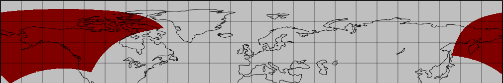

# Title: The weather oracle
## Forensics

## Description:
```
The year is 20XX. Meteorological agencies worldwide receive an anonymous file, containing disturbing weather data. A cataclysmic storm is forming on an unprecedented scale. Forecast models show an impossible convergence of hurricanes, tornadoes, and heat waves all in a single location. But something doesn’t add up. A rogue scientist, now missing, left a hidden message within the data. He claimed that this "perfect storm" is not natural. Before vanishing, he uncovered a classified climate manipulation project. The only clue he managed to transmit is buried within this file. We need you to undisclose what was hidden.

Author: drgn
```

## Hint:
```Hint:

🌐 Update from our meteorologists on the weather oracle

Our internal meteorologists have identified information within the data indicating that reported temperatures in Alaska are implausibly high. 📊 Based on our analysis, there is no scientific basis to support temperatures reaching the levels reported. ❄️🌡️
```

# Solution
The whole goal of it is understanding an uncommon file format, in this case `grib2`
If we look at the data with panoply : https://www.giss.nasa.gov/tools/panoply/ (Free program)
And we look at the temperature we will see this:


And we see that 999 degree in the temperature data in alaska, something is not right.
If we check the actual value of the layer, its all 999 except some of them which is our flag!

Here is the solution script:
```python
import pygrib
import numpy as np

chal_file = 'handout/chal'

# Open the GRIB file
grbs = pygrib.open(chal_file)

# Select the temperature data (There is multiple layer)
temp = grbs.select(name='Temperature')[-1] # This is the last layer added, as I only added a layer on top of the original data

# All the temperature values are 999 except some values, which are ASCII values of our flag
values_not_999 = temp.values[temp.values != 999]

# Printing the ASCII code
print(values_not_999)

# Just print the flag!
int_value = np.array(values_not_999).astype(np.int32)
for value in int_value:
    print(chr(value), end='')

# Rawr does the dragon
```

It will yield:
```
[ 48.  55.  67.  84.  70. 123. 121.  48. 117.  95.  52. 114.  51.  95.
  52.  95. 109.  51. 116.  51.  48. 114.  48. 108.  48. 103.  49. 115.
 116.  95.  52. 102. 116.  51. 114.  95.  52. 108. 108.  33. 125.]
07CTF{y0u_4r3_4_m3t30r0l0g1st_4ft3r_4ll!}% 
```

Flag: `07CTF{y0u_4r3_4_m3t30r0l0g1st_4ft3r_4ll!}`

# Data
This is real meteo data from alaska publicly