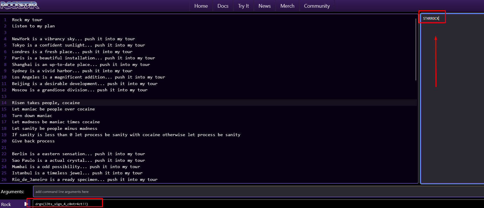

# World Tour
## Tags: `misc`


## Description:
```
The last composition was such a success that we decided to organize a world tour! We even started composing a brand new song specifically for the occasion.
Unfortunately, the disk became corrupted, and we were only able to recover part of the song along with its lyrics.
Sadly, the ending is missing... Can you help us fix it and uncover the secrets hidden within?

Flag format: drgn{.*}

The flag is already decorated/wrapped when found
Using Rockstar v2.0.29 
```

# What the challenge is:
The code is actually a pretty bad encryption/decryption function. You can find the python equivalent in `encode_flag.py`
The encrypted flag is added during the song into the "tour" variable. The decryption function is already present as well as a modulo function in the song. (Rockstar don't have modulo operator)

The missing part of the song is simply calling the decryption function with the right key.

# Step 1: Find the key
Simply strings the mp3 as the key is int the "corrupted" part (The noise)
```bash
strings chal.mp3
[...]
(((1
LAME3.100UUUUUUUUUUUUUUUUUUUUUUUUUUUUUUUUUUUUUUUUUUUUUUUUUUUUUUUUUUUUUUUUUUUUUUUUUUUUUUUUUUUUUUUUUUUUUUUUUUUUUUUUUUUUUUUUUUUUUUUUUUUUUUU
UUUUUUUUUUUUUUUUUUUUUUUUUUUUUUUUUUUUUUUUUUUUUUUUUUUUUUUUUUUUUUUUUUUUUUUUUUUUUUUUUUUUUUUUUUUUUUUUUUUUUUUUUUUUUUUUUUUUUUUUUUUUUUUUUUUUUUUUUUUUUUUUUUUUUUUUUUUUUUUUUUUUUUUUUUUUUUUUUUUUUUUUUUUUUUUUUUUUUUUUUUUUUUUUUUUUUUUUUUUUUUUUUUUUUUUUUUUUUUUUUUUUUUUUUUUUUUUUUUUUUUUUUUUUUUUUUUUUUUUUUUUUUUUUUUUUUUUUUUUUUUUUUUUUUUUUUUUUUUUUUUUUUUUUUUUUUUUUUUUUUUUUUUUUKey:ST4RR0CK
[...]
```
We can see at the end: `Key:ST4RR0CK`

# Step 2: Complete lyric.rock
The non-printable char at the end of lyric.rock is garbage and must be removed.

The 2nd line of the rockstar code is `Listen to my plan` which mean `my plan` is a variable that must be passed as an argument
The `my bus` function is actually the decryption function 
The `Risen` function is the module one

To complete the program simply call `my bus` with the right argument: `my plan` and `my tour`
To output the flag add a last line `shout $VARIABLE` depending how you called the flag here is the working missing 2 line:
```rockstar
let my last be my bus taking my plan, my tour
shout my last
```

You can find an other version in `original.rock` that is less obfuscated and does not look like lyrics



Flag: drgn{l3ts_s1gn_4_c0ntr4ct!!}

Here is the complete program:
```rockstar
Rock my tour
Listen to my plan

NewYork is a vibrancy sky... push it into my tour
Tokyo is a confident sunlight... push it into my tour
Londres is a fresh place... push it into my tour
Paris is a beautiful installation... push it into my tour
Shanghai is an up-to-date place... push it into my tour
Sydney is a vivid harbor... push it into my tour
Los Angeles is a magnificent addition... push it into my tour
Beijing is a desirable development... push it into my tour
Moscou is a grandiose division... push it into my tour

Risen takes people, cocaine
Let maniac be people over cocaine
Turn down maniac
Let madness be maniac times cocaine
Let sanity be people minus madness
If sanity is less than 0 let process be sanity with cocaine otherwise let process be sanity 
Give back process

Berlin is a eastern sensation... push it into my tour
Sao Paulo is a actual crystal... push it into my tour
Mumbai is a odd possibility... push it into my tour
Istanbul is a timeless jewel... push it into my tour
Rio_de_Janeiro is a ready specimen... push it into my tour
Mexico is a superb introduction... push it into my tour
Hong Kong is a considerable victory... push it into my tour
Buenos Aires is a careful equality... push it into my tour
Cairo is a possible sky... push it into my tour
Rome is a impressive expression... push it into my tour

My bus takes fuel and cocaine
Shatter fuel into molecule 
Let ice be molecule with 0 (energy)
Let my show be 28
Let my fear be silent
my fans are an other memory
For people in my show
Let their hands be risen taking people, ice
Let their dreams be molecule at their hands
Let their states be cocaine at people
Burn their dreams into oblivion
Let their minds be their states minus oblivion
Let their emotions be risen taking their minds, my fans
Burn their emotions into peace
Let my fear be my fear with peace
(Ohhhh ohhhh ohhh)
Give back my fear

Jakarta is a expensive extravagance... push it into my tour
Cape Town is a authentic industry... push it into my tour
Buenos Aires is a strong construction ... push it into my tour
Lagos is a significant knowledge... push it into my tour
Toronto is a special city... push it into my tour
Seoul is a beautiful structure... push it into my tour
Chicago is a appropriate society... push it into my tour
Dubai is economic palce... push it into my tour
Montreal is an industrial support... push it into my tour

(Here goes the missing part)
let my last be my bus taking my plan, my tour
shout my last
```