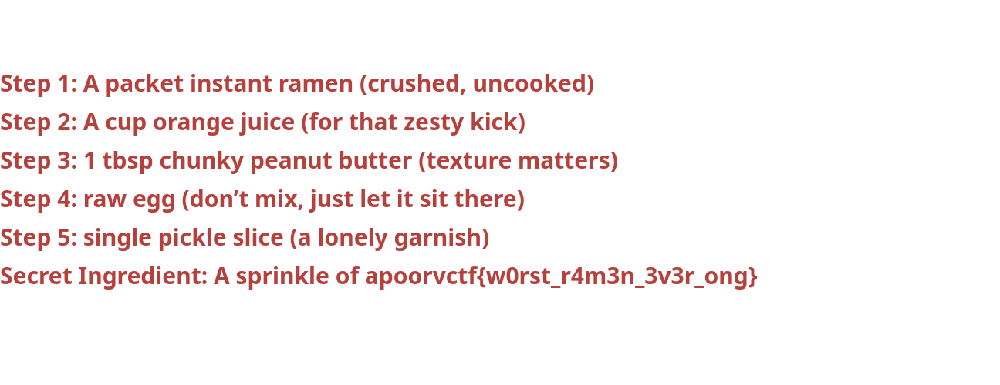

# Ramen Lockdown
# Forensic
# Description:
> A criminal mastermind named larry stole Chef Tataka ultimate ramen recipe and yeeted it into a password-protected zip file. Inside? A sacred file with the secret to flavor nirvana. Crack the zip, save the slurp. No pressure. 🍜💀

# Given
- password protected zip file

# Solution
The zip file is not compressed!

So we can use this tool: https://github.com/kimci86/bkcrack

But this attack imply that we know already a part of the data unencrypted.

```bash
unzip -l recipe.zip 
Archive:  recipe.zip
  Length      Date    Time    Name
---------  ---------- -----   ----
    89796  2025-02-24 08:07   secret_recipe.png
---------                     -------
    89796                     1 file
```

Well it is a PNG and not a text file. So we DO KNOW a bit of data right? Every PNG have something in common! The header!


```bash
echo -ne '\x89\x50\x4E\x47\x0D\x0A\x1A\x0A\x00\x00\x00\x0D\x49\x48\x44\x52' > known_plaintext.bin
```

``` bash
./bkcrack -C recipe.zip  -c secret_recipe.png -p known_plaintext.bin

bkcrack 1.7.1 - 2024-12-21
[09:58:33] Z reduction using 9 bytes of known plaintext
100.0 % (9 / 9)
[09:58:33] Attack on 721680 Z values at index 6
Keys: 7cfefd6a 4aedd214 970c7187
41.3 % (297837 / 721680)
Found a solution. Stopping.
You may resume the attack with the option: --continue-attack 297837
[10:00:28] Keys
7cfefd6a 4aedd214 970c7187
```

This yield the keys
`7cfefd6a 4aedd214 970c7187`

```bash
bkcrack -C recipe.zip -c secret_recipe.png -k 7cfefd6a 4aedd214 970c7187 -d decrypted_recipe.png
```


`apoorvctf{w0rst_r4m3n_3v3r_ong}`
