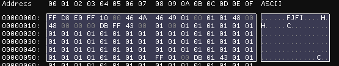
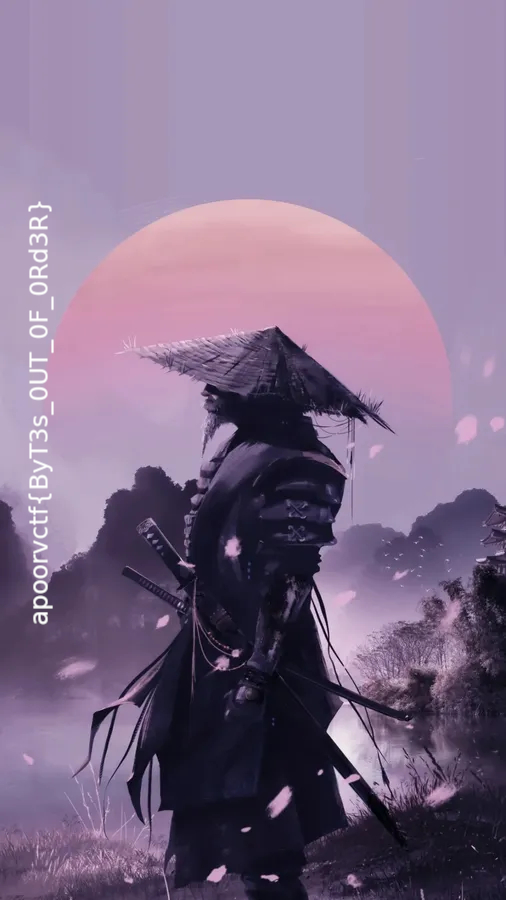

# Samurai’s Code
# Forensic
# Description
> Unveil the lost code of the Samurai and unlock the mystery hidden within.

# Given


# Solution

Starting with my stegotool checklist....

```bash
Trailing Data Discovered... Saving
b'++++++++++[>+>+++>+++++++>++++++++++<<<<-]>>>>++++.++++++++++++..----.+++.<------------.-----------..>---------------.++++++++++++++.---------.+++++++++++++.-----------------.<-.>++.++++++++..--------.+++++.-------.<.>--.++++++++++++.--.<+.>-------.+++.+++.-------.<.>-.<.++.+++++++++++++++++++++++++.+++++++++++++.>+++++++++++++.<+++++++++++++.----------------------------------.++++++++.>+++++++++.-------------------.<+++++++.>+.<-----.+++++++++.------------.<+++++++++++++++.>>++++++++++++++++.<+++.++++++++.>-.<--------.---------.++++++++++++++++++++.>.<++.>--------------.<<+++++.>.>-----.+++++++.<<++.>--.<++.---------.++.>>+++++++++++.-------------.----.++++++++++++++++++.<<++++++++++++++++.>>--.--.---.<<--.>>+++.-----------.-------.+++++++++++++++++.---------.+++++.-------.\n'
```

I know this is the brainfuck language so lets do this:

It yield: https://drive.google.com/file/d/`REDACTED`

Downloading `samurai`

Trying to find what it is was a failure, So i ended up in Hex editor..



So Usually `D8 FF` is a JPG.. also FJFI is usually JFIF, seems like the byte has been rotated?

Lets tgry to apply this logic

```python

with open("samurai", "rb") as input_file:
    data = input_file.read()


with open("fichier_repare.jpg", "wb") as output_file:

    for i in range(0, len(data), 4):
        block = data[i:i+4]
        if len(block) == 4:

            inverted_block = block[1:2] + block[0:1] + block[3:4] + block[2:3]
            output_file.write(inverted_block)
        else:

            output_file.write(block)
```

It yield



`apoorvctf{ByT3s_OUT_OF_ORd3R}`