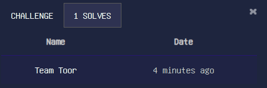
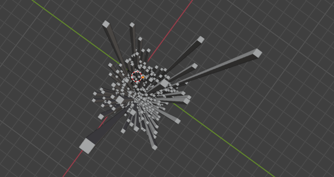
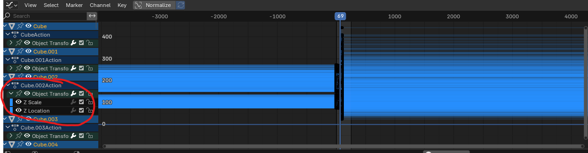
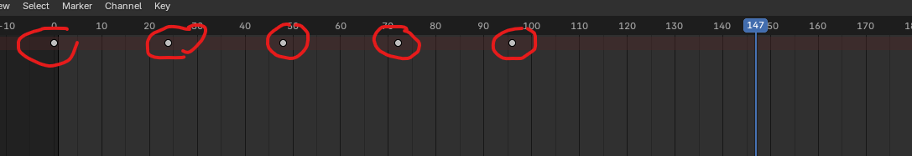
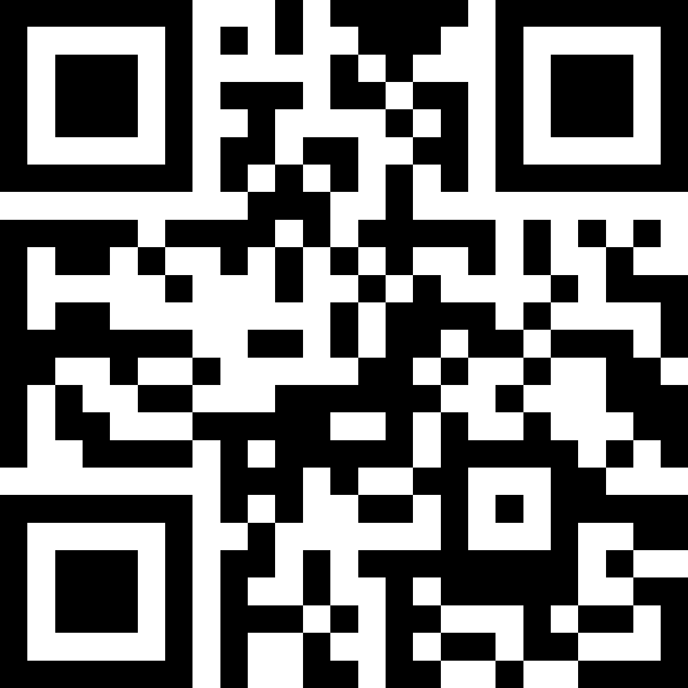

# Blend in Disguise
# Forensic
# Description
> You'll never find me, I blend in so well.

# Author @proximuz

# Given
- chal.blend
- hint.txt

# Special note
This is the first time ever I'm having the first blood on a challenge! 🎉🥳🎊🎈💥🏆




# Solution

What is a blend file

```bash
file chal.blend
chal.blend: Blender3D, saved as 64-bits little endian with version 4.03
```
Ohhhhhhhkay.. I guess I'm installing blender



So its an animation, and we have 25x25 bloc forming a grid.
The animation modify Z scale and Z location



We also have some keyframe:
`keyframes = [0, 24, 48, 72, 96]`



Finally lets get the hint.txt

```
Gather values, sum with care,
At every key, a weight to bear.
Tip the scales—one thousand’s gate,
Decide the path, control the fate.

One side dark, the other light,
Opposing forces, black and white.
Balance shifts, the truth unveiled,
A sight well known, a tale retold.
```

So I get that 
- I need to add the Zscale value `Gather values, sum with care`
- There is 250 frame I should only take the key one `At every key, a weight to bear.`
- I was already thinking of a QR Code at this point but how to limit the value for 1 and 0? The threshold is 1000 `Tip the scales—one thousand’s gate,`
- The rest of the hint just specify those 1 and 0 should be black and white which is indeed smell the qr code!

So I need the data and in blender you can run python script so I did!

```python
# This need to be ran in blender
import bpy
import csv


output_file = bpy.path.abspath("//animation_data.csv")


objects = [obj for obj in bpy.data.objects if obj.name.startswith("Cube")]


with open(output_file, 'w', newline='') as file:
    writer = csv.writer(file)
    writer.writerow(["Frame", "Cube Name", "Z Scale", "Z Location"])


    scene = bpy.context.scene
    for frame in range(scene.frame_start, scene.frame_end + 1):
        scene.frame_set(frame)
        

        for obj in objects:
            z_scale = obj.scale.z
            z_location = obj.location.z
            writer.writerow([frame, obj.name, z_scale, z_location])

print(f"Data exported {output_file}")
```

So I have data (assets/animation_data.csv) now lets write a script to replicate what the hint is saying

```python
import numpy as np
import pandas as pd
import matplotlib.pyplot as plt

def load_data(csv_file):
    return pd.read_csv(csv_file)

def get_matrix(df, frame, column, size=25):
    return df[df["Frame"] == frame][column].values.reshape(size, size)

def compute_qr_matrix(df, keyframes, weights, size=25):
    qr_matrix = np.zeros((size, size))
    
    for i, key_frame in enumerate(keyframes):
        frame_zscale = get_matrix(df, key_frame, "Z Scale", size)
        frame_zloc = get_matrix(df, key_frame, "Z Location", size)
        

        combined_frame = (frame_zscale)
        qr_matrix += combined_frame  
        print("----------------------------")
        print(qr_matrix)
    return qr_matrix

def binarize_qr_matrix(qr_matrix):
    threshold = 1000
    return (qr_matrix >= threshold).astype(int)

def save_qr_image(qr_matrix, output_file="qr_code.png"):
    qr_matrix_corrected = 1 - qr_matrix
    plt.imshow(qr_matrix_corrected, cmap="gray", vmin=0, vmax=1)
    plt.axis("off")
    plt.savefig(output_file, bbox_inches='tight', pad_inches=0, dpi=300)
    # plt.show()

def main():
    csv_file = "animation_data.csv"
    keyframes = [1, 24, 48, 72, 96]
    weights = [0.25, 0.25, 0.25, 0.25]  # Basés sur Z Scale
    
    data_frame = load_data(csv_file)
    qr_matrix = compute_qr_matrix(data_frame, keyframes, weights)
    binary_qr_matrix = binarize_qr_matrix(qr_matrix)
    print(binary_qr_matrix)
    save_qr_image(binary_qr_matrix)

if __name__ == "__main__":
    main()
```

This will yield:



```bash
barimg qr_code.png 

QR-Code:apoorvctf{bl3nd3r_1s_fuN}
scanned 1 barcode symbols from 1 images in 0.04 secon
```

`apoorvctf{bl3nd3r_1s_fuN}`