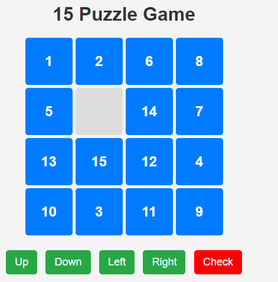
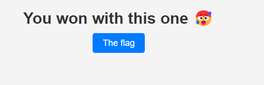
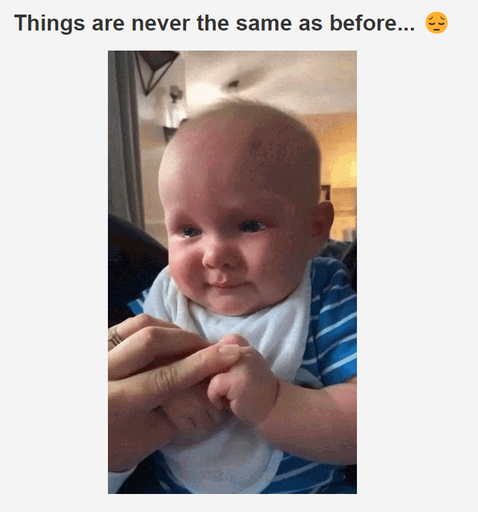

# 15 Puzzle
## Web

### Solved by @roose

We are given a website:



Once completed we are redirected to the next puzzle.

My teamate wrote a script to solve those puzzle:

```python
import requests
import heapq
from selenium import webdriver
from selenium.webdriver.common.by import By
from selenium.webdriver.common.keys import Keys
from selenium.webdriver.chrome.options import Options
import time
from urllib.parse import urljoin

# Define the goal state
goal = [
    [1, 2, 3, 4],
    [5, 6, 7, 8],
    [9, 10, 11, 12],
    [13, 14, 15, 0]
]

# Define the possible movements (down, up, right, left)
moves = [(1, 0), (-1, 0), (0, 1), (0, -1)]

# Function to find the position of the empty tile (0)
def find_empty_tile(state):
    for i in range(4):
        for j in range(4):
            if state[i][j] == 0:
                return i, j

# Function to calculate the Manhattan distance heuristic
def manhattan_distance(state):
    distance = 0
    for i in range(4):
        for j in range(4):
            if state[i][j] != 0:
                goal_i, goal_j = (state[i][j] - 1) // 4, (state[i][j] - 1) % 4
                distance += abs(i - goal_i) + abs(j - goal_j)
    return distance

# Function to calculate the linear conflict heuristic
def linear_conflict(state):
    conflict = 0
    for i in range(4):
        max_val = -1
        for j in range(4):
            if state[i][j] != 0 and (state[i][j] - 1) // 4 == i:
                if state[i][j] > max_val:
                    max_val = state[i][j]
                else:
                    conflict += 2
    for j in range(4):
        max_val = -1
        for i in range(4):
            if state[i][j] != 0 and (state[i][j] - 1) % 4 == j:
                if state[i][j] > max_val:
                    max_val = state[i][j]
                else:
                    conflict += 2
    return conflict

# Combined heuristic function
def heuristic(state):
    return manhattan_distance(state) + linear_conflict(state)

# Function to generate the possible successors of a given state
def generate_successors(state):
    successors = []
    empty_i, empty_j = find_empty_tile(state)
    for move in moves:
        new_i, new_j = empty_i + move[0], empty_j + move[1]
        if 0 <= new_i < 4 and 0 <= new_j < 4:
            new_state = [row[:] for row in state]
            new_state[empty_i][empty_j], new_state[new_i][new_j] = new_state[new_i][new_j], new_state[empty_i][empty_j]
            successors.append((new_state, (move[0], move[1])))
    return successors

# Function to pretty print the board
def pretty_print(state):
    print("\nCurrent Board:")
    for row in state:
        print(" ".join(str(x) if x != 0 else " " for x in row))
    print()

# IDA* search algorithm to solve the 15 Puzzle
def ida_star(initial_state):
    def search(path, g, bound):
        current_state = path[-1]
        f = g + heuristic(current_state)
        if f > bound:
            return f
        if current_state == goal:
            return path
        min_bound = float('inf')
        for successor, move in generate_successors(current_state):
            if successor not in path:
                path.append(successor)
                result = search(path, g + 1, bound)
                if isinstance(result, list):
                    return result
                if result < min_bound:
                    min_bound = result
                path.pop()
        return min_bound

    bound = heuristic(initial_state)
    path = [initial_state]
    iteration = 0
    while True:
        print(f"Starting iteration {iteration} with bound {bound}")
        result = search(path, 0, bound)
        if isinstance(result, list):
            return result
        if result == float('inf'):
            return None
        bound = result
        iteration += 1

# Function to solve the puzzle and get the moves
def solve_puzzle(initial_state):
    solution_path = ida_star(initial_state)
    if solution_path:
        solution_moves = []
        for i in range(1, len(solution_path)):
            prev_state = solution_path[i - 1]
            curr_state = solution_path[i]
            empty_i_prev, empty_j_prev = find_empty_tile(prev_state)
            empty_i_curr, empty_j_curr = find_empty_tile(curr_state)
            move = (empty_i_curr - empty_i_prev, empty_j_curr - empty_j_prev)
            solution_moves.append(move)
        return solution_moves
    else:
        return None

# Function to fetch and solve puzzles sequentially
def solve_puzzles(start_url):
    base_url = "http://REDACTED"
    current_url = start_url
    while current_url:

        chrome_options = Options()
        chrome_options.add_argument("--headless")  # Mode headless
        chrome_options.add_argument("--disable-gpu")  # Désactiver l'accélération GPU (optionnel)
        chrome_options.add_argument("--no-sandbox")  # Option pour certains environnements (optionnel)
        # Set up the Selenium WebDriver
        driver = webdriver.Chrome(options=chrome_options)  # Make sure you have the ChromeDriver installed and in your PATH

        
        driver.get(current_url)

        # Get the current board layout from the browser
        initial_state = get_current_board(driver)

        # Solve the puzzle
        solution_moves = solve_puzzle(initial_state)
        if solution_moves:
            solution_moves_str = str(solution_moves).replace('(', '[').replace(')', ']')
            print("Solution moves:", solution_moves_str)

            # Construct the check URL
            check_url = current_url + "/check"

            # Submit the solution to the server
            headers = {
                "Host": "REDACTED",
                "User-Agent": "Mozilla/5.0 (X11; Linux x86_64; rv:109.0) Gecko/20100101 Firefox/115.0",
                "Accept": "*/*",
                "Accept-Language": "en-US,en;q=0.5",
                "Accept-Encoding": "gzip, deflate, br",
                "Referer": current_url,
                "Content-Type": "application/json",
                "Origin": "http://REDACTED",
                "Connection": "keep-alive"
            }

            response = requests.post(
                check_url,
                headers=headers,
                json={"movements": solution_moves}
            )
            print("Response status code:", response.status_code)
            print("Response text:", response.text)
            try:
                result = response.json()
            except requests.exceptions.JSONDecodeError:
                print("Failed to decode JSON response")
                break

            if result.get('solved'):
                print("Puzzle solved successfully!")
                next_puzzle_relative_url = result.get('next_puzzle')
                if next_puzzle_relative_url:
                    current_url = urljoin(base_url, next_puzzle_relative_url)
                    print("Next puzzle URL:", current_url)
                    # time.sleep(5)  # Wait for a few seconds before fetching the next puzzle
                else:
                    print("No more puzzles.")
                    break
            else:
                print("Failed to solve the puzzle.")
                break
        else:
            print("No solution found")
            break

        # Close the browser
        driver.quit()

# Function to get the current board layout from the browser
def get_current_board(driver):
    driver.execute_script("console.log(puzzle)")
    time.sleep(1)  # Wait for the console log to be printed
    puzzle = driver.execute_script("return puzzle")
    return puzzle

# Start solving puzzles from the initial URL
initial_url = "REDACTED"
solve_puzzles(initial_url)
```

In the end we end up on `/fl4g_i5_you_c4n7_s33_m3`

(There is 100 challenge? At some point I though the puzzle were looping us around)



Clicking the button lead to `/g37_y0ur_r3al_fl4g` with a .gif of a crying baby.



Author was trolling us hard the page `/g37_y0ur_r3al_fl4g` is completely useless
We ran very quick stego basic check on the gif.. that is called `flag.gif`.. but this is a Web Challenge?!

If we go back to  `/fl4g_i5_you_c4n7_s33_m3` and show headers

```
curl -i -X GET  http://REDACTED/fl4g_i5_you_c4n7_s33_m3
HTTP/1.1 200 OK
Server: Werkzeug/3.1.3 Python/3.11.11
Date: Sun, 16 Feb 2025 03:29:39 GMT
Content-Type: text/html; charset=utf-8
Content-Length: 938
Hmm: RUg0WHtoNDk5eV91X3MwbHYzZF8xNV85dXp6MTNfMTAwXzdpbTM1fQ==
Connection: close
```

The `Hmm` header contains the flag in base64

`EH4X{h499y_u_s0lv3d_15_9uzz13_100_7im35}`

