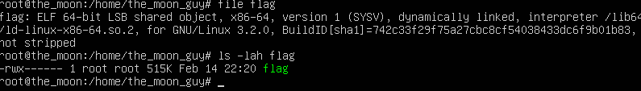
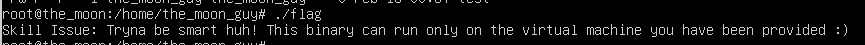
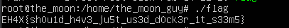

# Docker not allowed

We are given a Vmware (ill come to that later) machine containing multiple file 

- vmdk
- vmx
- vmxf
- nvram

There is a flag in the home of `the_moon_guy` user




Owner by root and we are logged in as `the_moon_guy` 

Usually I would get linpeas.sh and just find myself an privilege escalation but, for this one I'm gonna be smarter.

```bash
sudo modprobe nbd
sudo qemu-nbd -c /dev/nbd0 Docker\ Not\ Allowed.vmdk
sudo mount /dev/nbd0p2 /mnt/vm_disk
```
And I just run the flag elf as root!

```bash
sudo ./flag 
Skill Issue: Tryna be smart huh! This binary can run only on the the virtual machine you have been provided 🙂
```

Aw.. nah its not a skill issue, I was just unaware of this "protection"

So I will edit /etc/sudoers and add
`the_moon_guy ALL=(ALL:ALL) ALL`

Unmounting all that stuff, and starting the vm with qemu because i don't have vmware (vbox dosnt support that format)



OK CHALLENGE... you win... downloading #(%&(#*)) vmware player... 



`EH4X{sh0u1d_h4v3_ju5t_us3d_d0ck3r_1t_s33m5}`