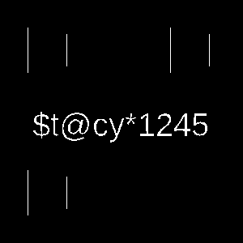

# Tracks
## Forensic
# Description
"The Track Not Taken"

We are given a mp4
```bash
 ffmpeg -i chall.mp4 
ffmpeg version 7.1-3 Copyright (c) 2000-2024 the FFmpeg developers
[...]
Input #0, mov,mp4,m4a,3gp,3g2,mj2, from 'chall.mp4':
  Metadata:
    major_brand     : isom
    minor_version   : 512
    compatible_brands: isomiso2avc1mp41
    encoder         : Lavf60.16.100
  Duration: 00:00:52.12, start: 0.000000, bitrate: 1220 kb/s
  Stream #0:0[0x1](und): Video: h264 (High) (avc1 / 0x31637661), yuv420p(tv, bt709, progressive), 640x360 [SAR 1:1 DAR 16:9], 935 kb/s, 25 fps, 25 tbr, 1000k tbn (default)
      Metadata:
        handler_name    : VideoHandler
        vendor_id       : [0][0][0][0]
        encoder         : Lavc61.19.100 libx264
  Stream #0:1[0x2](und): Audio: mp3 (mp3float) (mp4a / 0x6134706D), 48000 Hz, stereo, fltp, 138 kb/s (default)
      Metadata:
        handler_name    : SoundHandler
        vendor_id       : [0][0][0][0]
  Stream #0:2[0x3](und): Audio: mp3 (mp3float) (mp4a / 0x6134706D), 48000 Hz, stereo, fltp, 138 kb/s
      Metadata:
        handler_name    : SoundHandler
        vendor_id       : [0][0][0][0]
```

Extracting the 2 audio file from the mp4 with ffmpeg. The audio seem the same in both track.
Usual checklist

```bash
 binwalk audio_1.mp3 

DECIMAL       HEXADECIMAL     DESCRIPTION
--------------------------------------------------------------------------------
0             0x0             MP3 ID3 tag, v2.4
489637        0x778A5         JBOOT STAG header, image id: 4, timestamp 0x74EEB0C4, image size: 1356582065 bytes, image JBOOT checksum: 0x1CE9, header JBOOT checksum: 0xA911
899955        0xDBB73         Zip archive data, encrypted at least v1.0 to extract, compressed size: 45, uncompressed size: 33, name: flag.txt
900160        0xDBC40         End of Zip archive, footer length: 22
```
That zipfile contains flag.txt, password protected. rockyou.txt did not work

The other audio file:

```bash
binwalk audio_2.mp3 

DECIMAL       HEXADECIMAL     DESCRIPTION
--------------------------------------------------------------------------------
0             0x0             MP3 ID3 tag, v2.4
489637        0x778A5         JBOOT STAG header, image id: 4, timestamp 0x74EEB0C4, image size: 1356582065 bytes, image JBOOT checksum: 0x1CE9, header JBOOT checksum: 0xA911
899955        0xDBB73         Zip archive data, at least v2.0 to extract, compressed size: 2082, uncompressed size: 2642, name: qrf.png
902179        0xDC423         End of Zip archive, footer length: 22
```

That zip contain a file! `qrf.png`


```bash
zbarimg qrf.png
Connection Error (Failed to connect to socket /run/dbus/system_bus_socket: No such file or directory)
Connection Null
QR-Code:not every qr code should be scanned
scanned 1 barcode symbols from 1 images in 0 seconds
```

So its probably stego heh?

Using stegoveritas



I got the flag! `YB4R{x00zyh$bgcln7_f0p3yx_$n4ws}` oh.. wait.. the prefix should be EHAX... 

Rot? Nope :(
Vignere? Yes!


`EH4X{d00fen$hmirt7_l0v3ed_$t4cy}`