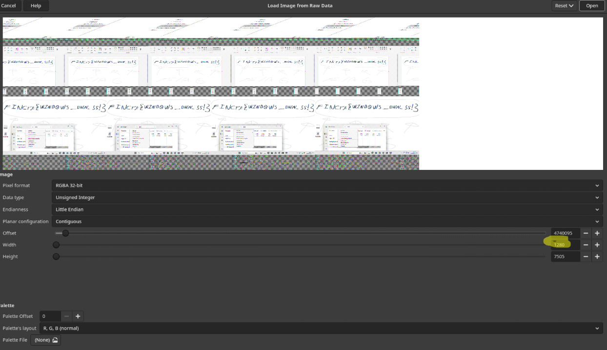

# A work of art!

## Catégorie : Forensic
## Description

    Je suis artiste, et j’étais en train de concevoir mon dernier fond d’écran sur mesure. Il a une taille un peu inhabituelle — 1280×720 — mais j’y ai mis tout mon cœur et mon âme. Honnêtement, c’était l’une de mes plus grandes œuvres à ce jour. Je l’avais même définie comme fond d’écran pour l’admirer pendant que je travaillais.
    Malheureusement, avant que j’aie eu le temps de le sauvegarder, ma station de travail a complètement planté. Tout ce qui a survécu, c’est ce dump mémoire. Un ami m’a dit qu’avec les bons outils, il pourrait encore être possible de récupérer mon chef-d’œuvre à partir de ça. Maintenant, je garde ce dump en espérant que ma création pourra être ressuscitée.

Format du flag
`FINCTF{.*}`

## Solution:

Le fichier est un dump memoire de dwm, Desktop Windows Manager.

Lors de l'ecriture de ce writeup, il etait tard, et je suis lache comme un chat! Donc voici une explication fait avec une IA!

```AI
Explication : DWM et la Persistance des Images

Le Desktop Window Manager (DWM) est le compositeur de fenêtres de Windows (introduit avec Windows Vista). Son rôle principal est de rendre les interfaces utilisateur en mémoire, puis de composer les images finales des fenêtres, des effets visuels (transparence, animations) et du bureau, avant de les envoyer à l'écran.
1. Le Rôle du Frame Buffer et de la Composition

Pour effectuer cette composition, le DWM ne dessine pas directement sur l'écran. Chaque application dessine dans sa propre surface de redirection (une zone de mémoire partagée). Le DWM prend ces surfaces, les redimensionne, applique les effets, et les assemble dans une mémoire tampon finale appelée le frame buffer (ou une structure de mémoire similaire).

    Persistance après l'affichage : Même après qu'une fenêtre est fermée ou minimisée, le DWM peut conserver temporairement la dernière image rendue de cette fenêtre en mémoire. C'est nécessaire pour des transitions rapides, la gestion des miniatures de la barre des tâches (Aero Peek), et pour permettre la restauration rapide du contenu.

2. La Vulnérabilité (Memory Dump)

Lorsqu'un Memory Dump (copie complète ou partielle de la mémoire vive du système) est effectué – que ce soit par un logiciel d'analyse forensique, un débogueur, ou suite à un crash (Blue Screen of Death) – ces zones de mémoire gérées par le DWM et le sous-système graphique peuvent être capturées.

    Informations Sensibles : Les chercheurs ont démontré qu'il est possible de récupérer des informations sensibles (mots de passe tapés, clés secrètes, images affichées) à partir de ces dumps, même si ces informations n'étaient affichées que brièvement. Ces données sont souvent trouvées dans des régions de mémoire allouées au processus dwm.exe ou dans la mémoire vidéo (VRAM).

    Le Cas des Miniatures : Les miniatures de la barre des tâches sont un exemple flagrant. Ces petites images sont des copies en direct de la fenêtre et sont stockées de manière visible en mémoire par le DWM.
```

Donc dans ce data brute, il se cache les images prise lors de la capture memoire.
Ma facon de resoudre ce challenge est un peu loufoque.

Ouvrir le dump avec GIMP, en mode `raw`
Mettre le bon width (1280)
Et naviguer dans le data en modifiant l'offset.



A Work of art `FINCTF{W1ND0WS_DWM_SS!}`

> P.S. Le M pourrait etre confondue avec un N mais le nom du fichier est: dwm.DMP