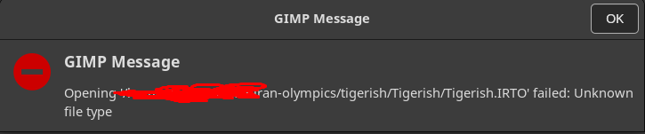
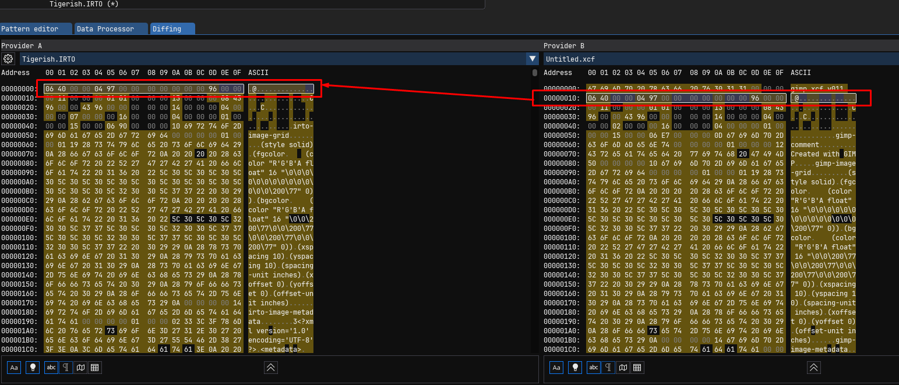
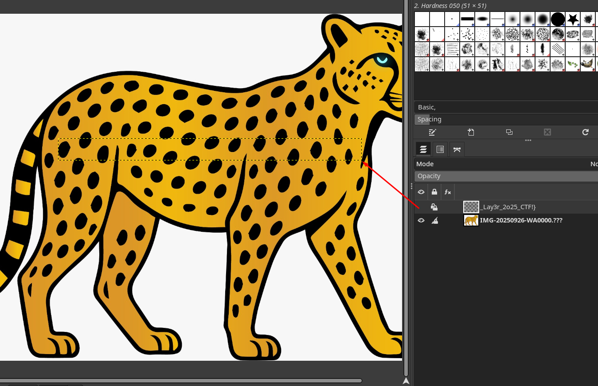
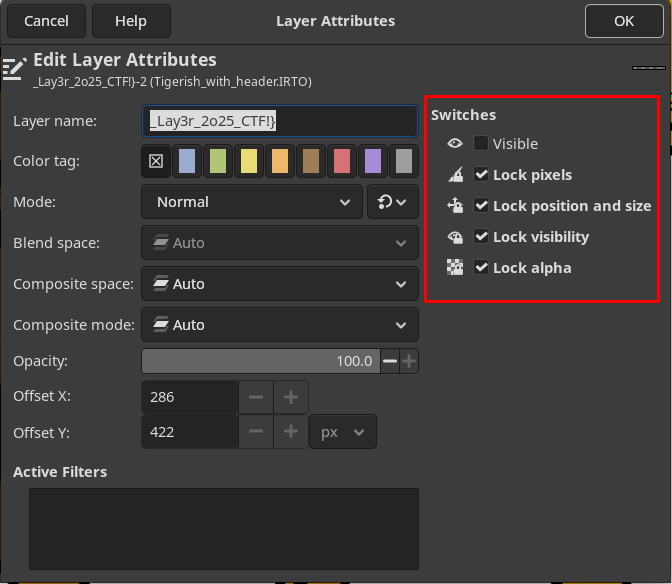
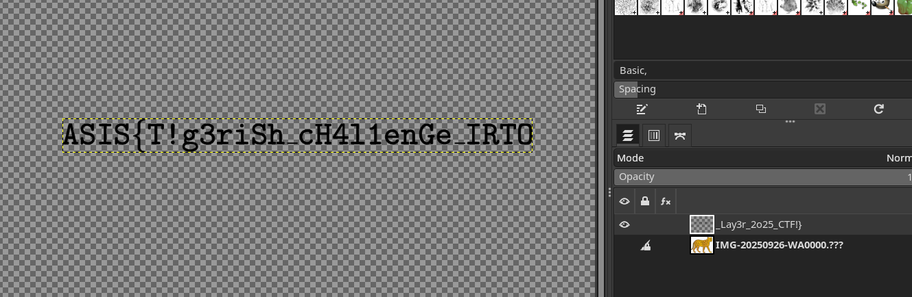

# Tigerish
## Description
```
A file containing important information about a rare species in Iran, Tigerish has been corrupted. Restoring this file will help prevent the extinction of this species.
```

## Given file
    - Tigerish.IRTO


Lets begin, what is an IRTO file?!

```bash
file Tigerish.IRTO 
Tigerish.IRTO: data
```

Lets verify the first bytes of the file
`06 40 00 00 04 97 00 00 00 00 00 00 00 96 00 00`

Nothing seems to match with some simple google search.

Well lets try to see if there is any usefull strings:
```
irto-image-grid
(style solid)
(fgcolor
    (color "R'G'B'A float" 16 "\0\0\0\0\0\0\0\0\0\0\0\0\0\0\200\77" 0))
(bgcolor
    (color "R'G'B'A float" 16 "\0\0\200\77\0\0\200\77\0\0\200\77\0\0\200\77" 0))
(xspacing 10)
(yspacing 10)
(spacing-unit inches)
(xoffset 0)
(yoffset 0)
(offset-unit inches)
irto-image-metadata
3<?xml version='1.0' encoding='UTF-8'?>
<metadata>
  <tag name="Exif.Image.BitsPerSample">8 8 8</tag>
  <tag name="Exif.Image.ImageLength">xxxx</tag>
  <tag name="Exif.Image.ImageWidth">yyyy</tag>
  <tag name="Exif.Image.Orientation">0</tag>
  <tag name="Exif.Image.ResolutionUnit">2</tag>
  <tag name="Exif.Image.XResolution">300/1</tag>
  <tag name="Exif.Image.YResolution">300/1</tag>
  <tag name="Exif.Photo.ColorSpace">1</tag>
  <namespace prefix="tiff" url="http://ns.adobe.com/tiff/1.0/"></namespace>
  <tag name="Xmp.tiff.Orientation">1</tag>
</metadata>
gimp-image-grid
(style solid)
(fgcolor
    (color "R'G'B'A float" 16 "\0\0\0\0\0\0\0\0\0\0\0\0\0\0\200\77" 0))
(bgcolor
    (color "R'G'B'A float" 16 "\0\0\200\77\0\0\200\77\0\0\200\77\0\0\200\77" 0))
(xspacing 10)
(yspacing 10)
(spacing-unit inches)
(xoffset 0)
(yoffset 0)
(offset-unit inches)
jpeg-settings
gimp-image-metadata
<?xml version='1.0' encoding='UTF-8'?>
<metadata>
  <tag name="Exif.Image.BitsPerSample">8 8 8</tag>
  <tag name="Exif.Image.ImageLength">1175</tag>
  <tag name="Exif.Image.ImageWidth">1600</tag>
  <tag name="Exif.Image.ResolutionUnit">2</tag>
  <tag name="Exif.Image.XResolution">300/1</tag>
  <tag name="Exif.Image.YResolution">300/1</tag>
  <tag name="Exif.Photo.ColorSpace">1</tag>
</metadata>
_Lay3r_2o25_CTF!}
```

Oh we already have 2nd or 3rd part of the flag : `_Lay3r_2o25_CTF!}`

We have a few interesting strings also
- `gimp-image-grid`
- `IMG-20250926-WA0000.???`

This make me think its an XCF file from gimp and there is another image embedded into it, probably first part of the flag right?. 

Opening it with gimp yield



Well the description stated it was corrupted. 
I'm not very familliar with gimp but I'm suspicious So I made a brand new xcf file here are the strings
```
gimp xcf v011
gimp-comment
Created with GIMP
gimp-image-grid
(style solid)
(fgcolor
    (color "R'G'B'A float" 16 "\0\0\0\0\0\0\0\0\0\0\0\0\0\0\200\77" 0))
(bgcolor
    (color "R'G'B'A float" 16 "\0\0\200\77\0\0\200\77\0\0\200\77\0\0\200\77" 0))
(xspacing 10)
(yspacing 10)
(spacing-unit inches)
(xoffset 0)
(yoffset 0)
(offset-unit inches)
gimp-image-metadata
g<?xml version='1.0' encoding='UTF-8'?>
<metadata>
  <tag name="Exif.Image.BitsPerSample">8 8 8</tag>
  <tag name="Exif.Image.DateTime">2025:09:26 17:15:31</tag>
  <tag name="Exif.Image.DateTimeOriginal">2025:09:26 17:15:31</tag>
  <tag name="Exif.Image.ImageLength">1175</tag>
  <tag name="Exif.Image.ImageWidth">1600</tag>
  <tag name="Exif.Image.ResolutionUnit">2</tag>
  <tag name="Exif.Image.XResolution">300/1</tag>
  <tag name="Exif.Image.YResolution">300/1</tag>
  <tag name="Exif.Photo.ColorSpace">1</tag>
  <tag name="Exif.Photo.DateTimeDigitized">2025:09:26 17:15:31</tag>
  <tag name="Exif.Photo.DateTimeOriginal">2025:09:26 17:15:31</tag>
  <tag name="Exif.Photo.OffsetTime">-04:00</tag>
  <tag name="Exif.Photo.OffsetTimeDigitized">-04:00</tag>
  <tag name="Exif.Photo.OffsetTimeOriginal">-04:00</tag>
  <namespace prefix="photoshop" url="http://ns.adobe.com/photoshop/1.0/"></namespace>
  <tag name="Xmp.photoshop.DateCreated">2025:09:26T17:15:31-04:00</tag>
  <namespace prefix="xmp" url="http://ns.adobe.com/xap/1.0/"></namespace>
[...]
</metadata>
Background
```

So it is probably an `GIMP XCF image data, version 011`

I notice this also, my new file have this particular string
`gimp xcf v011` that look like an header. Lets inspect the byte shall we?



Aww, the good old CTF trick, I see I see, well I know one way to prepend an header to a file...
```python
# add_xcf_header.py
header = b'gimp xcf v011\x00\x00\x00' # The header from my own gimp file

with open("Tigerish.IRTO", "rb") as f:
    data = f.read() # Read data from original file


new_data = header + data # Prepend the header

with open("Tigerish_with_header.xcf", "wb") as f:
    f.write(new_data)  # Save it as a new file
```

Lets open it with gimp now



We can not see the content of the "2nd part layer" lets remove the lock and show the layer as it is invisible right now






Flag:
`ASIS{T!g3riSh_cH4l1enGe_IRTO_Lay3r_2o25_CTF!}`

And meow meow meow does the tiger....
