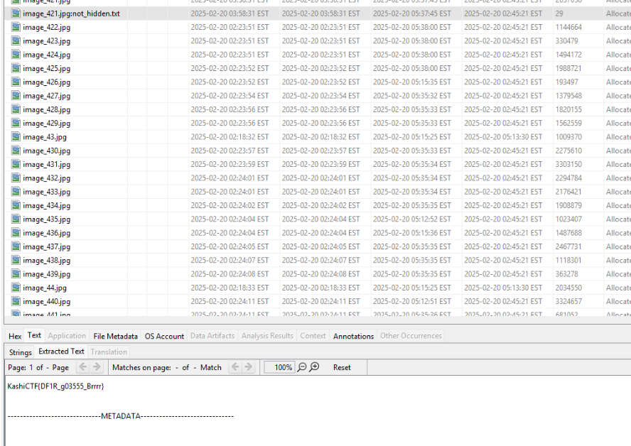

# Memories Bring Back
## Forensic

## Description
> A collection of images, a digital time capsule—preserved in this file. But is every picture really just a picture? A photographer once said, “Every image tells a story, but some stories are meant to stay hidden.” Maybe it’s time to inspect the unseen and find what’s been left behind.

# Solution:

We have:

```bash
file chall 
chall: DOS/MBR boot sector MS-MBR Windows 7 english at offset 0x163 "Invalid partition table" at offset 0x17b "Error loading operating system" at offset 0x19a "Missing operating system", disk signature 0x5032578b; partition 1 : ID=0x7, start-CHS (0x0,2,3), end-CHS (0x7e,254,63), startsector 128, 2041856 sectors
```

As usual opening autopsy, and it was very simple. Another Alternate Data Stream challenge:



Flag is not even in base64 so another simpler solution:

```bash
strings chall | grep -i kashictf
KashiCTF{Fake_Flag}
KashiCTF{Fake_Flag}
KashiCTF{Fake_Flag}
KashiCTF{DF1R_g03555_Brrrr}
```

`KashiCTF{DF1R_g03555_Brrrr}`