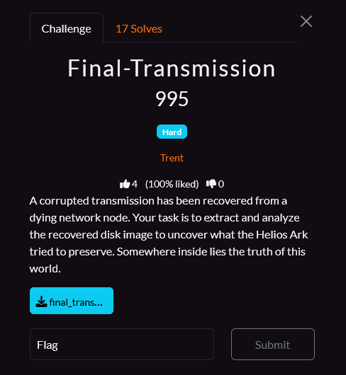
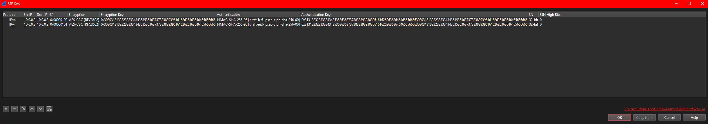
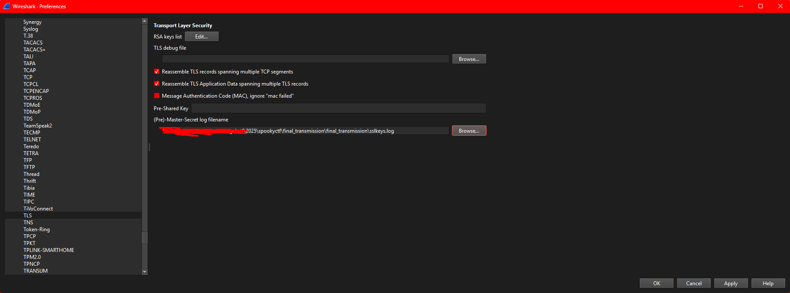
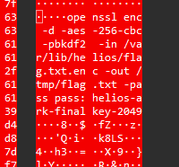

# Final Transmission
## Category: Forensic



## Solution

We have a pcap as well as more text file containing various information

Client.txt:
```
src 10.0.0.3 dst 10.0.0.2
	proto esp spi 0x00000101 reqid 0 mode transport
	replay-window 0 
	auth-trunc hmac(sha256) 0x31313232333334343535363637373838393930306161626263636464656566663030313132323333343435353636373738383939616162626363646465656666 96
	enc cbc(aes) 0x3030313132323333343435353636373738383939616162626363646465656666
	lastused 2025-10-12 17:06:40
	anti-replay context: seq 0x0, oseq 0x0, bitmap 0x00000000
	sel src 0.0.0.0/0 dst 0.0.0.0/0 
src 10.0.0.2 dst 10.0.0.3
	proto esp spi 0x00000100 reqid 0 mode transport
	replay-window 0 
	auth-trunc hmac(sha256) 0x31313232333334343535363637373838393930306161626263636464656566663030313132323333343435353636373738383939616162626363646465656666 96
	enc cbc(aes) 0x3030313132323333343435353636373738383939616162626363646465656666
	lastused 2025-10-12 17:06:40
	anti-replay context: seq 0x0, oseq 0x13c, bitmap 0x00000000
	sel src 0.0.0.0/0 dst 0.0.0.0/0 
```

Server.txt:
```
src 10.0.0.2 dst 10.0.0.3
	proto esp spi 0x00000100 reqid 0 mode transport
	replay-window 0 
	auth-trunc hmac(sha256) 0x31313232333334343535363637373838393930306161626263636464656566663030313132323333343435353636373738383939616162626363646465656666 96
	enc cbc(aes) 0x3030313132323333343435353636373738383939616162626363646465656666
	lastused 2025-10-12 17:06:40
	anti-replay context: seq 0x0, oseq 0x0, bitmap 0x00000000
	sel src 0.0.0.0/0 dst 0.0.0.0/0 
src 10.0.0.3 dst 10.0.0.2
	proto esp spi 0x00000101 reqid 0 mode transport
	replay-window 0 
	auth-trunc hmac(sha256) 0x31313232333334343535363637373838393930306161626263636464656566663030313132323333343435353636373738383939616162626363646465656666 96
	enc cbc(aes) 0x3030313132323333343435353636373738383939616162626363646465656666
	lastused 2025-10-12 17:06:40
	anti-replay context: seq 0x0, oseq 0x389, bitmap 0x00000000
	sel src 0.0.0.0/0 dst 0.0.0.0/0 
```

sslkeys.logs:
```
# TLS secrets log file, generated by OpenSSL / Python
SERVER_HANDSHAKE_TRAFFIC_SECRET 204d0530cdf1d77b7eb2fb7dd7ed9a270103ca35d260ad1c5024d02dfcd8db4c 8613926ddf6ca3aeb59b76cf398033e36e3995338f9e0f4d877af4dcec001c960853e79a63c1ed350208e6c9c08bba42
EXPORTER_SECRET 204d0530cdf1d77b7eb2fb7dd7ed9a270103ca35d260ad1c5024d02dfcd8db4c c410773045c320f177f51f7876da6bbed4065297cc6e6665b778991a04e506871cf68fe7d0cc57714964b5979e5630a8
SERVER_TRAFFIC_SECRET_0 204d0530cdf1d77b7eb2fb7dd7ed9a270103ca35d260ad1c5024d02dfcd8db4c ad2c6a7207229ab9bef233d9dda4b253ec8e3af91605912889c929eb695770bb0ae481f4693d52b85962a212a8173a9f
CLIENT_HANDSHAKE_TRAFFIC_SECRET 204d0530cdf1d77b7eb2fb7dd7ed9a270103ca35d260ad1c5024d02dfcd8db4c dff76502812fcff9fba013ed71d07132ab4ed696025efe29d1f1a39129d742d6970d386e94d37e638a204b2b9e3a34e4
CLIENT_TRAFFIC_SECRET_0 204d0530cdf1d77b7eb2fb7dd7ed9a270103ca35d260ad1c5024d02dfcd8db4c 23646a4b040293d868ea010d49b83afe65e26f284fcd320c974ebccde3339243e2fbb908664bc3e573c184ac00dbdc9a
SERVER_HANDSHAKE_TRAFFIC_SECRET 68bf9e08b499edbb9a8032c95a7c512b8e2639b707447cba3ede8da54bf09205 de98fcbb88ce873173179893bd4a054ea1af14771e9a5bd05a61c23e52e2943dea20cbfb1516dcc8f49334ae9e722ec7
EXPORTER_SECRET 68bf9e08b499edbb9a8032c95a7c512b8e2639b707447cba3ede8da54bf09205 875785672569dca543ab32dc3b94061d1ae9a7c1b5d6be625149871cd734ab2b97d03472210fdc28be009a5f090da9ac
SERVER_TRAFFIC_SECRET_0 68bf9e08b499edbb9a8032c95a7c512b8e2639b707447cba3ede8da54bf09205 998dae629e20544e430b7cfb8d0ad3828f446a713437b0e64b1a25ac700c00756f035654dad5e01dbc4247bce0b0b582
CLIENT_HANDSHAKE_TRAFFIC_SECRET 68bf9e08b499edbb9a8032c95a7c512b8e2639b707447cba3ede8da54bf09205 d4b27f6d7bc96fcee3a45d6164950a7be1ec0504d0ac98377ebe4f6ae5c3e8e5483d729b4bc83fa51faec643c0507a1c
CLIENT_TRAFFIC_SECRET_0 68bf9e08b499edbb9a8032c95a7c512b8e2639b707447cba3ede8da54bf09205 392bef7e85c21ca8768c99df90d08b561872771e2e60063f2099f7c0b4de0bfffb35ac52c5237c6efa7dd76a2fd0ffdb
```

Opening the pcap we have ESP packet in the conversation between `10.0.0.2` and `10.0.0.3`

What is ESP?

ESP — Encapsulating Security Payload — is a component of IPsec that provides confidentiality, and optionally integrity and authentication, for IP packets. It protects the payload (the data carried by the IP packet) by encrypting it and (optionally) adding an integrity check.

- ESP is used with IPsec Security Associations (SAs).
- It operates directly inside IP (it is an IP protocol, not TCP/UDP)

To be able to decrypt this we will need the following:
- Security Parameters Index (SPI) — identifies the IPsec Security Association (SA) that contains the keys and algorithms to use.
- Encryption algorithm (cipher) — e.g., AES-GCM, AES-CBC, ChaCha20-Poly1305; you must know which algorithm was negotiated.
- Encryption key (ESP encryption key) — the symmetric key used to decrypt the ciphertext (derived from the IKE/SA).
- Integrity/authentication algorithm (if used) — e.g., HMAC-SHA256 or implicit AEAD (AES-GCM). Needed to verify integrity/ICV.
- Initialization Vector — per-packet IV or nonce used by the cipher (often carried inside the packet or derived from a salt + sequence number). Necessary for - decryption.

## Decrypting the ESP protocol:

Fortunately the client.txt / server.txt contains all that information we just need to input it into wireshark. After fidgeting a bit for the format of the key

We go into the ESP protocol preference in wireshark and punch it all the right information into the ESP SAs (Security Association)


(Don't forget to tick the check box to make wireshark decrypt it!)

ESP SA file for wireshark (copy paste friendly):
```
# This file is automatically generated, DO NOT MODIFY.
"IPv4","10.0.0.2","10.0.0.3","0x00000100","AES-CBC [RFC3602]","0x3030313132323333343435353636373738383939616162626363646465656666","HMAC-SHA-256-96 [draft-ietf-ipsec-ciph-sha-256-00]","0x31313232333334343535363637373838393930306161626263636464656566663030313132323333343435353636373738383939616162626363646465656666","32-bit","0"
"IPv4","10.0.0.3","10.0.0.2","0x00000101","AES-CBC [RFC3602]","0x3030313132323333343435353636373738383939616162626363646465656666","HMAC-SHA-256-96 [draft-ietf-ipsec-ciph-sha-256-00]","0x31313232333334343535363637373838393930306161626263636464656566663030313132323333343435353636373738383939616162626363646465656666","32-bit","0"
```

Finally we have our packet decrypted out of the ESP protocol. But wait there's more!

## Decrypting the TLS protocol:

We also have SSL logs, which is required to decrypt the TLS packet, this is a bit more easier as the information given are already in the right format.
Once again in protocol preference punch in the information



## Browsing the conversation

Now that we can see the traffic in clear text I notice something immediately:



Lets dump all the TLS decrypted data shall we:
Follow TLS stream and save as binary: raw1.bin

```bash
binwalk raw1.bin  

DECIMAL       HEXADECIMAL     DESCRIPTION
--------------------------------------------------------------------------------
0             0x0             SQLite 3.x database,
12205         0x2FAD          Unix path: /var/lib/helios/flag.txt.enc -out /tmp/flag.txt -pass pass:helios-ark-finalkey-2049
484549        0x764C5         OpenSSL encryption, salted, salt: 0x506CA54449EB15C6
486356        0x76BD4         OpenSSL encryption, salted, salt: 0x46BB6F3655A08B70
488467        0x77413         OpenSSL encryption, salted, salt: 0x6375DEF5DAD6A96A
488540        0x7745C         OpenSSL encryption, salted, salt: 0xD2BA19FEB2BAD1CC
488672        0x774E0         OpenSSL encryption, salted, salt: 0x266ADA17652AED33
```
Sqlite 3?

```bash
file raw1 
raw1: SQLite 3.x database, last written using SQLite version 3045001, writer version 2, read version 2, file counter 2, database pages 120, cookie 0x2, schema 4, UTF-8, version-valid-for 2
```

## Digging into the database
```bash
sqlite3 raw1.bin
SQLite version 3.46.1 2024-08-13 09:16:08
Enter ".help" for usage hints.
sqlite> .tables
admin_log  uploads  
```
```sql
sqlite> select * from admin_log;
1|openssl enc -d -aes-256-cbc -pbkdf2 -in /var/lib/helios/flag.txt.enc -out /tmp/flag.txt -pass pass:helios-ark-finalkey-2049
```
This command uses OpenSSL to decrypt a file encrypted with AES-256-CBC (the input /var/lib/helios/flag.txt.enc) using a passphrase-derived key (PBKDF2) and writes the plaintext to /tmp/flag.txt; the passphrase is supplied directly on the command line (helios-ark-finalkey-2049).

Token-by-token breakdown:
- openssl — the OpenSSL command line tool.
- enc — use the symmetric cipher "enc" utility (encrypt/decrypt).
- -d — decrypt (opposite of -e / encrypt).
- -aes-256-cbc — cipher algorithm: AES with 256-bit key in CBC mode.
- -pbkdf2 — use PBKDF2 to derive the encryption key from the provided passphrase (better than the old, weak default KDF). The file usually contains a salt (OpenSSL Salted__ - header) which PBKDF2 uses.
- -in /var/lib/helios/flag.txt.enc — input ciphertext file to decrypt.
- -out /tmp/flag.txt — output file for the decrypted plaintext.
- -pass pass:helios-ark-finalkey-2049 — supply the passphrase directly (pass: scheme).

Thats great but we don't have the encrypted flag...yet!

```bash
sqlite> .schema uploads
CREATE TABLE uploads(id INTEGER PRIMARY KEY, name TEXT, data BLOB);
sqlite> select name from uploads;
helios_archive.tar.gz.enc
photo1.enc
photo2.enc
manifesto.txt.enc
flag.txt.enc
notes.txt
```
I'm very interested into the flag.txt.enc file !

I'm a python guy so here is how I extracted the flag.txt.enc
```python
import sys, sqlite3

if len(sys.argv) != 2:
    print("Usage: {} path/to/db.sqlite".format(sys.argv[0]))
    sys.exit(1)

db = sys.argv[1]
outname = "flag.txt.enc"

con = sqlite3.connect(db)
cur = con.cursor()
cur.execute("SELECT data FROM uploads WHERE name = ?", ("flag.txt.enc",))
row = cur.fetchone()
if not row:
    print("No row found for name=flag.txt.enc")
    sys.exit(2)

blob = row[0]
with open(outname, "wb") as f:
    f.write(blob)

print(f"Wrote {outname} ({len(blob)} bytes)")
con.close()
```

## Decrypting the final flag

Now using the previous command (slightly altered for my needs)
```bash
openssl enc -d -aes-256-cbc -pbkdf2 -in flag.txt.enc -out finally_did_it.txt -pass pass:helios-ark-finalkey-2049
```
Yield

`NICC{ARK_SIG_7F3A1B}`

And `The file is not displayed in the text editor because it is either binary or uses an unsupported text encoding.` does the vscode in a forensic challenge.