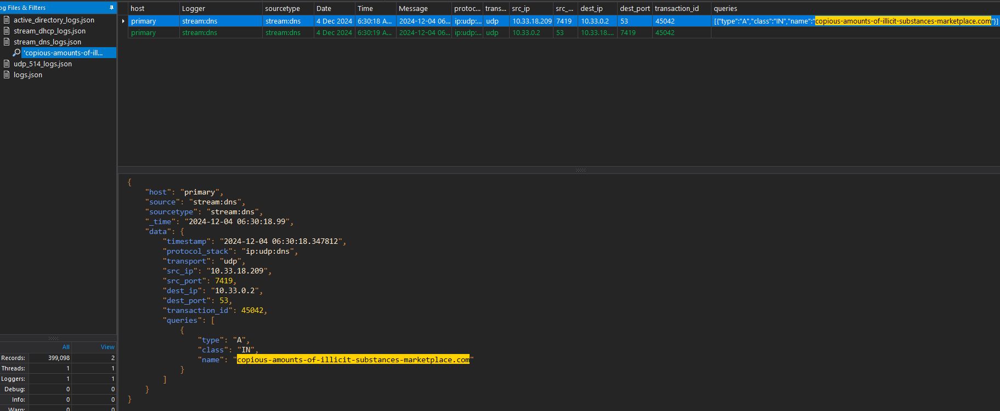
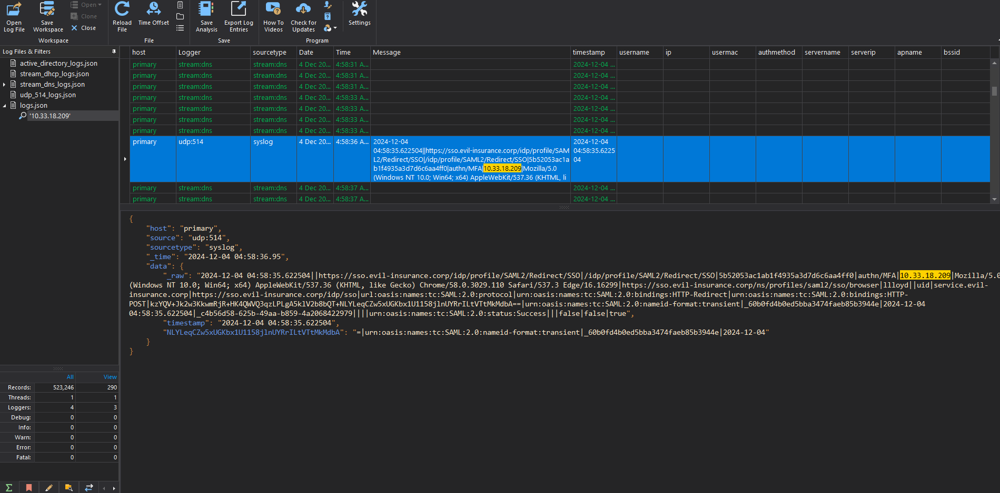

# Trace EM

We are given logs.json

Which is about 25mb of json data.

Openning it with LogViewPlus we have 4 loggers
- ActiveDirectory 
- stream:dhcp 
- stream:dns 
- udp:514

I'm a lazy cat so I splited the log for LogViewPlus auto-formatter to add all the proper column. (Which I still had to edit manually afterward)

```bash
cat logs.json | jq -c '. | select(.source == "stream:dhcp")' > stream_dhcp_logs.json
cat logs.json | jq -c '. | select(.source == "stream:dns")' > stream_dns_logs.json
cat logs.json | jq -c '. | select(.source == "udp:514")' > udp_514_logs.json
cat logs.json | jq -c '. | select(.source == "ActiveDirectory")' > active_directory_logs.json
```

I have no idea what I am looking for, description says ISP caught an illegal activity. 

So I began to investigate on the DNS logs. I dumped all the domain requested with some bash (10 MB! before removing duplicate)

I won't put the dump in this depot as its still huge, but this came to my attention
```
"name":"copious-amounts-of-illicit-substances-marketplace.com"
```



The requests
```json
{
    "host": "primary",
    "source": "stream:dns",
    "sourcetype": "stream:dns",
    "_time": "2024-12-04 06:30:18.99",
    "data": {
        "timestamp": "2024-12-04 06:30:18.347812",
        "protocol_stack": "ip:udp:dns",
        "transport": "udp",
        "src_ip": "10.33.18.209",
        "src_port": 7419,
        "dest_ip": "10.33.0.2",
        "dest_port": 53,
        "transaction_id": 45042,
        "queries": [
            {
                "type": "A",
                "class": "IN",
                "name": "copious-amounts-of-illicit-substances-marketplace.com"
            }
        ]
    }
}
```
This is suspect indeed, this give us some information:

The IP of the user that made the DNS request: 10.33.18.209

We have probably corelate this to other logs lets check it out



```json
{
    "host": "primary",
    "source": "udp:514",
    "sourcetype": "syslog",
    "_time": "2024-12-04 04:58:36.95",
    "data": {
        "_raw": "2024-12-04 04:58:35.622504||https://sso.evil-insurance.corp/idp/profile/SAML2/Redirect/SSO|/idp/profile/SAML2/Redirect/SSO|5b52053ac1ab1f4935a3d7d6c6aa4ff0|authn/MFA|10.33.18.209|Mozilla/5.0 (Windows NT 10.0; Win64; x64) AppleWebKit/537.36 (KHTML, like Gecko) Chrome/58.0.3029.110 Safari/537.3 Edge/16.16299|https://sso.evil-insurance.corp/ns/profiles/saml2/sso/browser|llloyd||uid|service.evil-insurance.corp|https://sso.evil-insurance.corp/idp/sso|url:oasis:names:tc:SAML:2.0:protocol|urn:oasis:names:tc:SAML:2.0:bindings:HTTP-Redirect|urn:oasis:names:tc:SAML:2.0:bindings:HTTP-POST|kzYQV+Jk2w3KkwmRjR+HK4QWVQ3qzLPLgA5klV2b8bQT+NLYLeqCZw5xUGKbx1U1158jlnUYRrILtVTtMkMdbA==|urn:oasis:names:tc:SAML:2.0:nameid-format:transient|_60b0fd4b0ed5bba3474faeb85b3944e|2024-12-04 04:58:35.622504|_c4b56d58-625b-49aa-b859-4a2068422979||||urn:oasis:names:tc:SAML:2.0:status:Success|||false|false|true",
        "timestamp": "2024-12-04 04:58:35.622504",
        "NLYLeqCZw5xUGKbx1U1158jlnUYRrILtVTtMkMdbA": "=|urn:oasis:names:tc:SAML:2.0:nameid-format:transient|_60b0fd4b0ed5bba3474faeb85b3944e|2024-12-04"
    }
}
```

By the url `llloyd` is our guy

`irisctf{llloyd}`