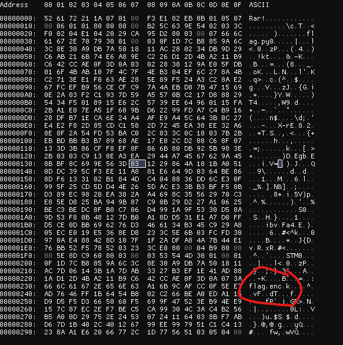
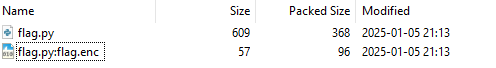

# Decrypt Me:

## Description
>I encrypted my encryption script, but I forgot the password. Can you help me decrypt it?

We have `flag.rar`

It is password protected. As usual... `rar2john`
give us this:

```
flag.rar:$rar5$16$1d7cb8859a6c3c8e30a9db7a501811ac$15$280234db9d29c6ab216b74e6a89ec226$8$d12d4ba211b9c642
flag.rar:$rar5$16$1d7cb8859a6c3c8e30a9db7a501811ac$15$7d06143b1a7dab3327b3ef1e41ad881a$8$d12d4ba211b9c64
```

After running the usual `rockyou.txt`

```bash
john hash.txt --show
flag.rar:toronto416
flag.rar:toronto416

2 password hashes cracked, 0 left
```

```bash
unrar l flag.rar

UNRAR 7.10 beta 1 freeware      Copyright (c) 1993-2024 Alexander Roshal

Archive: flag.rar
Details: RAR 5

 Attributes      Size     Date    Time   Name
----------- ---------  ---------- -----  ----
*   ..A....       609  2025-01-05 21:13  flag.py
----------- ---------  ---------- -----  ----
                  609                    1
```

The python script

```python
from Crypto.Cipher import AES
from Crypto.Util.Padding import pad
from Crypto.Hash import SHA256
from time import time
import random
random.seed(int(time()))
KEY = SHA256.new(str(random.getrandbits(256)).encode()).digest()
FLAG = "uoftctf{fake_flag}"

def encrypt_flag(flag, key):
    cipher = AES.new(key, AES.MODE_EAX)
    ciphertext, tag = cipher.encrypt_and_digest(flag.encode())
    return cipher.nonce + ciphertext

def main():
    encrypted_flag = encrypt_flag(FLAG, KEY)
    with open("flag.enc", "wb") as f:
        f.write(encrypted_flag)

if __name__ == "__main__":
    main()
```

So we know how he encrypted the flag.... but.. where is the flag?

I don't use often `rar`

I ended up looking at the HEX



Getting the rar on my hosts and opening it with 7zip



So our flag file is in the alternate data stream. 

Now if we find the same seed value we should be able to decrypt it. 
In 7zip 2025-01-05 21:13

Unfortunately it was not working. So I though I'm lacking precision

```bash
stat flag.enc 
  File: flag.enc
  Size: 57              Blocks: 8          IO Block: 4096   regular file
Device: 8,32    Inode: 33580605    Links: 1
Access: (0644/-rw-r--r--)  Uid: ( 1000/     tma)   Gid: ( 1000/     tma)
Access: 2025-01-12 19:14:07.207626321 -0500
Modify: 2025-01-05 21:13:39.975991200 -0500
Change: 2025-01-11 12:14:27.811975021 -0500
 Birth: 2025-01-11 12:13:21.181983525 -0500
 ```

Ok now I have a more precise time

```bash
date -d "2025-01-05 21:13:39" +%s
1736129619
```

Now lets write a script of the decryption


```python
from Crypto.Cipher import AES
from Crypto.Hash import SHA256
import random
from time import time
import sys


input_file = "flag.enc"


random.seed(1736129619)
KEY = SHA256.new(str(random.getrandbits(256)).encode()).digest()


def decrypt_flag(encrypted_data, key):
    nonce = encrypted_data[:16] 
    ciphertext = encrypted_data[16:]  
    
    cipher = AES.new(key, AES.MODE_EAX, nonce=nonce)
    decrypted_data = cipher.decrypt(ciphertext)
    return decrypted_data


with open(input_file, "rb") as f:
    encrypted_data = f.read()


decrypted_flag = decrypt_flag(encrypted_data, KEY)


print(decrypted_flag.decode())
```

`uoftctf{ads_and_aes_are_one_letter_apart}`

But after the CTF was over, by speaking with other contestant, I learned something about rar!
You can see Alternate Data Stream with it!
``` bash
unrar vta flag.rar

UNRAR 7.10 beta 1 freeware      Copyright (c) 1993-2024 Alexander Roshal

Archive: flag.rar
Details: RAR 5

        Name: flag.py
        Type: File
        Size: 609
 Packed size: 368
       Ratio: 60%
       mtime: 2025-01-05 21:13:39,975991200
  Attributes: ..A....
   CRC32 MAC: D295CA29
     Host OS: Windows
 Compression: RAR 5.0(v50) -m3 -md=128k
       Flags: encrypted 

        Name: STM
        Type: NTFS alternate data stream
      Target: :flag.enc
        Size: 57
 Packed size: 96
       Ratio: 168%
  Attributes: .B
       CRC32: 60C98D5E
     Host OS: Windows
 Compression: RAR 5.0(v50) -m3 -md=128k
       Flags: encrypted 

     Service: EOF
```

Meow does the cat