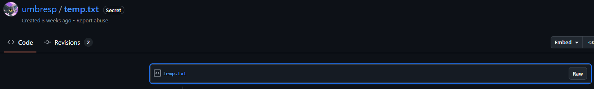
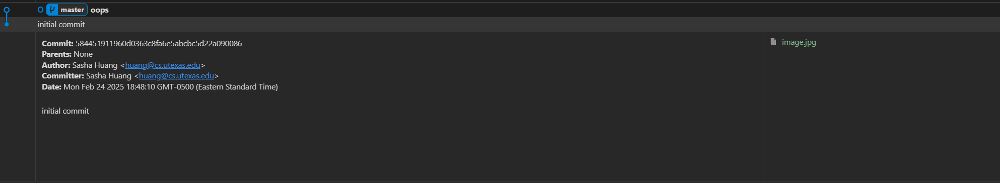

# Down the Rabbit Hole
# Misc
## Description:
> Note: The initial scope for this challenge is just the Discord server itself, and not any persons or individuals. Unofficial content is not in scope.

# Solution

Using the API i did query the channel endpoint and this came out
```bash
curl -X GET "https://discord.com/api/v10/guilds/543208473022955550/channels" -H "Authorization: <auth_toke>"
```

```json
  {
    "id": "1343704741812764792",
    "type": 0,
    "last_message_id": "1343704779083485256",
    "flags": 0,
    "guild_id": "543208473022955550",
    "name": "admin-only",
    "parent_id": "806995482449674280",
    "rate_limit_per_user": 0,
    "topic": "Planning doc: https://docs.google.com/document/d/1cgFhoHKLEbbJlu1SX4gCfFI4CGEEoEisiFq1CW-TKUo/\nAdmin password: Bdm@9D/]J^7@9[D(",
    "position": 5,
    "permission_overwrites": [
      {
        "id": "543208473022955550",
        "type": 0,
        "allow": "0",
        "deny": "1024"
      }
    ],
    "nsfw": false
  },
  ```
Going here

```
https://docs.google.com/document/d/1cgFhoHKLEbbJlu1SX4gCfFI4CGEEoEisiFq1CW-TKUo/edit?tab=t.0#heading=h.ypgfsa6mt56r
```

I downloaded the doc in markdown `asset/UTCTF 2025 Operational Notes.md`

The link shown actually send us to GitHub

https://gist.github.com/umbresp/5275f23f615c9bdcb21c463ac4b87c3c




The GIST have 2 revision

This has been added then removed:

`aHR0cHM6Ly9tZWdhLm56L2ZpbGUvSEhnUjFSUkw=`

Lets decode that b64 strings: `https://mega.nz/file/HHgR1RRL`

It required a decyption key and `Admin password: Bdm@9D/]J^7@9[D(` does not work.

Searching a bit I went back on the google doc and proceed to download other format of the file and in txt `asset/UTCTF 2025 Operational Notes.txt` there is an extra-line?! What?!

`WPPVY-9YgdHlRZjIWlYWnyST4lqZiILaA_tpGt3bqVU` Which is the mega decryption key. 
So we get a zipfile password protected and `Admin password: Bdm@9D/]J^7@9[D(` was the password to it

Inside we have a git depot



Checking out that first commit (Both commit contains a different bunny image)

And... Lets start the usual stego checklist?

Nothing came out, and then I remember that strings `Coq\IP1o7hr#yyW7` in the doc (need to assemble it as each char are on a different line)

Starting with good old steghide

```bash
steghide extract -sf image.jpg 
Enter passphrase: Coq\IP1o7hr#yyW7
wrote extracted data to "emb2.txt".

cat emb2.txt 
utflag{f0ll0w1ng_th3_wh1t3_r4bb1t_:3}
```

`utflag{f0ll0w1ng_th3_wh1t3_r4bb1t_:3}`

And gruik-gruik does the rabbit 🐰🐰🐰🐰🐰