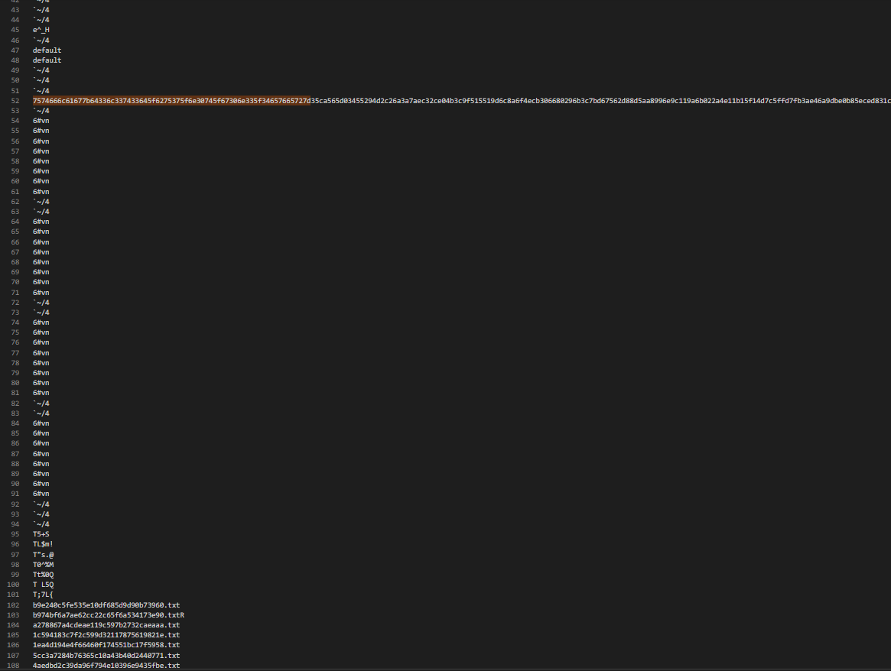

# Forgotten Footprints
## Forensic
## Description

>I didn't want anyone to find the flag, so I hid it away. Unfortunately, I seem to have misplaced it.

# Given:
- disk.img

# Solution

What do we have here:

```bash
disk.img: BTRFS Filesystem sectorsize 4096, nodesize 16384, leafsize 16384, UUID=19796fde-a3e0-4003-a5c6-607e2f34b80f, 2375680/131072000 bytes used, 1 devices
```
I CAN'T BELIEVE ITS NOT BUTTER!

Lets mount that up shall we?

```bash
sudo mount -o loop disk.img /mnt/unlock
```

File list:

<details>

```bash
ls -lah
total 2.0M
drwxr-xr-x  1 tma  tma   18K Mar 13 03:21 .
drwxr-xr-x 24 root root 4.0K Mar 10 16:27 ..
-rw-r--r--  1 tma  tma  8.0K Mar 13 03:21 00ceb2ed7a9a475d66c86d16ea9a5d36.txt
-rw-r--r--  1 tma  tma  8.0K Mar 13 03:21 00d7f3cf9ea2f6b0ab718041ab3f5ea4.txt
-rw-r--r--  1 tma  tma  8.0K Mar 13 03:21 01d3003a5b3b1f79457f5f9d625fdcd3.txt
-rw-r--r--  1 tma  tma  8.0K Mar 13 03:21 055f8cf970aaae3c4d5d6a5b8a53cf1b.txt
-rw-r--r--  1 tma  tma  8.0K Mar 13 03:21 05885302809b59d7e3fb9f0d2fd1e168.txt
-rw-r--r--  1 tma  tma  8.0K Mar 13 03:21 060dc77d7342b51aad80410a0049abaa.txt
-rw-r--r--  1 tma  tma  8.0K Mar 13 03:21 06a381ea77e934e518cdc15da4cade0e.txt
-rw-r--r--  1 tma  tma  8.0K Mar 13 03:21 076844fd1cf63bfa18dd5780cf3f0eba.txt
-rw-r--r--  1 tma  tma  8.0K Mar 13 03:21 07ffeabdccab4491dd2612384808f8eb.txt
-rw-r--r--  1 tma  tma  8.0K Mar 13 03:21 0871fbecc6befd2eea2c3fec3876708d.txt
-rw-r--r--  1 tma  tma  8.0K Mar 13 03:21 087fdc216a55c9937b232c248180329c.txt
-rw-r--r--  1 tma  tma  8.0K Mar 13 03:21 094ab5958b742f7b68b56e4ab0018ff5.txt
-rw-r--r--  1 tma  tma  8.0K Mar 13 03:21 0989207ed3ae819bc84535c40089ad23.txt
-rw-r--r--  1 tma  tma  8.0K Mar 13 03:21 0c49baffcc12b24f4dc303b470f34b34.txt
-rw-r--r--  1 tma  tma  8.0K Mar 13 03:21 0eadbad0654e7e65d1a1f18d7c7c625c.txt
-rw-r--r--  1 tma  tma  8.0K Mar 13 03:21 0edb8fc7eeba079a952fd2214c409fc9.txt
-rw-r--r--  1 tma  tma  8.0K Mar 13 03:21 1167193a258d6820670065d6f537983d.txt
-rw-r--r--  1 tma  tma  8.0K Mar 13 03:21 12af7c4937af19e477e992ca04879b9b.txt
-rw-r--r--  1 tma  tma  8.0K Mar 13 03:21 12c243ae147ad4eb4201481b101366a8.txt
-rw-r--r--  1 tma  tma  8.0K Mar 13 03:21 12e8880125043f34cab0a77e964c8490.txt
-rw-r--r--  1 tma  tma  8.0K Mar 13 03:21 1362130475cfbd994b9523d10f346722.txt
-rw-r--r--  1 tma  tma  8.0K Mar 13 03:21 14d6de7818fad45b9be2bcecefab5087.txt
-rw-r--r--  1 tma  tma  8.0K Mar 13 03:21 15007bb1b2d9915be7223c65bd2bb9c9.txt
-rw-r--r--  1 tma  tma  8.0K Mar 13 03:21 15281b46748f740a7ba7f80e0058c4e4.txt
-rw-r--r--  1 tma  tma  8.0K Mar 13 03:21 15e4dec1654bc2c1d2712cd407d7f307.txt
-rw-r--r--  1 tma  tma  8.0K Mar 13 03:21 187fd1b1f62bf53283d219370a7706da.txt
-rw-r--r--  1 tma  tma  8.0K Mar 13 03:21 18953ff58ea03efbd10c717ba71dc400.txt
-rw-r--r--  1 tma  tma  8.0K Mar 13 03:21 19a443a3c90af244052003b9ec9bbb2c.txt
-rw-r--r--  1 tma  tma  8.0K Mar 13 03:21 1afec71268efb74472885284e9572131.txt
-rw-r--r--  1 tma  tma  8.0K Mar 13 03:21 1c594183c7f2c599d32117875619821e.txt
-rw-r--r--  1 tma  tma  8.0K Mar 13 03:21 1cd1bffc3c3061399bdb3fff2acb77bf.txt
-rw-r--r--  1 tma  tma  8.0K Mar 13 03:21 1e2e9812e6306811f5adff5616df72f5.txt
-rw-r--r--  1 tma  tma  8.0K Mar 13 03:21 1ea4d194e4f66460f174551bc17f5958.txt
-rw-r--r--  1 tma  tma  8.0K Mar 13 03:21 209d3acf9a9585513a21be602f8133c0.txt
-rw-r--r--  1 tma  tma  8.0K Mar 13 03:21 21e6129b5a9ec245fa74ce4dc5e45da5.txt
-rw-r--r--  1 tma  tma  8.0K Mar 13 03:21 22f305b98c0753c5d83c4edd87ae2164.txt
-rw-r--r--  1 tma  tma  8.0K Mar 13 03:21 258e34769844a3af54617e43c99d35b2.txt
-rw-r--r--  1 tma  tma  8.0K Mar 13 03:21 262e3cf7e900c1b5296092c272da7a00.txt
-rw-r--r--  1 tma  tma  8.0K Mar 13 03:21 26f568e51110f3a6fe4e471d13aa3617.txt
-rw-r--r--  1 tma  tma  8.0K Mar 13 03:21 27257325c555e7783fad6798e7d5221e.txt
-rw-r--r--  1 tma  tma  8.0K Mar 13 03:21 2844326c958240e239d7955ea674812b.txt
-rw-r--r--  1 tma  tma  8.0K Mar 13 03:21 28ce13c5cb7fd43c3c2ace9d32ccbec9.txt
-rw-r--r--  1 tma  tma  8.0K Mar 13 03:21 2a00f04b135303d9354622254a4732fb.txt
-rw-r--r--  1 tma  tma  8.0K Mar 13 03:21 2aefafa708feb8d7c05ffb6c552b3629.txt
-rw-r--r--  1 tma  tma  8.0K Mar 13 03:21 2b8a95600262f13e7afb24e4b0b50b6e.txt
-rw-r--r--  1 tma  tma  8.0K Mar 13 03:21 2dab597228d4a54c0b7ddb174b2f90ef.txt
-rw-r--r--  1 tma  tma  8.0K Mar 13 03:21 2dc64511430f6b82af2fb0670ed27a97.txt
-rw-r--r--  1 tma  tma  8.0K Mar 13 03:21 2ddd45b2d8ec0793c42d1b847d186078.txt
-rw-r--r--  1 tma  tma  8.0K Mar 13 03:21 2de4c3ec8acaf8bc9ab4739de9dfa7bb.txt
-rw-r--r--  1 tma  tma  8.0K Mar 13 03:21 2e1facc7f78671e2c935453654558a3f.txt
-rw-r--r--  1 tma  tma  8.0K Mar 13 03:21 2e467e901d123724941329a727b0bf50.txt
-rw-r--r--  1 tma  tma  8.0K Mar 13 03:21 2f168ea7ec03859f5454c4257472df1b.txt
-rw-r--r--  1 tma  tma  8.0K Mar 13 03:21 2f26b97ce51a92621053ffede18b3ca9.txt
-rw-r--r--  1 tma  tma  8.0K Mar 13 03:21 310946b435c5ba157d6e1b4ac415d66a.txt
-rw-r--r--  1 tma  tma  8.0K Mar 13 03:21 3152c1e78efd2cb821d710ed015b3d5b.txt
-rw-r--r--  1 tma  tma  8.0K Mar 13 03:21 315dc5fc59825076b011dd046c8491d2.txt
-rw-r--r--  1 tma  tma  8.0K Mar 13 03:21 3207cbeef8533ecbdc2a29495ffaebd4.txt
-rw-r--r--  1 tma  tma  8.0K Mar 13 03:21 341d6de50d2e2cae8b368198c24245b2.txt
-rw-r--r--  1 tma  tma  8.0K Mar 13 03:21 3469699cae3ab215ae15be3bd3e83601.txt
-rw-r--r--  1 tma  tma  8.0K Mar 13 03:21 3484780774380c66a05a18b243b22a6f.txt
-rw-r--r--  1 tma  tma  8.0K Mar 13 03:21 354b79b58f379d877223f0cadc8710f2.txt
-rw-r--r--  1 tma  tma  8.0K Mar 13 03:21 3621ba3417815a40cd18e9d8b3a33dd9.txt
-rw-r--r--  1 tma  tma  8.0K Mar 13 03:21 364235bd7c0b8cf5508ea9c1cf3e82e2.txt
-rw-r--r--  1 tma  tma  8.0K Mar 13 03:21 372baded9d6db5ae1f8202179d369b61.txt
-rw-r--r--  1 tma  tma  8.0K Mar 13 03:21 3bcd39fcbe153cd3fc588cc73db918bd.txt
-rw-r--r--  1 tma  tma  8.0K Mar 13 03:21 3be6e1f1a3afc9e898e54e64c10922a6.txt
-rw-r--r--  1 tma  tma  8.0K Mar 13 03:21 3dac44d415ccaa1740f2fabfa5d73c55.txt
-rw-r--r--  1 tma  tma  8.0K Mar 13 03:21 3ebe329eab0f6d6e69d250f26bda705b.txt
-rw-r--r--  1 tma  tma  8.0K Mar 13 03:21 3f9c5bffc5891ef0a2ed2b625478b8ab.txt
-rw-r--r--  1 tma  tma  8.0K Mar 13 03:21 3fad9deeaed95ad3ea736b4d2892c261.txt
-rw-r--r--  1 tma  tma  8.0K Mar 13 03:21 413a0a8a60f56bcff8d8b7096c2640df.txt
-rw-r--r--  1 tma  tma  8.0K Mar 13 03:21 42c1dae1a66df7e3041b3d3aa6cfb5d3.txt
-rw-r--r--  1 tma  tma  8.0K Mar 13 03:21 42d93e3d7c464a1f47f24af7d0dbe4dd.txt
-rw-r--r--  1 tma  tma  8.0K Mar 13 03:21 43fa5a31db7b42a289091b47f9b0141e.txt
-rw-r--r--  1 tma  tma  8.0K Mar 13 03:21 443be4acf192337ffc71635b55362506.txt
-rw-r--r--  1 tma  tma  8.0K Mar 13 03:21 444f108a5723c4d79c8a6afacd9d7320.txt
-rw-r--r--  1 tma  tma  8.0K Mar 13 03:21 4695fa768752d781740e18789ebfa648.txt
-rw-r--r--  1 tma  tma  8.0K Mar 13 03:21 46a3d3dfe4cc5edf61a4b09987d90119.txt
-rw-r--r--  1 tma  tma  8.0K Mar 13 03:21 475a42527611db9e5b06531baf140ae2.txt
-rw-r--r--  1 tma  tma  8.0K Mar 13 03:21 478dbc4353f1414466261d560dbe2185.txt
-rw-r--r--  1 tma  tma  8.0K Mar 13 03:21 47c76319bf3dad58947f80ecf9e4da8c.txt
-rw-r--r--  1 tma  tma  8.0K Mar 13 03:21 48bffed92d2e09bb7dd41cc8ed2e568c.txt
-rw-r--r--  1 tma  tma  8.0K Mar 13 03:21 48dbd213dd2521fe50cbe00d5f7a6dd2.txt
-rw-r--r--  1 tma  tma  8.0K Mar 13 03:21 4adc18686ac91eae98dd914abe132a60.txt
-rw-r--r--  1 tma  tma  8.0K Mar 13 03:21 4aedbd2c39da96f794e10396e9435fbe.txt
-rw-r--r--  1 tma  tma  8.0K Mar 13 03:21 4b4eb28461e2048e6f0e89be8b18e73b.txt
-rw-r--r--  1 tma  tma  8.0K Mar 13 03:21 4b54539574739634bbe76c1e6962e561.txt
-rw-r--r--  1 tma  tma  8.0K Mar 13 03:21 4b86bd9ae3c8ab75b673169ebe82723d.txt
-rw-r--r--  1 tma  tma  8.0K Mar 13 03:21 4b9f942e0fc31081ef174d6c7990c1ac.txt
-rw-r--r--  1 tma  tma  8.0K Mar 13 03:21 4d0476f708e8bea1d75e5440a506cd0b.txt
-rw-r--r--  1 tma  tma  8.0K Mar 13 03:21 506446504bc2d135743717a032672551.txt
-rw-r--r--  1 tma  tma  8.0K Mar 13 03:21 519c0c9f1aa773515b7bc8ab13e035f9.txt
-rw-r--r--  1 tma  tma  8.0K Mar 13 03:21 52d3f88366b45643a71779b2d8853b6b.txt
-rw-r--r--  1 tma  tma  8.0K Mar 13 03:21 5469c60642b8598570df04b940aa58ed.txt
-rw-r--r--  1 tma  tma  8.0K Mar 13 03:21 54876dc854aeba201032b80b1786bc35.txt
-rw-r--r--  1 tma  tma  8.0K Mar 13 03:21 55f1f18171697d415856ffd99f29b4a7.txt
-rw-r--r--  1 tma  tma  8.0K Mar 13 03:21 578bffb1f1812b3816846a059cd4ce2e.txt
-rw-r--r--  1 tma  tma  8.0K Mar 13 03:21 57fab9ced172c04814968066fc69bcd0.txt
-rw-r--r--  1 tma  tma  8.0K Mar 13 03:21 59b4b8d8e33aa563dc5321324acc6fde.txt
-rw-r--r--  1 tma  tma  8.0K Mar 13 03:21 5aacb7e5664f60e2e5fd3cfc17004ede.txt
-rw-r--r--  1 tma  tma  8.0K Mar 13 03:21 5b2378bfff0cf96052731fd94a1f516c.txt
-rw-r--r--  1 tma  tma  8.0K Mar 13 03:21 5cc3a7284b76365c10a43b40d2440771.txt
-rw-r--r--  1 tma  tma  8.0K Mar 13 03:21 5d18e1d71d2cc4de63c1f7a163b06037.txt
-rw-r--r--  1 tma  tma  8.0K Mar 13 03:21 5e1a255e6b91ce691d4bd432939c2979.txt
-rw-r--r--  1 tma  tma  8.0K Mar 13 03:21 5fdbddeb365570eff4ac08b1b2db13e2.txt
-rw-r--r--  1 tma  tma  8.0K Mar 13 03:21 60b1958bac93c125fa73c08fe5dc0055.txt
-rw-r--r--  1 tma  tma  8.0K Mar 13 03:21 614e0cea6b4cddadf94adc28a3b4f23a.txt
-rw-r--r--  1 tma  tma  8.0K Mar 13 03:21 616c77895b9088302b96c7fba8be1058.txt
-rw-r--r--  1 tma  tma  8.0K Mar 13 03:21 621f2f894a415844d4574dd4d5e6ba89.txt
-rw-r--r--  1 tma  tma  8.0K Mar 13 03:21 625e148338e14b8a97804d90e03da06c.txt
-rw-r--r--  1 tma  tma  8.0K Mar 13 03:21 632724d8f934842d584e2b00969c1f66.txt
-rw-r--r--  1 tma  tma  8.0K Mar 13 03:21 66ac434e2a555ccb8b6c60de95770a27.txt
-rw-r--r--  1 tma  tma  8.0K Mar 13 03:21 676e834bab7bfebdf4b7d4c34ba266b9.txt
-rw-r--r--  1 tma  tma  8.0K Mar 13 03:21 6805a0642d33db6d4bb93c8dba1349da.txt
-rw-r--r--  1 tma  tma  8.0K Mar 13 03:21 68b870683677068b1807f6107ebf78e7.txt
-rw-r--r--  1 tma  tma  8.0K Mar 13 03:21 6a1cd6bc7ae4d0779f7a0be7075e1c1b.txt
-rw-r--r--  1 tma  tma  8.0K Mar 13 03:21 6a9d315e7ca6b8d3a04438b8e7b2f52a.txt
-rw-r--r--  1 tma  tma  8.0K Mar 13 03:21 6b27090cabfc390b99397a67311bbd34.txt
-rw-r--r--  1 tma  tma  8.0K Mar 13 03:21 6b5519c9f1bf62d2c5d35e29ef98214c.txt
-rw-r--r--  1 tma  tma  8.0K Mar 13 03:21 6e050c0c957e74a3f637d80daf6fedab.txt
-rw-r--r--  1 tma  tma  8.0K Mar 13 03:21 6f0bfaf2bf48c0125e5d614430e47396.txt
-rw-r--r--  1 tma  tma  8.0K Mar 13 03:21 73415f309f666378b87062160727d45c.txt
-rw-r--r--  1 tma  tma  8.0K Mar 13 03:21 7384af0ffc55b9dd836db20bb94f2fd5.txt
-rw-r--r--  1 tma  tma  8.0K Mar 13 03:21 73fc7052b1037e206e23912bdefd3732.txt
-rw-r--r--  1 tma  tma  8.0K Mar 13 03:21 75e0cbe752e53a30c3aa6bbd2eccf712.txt
-rw-r--r--  1 tma  tma  8.0K Mar 13 03:21 76d08db0e890f78b653d090e75a36fe3.txt
-rw-r--r--  1 tma  tma  8.0K Mar 13 03:21 77388ac8ac00cdd7ac09359c8442207c.txt
-rw-r--r--  1 tma  tma  8.0K Mar 13 03:21 780d22e0e9b3835ce0c88f003bb9d506.txt
-rw-r--r--  1 tma  tma  8.0K Mar 13 03:21 7b7acf3ef95ba055f11a5ed687f80997.txt
-rw-r--r--  1 tma  tma  8.0K Mar 13 03:21 7db802aa387c9224d1784ffe8c58908f.txt
-rw-r--r--  1 tma  tma  8.0K Mar 13 03:21 7e1830e2a55158ff373b4c037e199585.txt
-rw-r--r--  1 tma  tma  8.0K Mar 13 03:21 80b2d6c6bcab36efb33e31a45b08d181.txt
-rw-r--r--  1 tma  tma  8.0K Mar 13 03:21 8129e14c8b59bf8aa81f92b1ad02143a.txt
-rw-r--r--  1 tma  tma  8.0K Mar 13 03:21 81a16fa32dd71a3e2567693e9e1c6d42.txt
-rw-r--r--  1 tma  tma  8.0K Mar 13 03:21 840eb2ecda48aaf682a92c6aedf20697.txt
-rw-r--r--  1 tma  tma  8.0K Mar 13 03:21 8504bea5736ef61d7ad57c0f4989f808.txt
-rw-r--r--  1 tma  tma  8.0K Mar 13 03:21 8857b01fa56f561c1d95123fe2e6fae8.txt
-rw-r--r--  1 tma  tma  8.0K Mar 13 03:21 893ad7f42fda93295702bb190abb221b.txt
-rw-r--r--  1 tma  tma  8.0K Mar 13 03:21 8952859ea9839748530345bce4eefba7.txt
-rw-r--r--  1 tma  tma  8.0K Mar 13 03:21 8b4255c8c756c7ff94e9bee5b80d01fe.txt
-rw-r--r--  1 tma  tma  8.0K Mar 13 03:21 8d7e6db828d0f856ef485ade03bd7e0b.txt
-rw-r--r--  1 tma  tma  8.0K Mar 13 03:21 8fdeba2a54a0618be0cc9f1fb8011621.txt
-rw-r--r--  1 tma  tma  8.0K Mar 13 03:21 9133b540204088038bb6f12e0eddcb38.txt
-rw-r--r--  1 tma  tma  8.0K Mar 13 03:21 9269b00fe7323ce3cbc87fffc091a349.txt
-rw-r--r--  1 tma  tma  8.0K Mar 13 03:21 92b43c8a37c89675948a62666d0f862d.txt
-rw-r--r--  1 tma  tma  8.0K Mar 13 03:21 92d5860169377633a211f8459e7df4c3.txt
-rw-r--r--  1 tma  tma  8.0K Mar 13 03:21 92f30ad86a56e2ae26ca71a75e5953e5.txt
-rw-r--r--  1 tma  tma  8.0K Mar 13 03:21 9514b2bcad92098db605ff7d47ce7a9c.txt
-rw-r--r--  1 tma  tma  8.0K Mar 13 03:21 956614a853023ec25394166559fee46c.txt
-rw-r--r--  1 tma  tma  8.0K Mar 13 03:21 95e4030012f97a566d0672f96b888f6d.txt
-rw-r--r--  1 tma  tma  8.0K Mar 13 03:21 9611d1421ad76231d3986bc032d9b1f0.txt
-rw-r--r--  1 tma  tma  8.0K Mar 13 03:21 972ea658bbfdac5ad8df3c7b157fc7f1.txt
-rw-r--r--  1 tma  tma  8.0K Mar 13 03:21 9778e10b6059fd2cbdfdf9f22d4ef26a.txt
-rw-r--r--  1 tma  tma  8.0K Mar 13 03:21 982a5dce6ec436d3cb2d9175fea8d92e.txt
-rw-r--r--  1 tma  tma  8.0K Mar 13 03:21 988b7b296a814ff97f3bd2a3af70c6bc.txt
-rw-r--r--  1 tma  tma  8.0K Mar 13 03:21 99c3b55212de45180db48d07226fa8c9.txt
-rw-r--r--  1 tma  tma  8.0K Mar 13 03:21 99dedef98e8f50ff5521d38bfa7546c7.txt
-rw-r--r--  1 tma  tma  8.0K Mar 13 03:21 9c20d5d7f09baf35172a5dfaae38b152.txt
-rw-r--r--  1 tma  tma  8.0K Mar 13 03:21 9d7a4f7184b7e2cd1164907bdb73b017.txt
-rw-r--r--  1 tma  tma  8.0K Mar 13 03:21 9ec3edfbeef34d849a98a8552c6a68dc.txt
-rw-r--r--  1 tma  tma  8.0K Mar 13 03:21 9fddd4e309e1baaa79db3328f5fccdfe.txt
-rw-r--r--  1 tma  tma  8.0K Mar 13 03:21 a0ffaa9bc371092ac9868f10ebeca70b.txt
-rw-r--r--  1 tma  tma  8.0K Mar 13 03:21 a18c9904664bbed1fbd4aa6a1506b350.txt
-rw-r--r--  1 tma  tma  8.0K Mar 13 03:21 a278867a4cdeae119c597b2732caeaaa.txt
-rw-r--r--  1 tma  tma  8.0K Mar 13 03:21 a365dceab109c128bcda9d3a20d9b063.txt
-rw-r--r--  1 tma  tma  8.0K Mar 13 03:21 a369a16885497c75726b0e2bb7c5e037.txt
-rw-r--r--  1 tma  tma  8.0K Mar 13 03:21 a3bf9e81c27745a10c4ae417fe0842e5.txt
-rw-r--r--  1 tma  tma  8.0K Mar 13 03:21 a595eacde1eb53ac636520a214ae3f92.txt
-rw-r--r--  1 tma  tma  8.0K Mar 13 03:21 a5dd5e167c7b690e07b226979df312f5.txt
-rw-r--r--  1 tma  tma  8.0K Mar 13 03:21 a5f164b7c202e46479bbda1d91b9ddea.txt
-rw-r--r--  1 tma  tma  8.0K Mar 13 03:21 a6933af509242dba91b9bfe136657901.txt
-rw-r--r--  1 tma  tma  8.0K Mar 13 03:21 a6d3de9e6a16d3ea8a4dafe0f7a227c3.txt
-rw-r--r--  1 tma  tma  8.0K Mar 13 03:21 a92e0cd09cb5c74fecb10400df8337f7.txt
-rw-r--r--  1 tma  tma  8.0K Mar 13 03:21 ab6f6a81eb96aa26e6fb7fda51eff81b.txt
-rw-r--r--  1 tma  tma  8.0K Mar 13 03:21 abb8e5e67d32e97f15f55b9ffdaab813.txt
-rw-r--r--  1 tma  tma  8.0K Mar 13 03:21 ac1e2fd0f03d3d852d9ca08a4e894fb4.txt
-rw-r--r--  1 tma  tma  8.0K Mar 13 03:21 ac97e0518453a796c7ac9578a69b7695.txt
-rw-r--r--  1 tma  tma  8.0K Mar 13 03:21 acabc0c569247d79e956ec52ad846df2.txt
-rw-r--r--  1 tma  tma  8.0K Mar 13 03:21 b054a38f908de1767088d022aa54e7f6.txt
-rw-r--r--  1 tma  tma  8.0K Mar 13 03:21 b1a1d9d2414589263b8d75fd795bdd13.txt
-rw-r--r--  1 tma  tma  8.0K Mar 13 03:21 b48342bd907b2352192e19078f6c8b76.txt
-rw-r--r--  1 tma  tma  8.0K Mar 13 03:21 b65fe4c4a7ec74430b2fc41981070745.txt
-rw-r--r--  1 tma  tma  8.0K Mar 13 03:21 b66ad4ae6dbc5e5c886edf1e58f1bab9.txt
-rw-r--r--  1 tma  tma  8.0K Mar 13 03:21 b6cf537ed6beaec1ca91b00cf0425c5a.txt
-rw-r--r--  1 tma  tma  8.0K Mar 13 03:21 b7ed1293db34f56d6d3b749a3c4582ac.txt
-rw-r--r--  1 tma  tma  8.0K Mar 13 03:21 b819519aed659fcaac810b022f6ea5d7.txt
-rw-r--r--  1 tma  tma  8.0K Mar 13 03:21 b866c3366b77fe7eae47b65e9a7fff92.txt
-rw-r--r--  1 tma  tma  8.0K Mar 13 03:21 b958a1dcff90304830ccfb490085d948.txt
-rw-r--r--  1 tma  tma  8.0K Mar 13 03:21 b974bf6a7ae62cc22c65f6a534173e90.txt
-rw-r--r--  1 tma  tma  8.0K Mar 13 03:21 b9e240c5fe535e10df685d9d90b73960.txt
-rw-r--r--  1 tma  tma  8.0K Mar 13 03:21 ba9792db4a1ef517c6719ccf22c3d270.txt
-rw-r--r--  1 tma  tma  8.0K Mar 13 03:21 bb811256fb383634011f002a0064a262.txt
-rw-r--r--  1 tma  tma  8.0K Mar 13 03:21 bcdf9b251cc3059b95f0c1556e4df3f4.txt
-rw-r--r--  1 tma  tma  8.0K Mar 13 03:21 bd5c84286814709fae2dcf4b07c7aabe.txt
-rw-r--r--  1 tma  tma  8.0K Mar 13 03:21 bde9c0907964b5423702d1c372eccd8c.txt
-rw-r--r--  1 tma  tma  8.0K Mar 13 03:21 beb13d22878d5ac71148e72c67ad353b.txt
-rw-r--r--  1 tma  tma  8.0K Mar 13 03:21 bfe12e59e9cb4d9b8798d87712a62554.txt
-rw-r--r--  1 tma  tma  8.0K Mar 13 03:21 c049a83a7b7fcd49bfaed3b1b731eccd.txt
-rw-r--r--  1 tma  tma  8.0K Mar 13 03:21 c11b9f9e3fa67ee68fb79368b69e2d02.txt
-rw-r--r--  1 tma  tma  8.0K Mar 13 03:21 c1b46673b22242099c47b277bac1d30f.txt
-rw-r--r--  1 tma  tma  8.0K Mar 13 03:21 c3fc0a1756de274bf0a5b2acb8ef6a70.txt
-rw-r--r--  1 tma  tma  8.0K Mar 13 03:21 c45a3fc45c3b98230fc449cccd7903a0.txt
-rw-r--r--  1 tma  tma  8.0K Mar 13 03:21 c7f33b32bd809d2e7b00890033f15128.txt
-rw-r--r--  1 tma  tma  8.0K Mar 13 03:21 ca97af95ca871cc62d08b872a588c6a4.txt
-rw-r--r--  1 tma  tma  8.0K Mar 13 03:21 cc53dd8c6df25974478759a938d76ac5.txt
-rw-r--r--  1 tma  tma  8.0K Mar 13 03:21 cd4dafbdb1846761f5f410ce389be20c.txt
-rw-r--r--  1 tma  tma  8.0K Mar 13 03:21 cdb57c5c7d4dd91084e4cf2ac18eafe2.txt
-rw-r--r--  1 tma  tma  8.0K Mar 13 03:21 cdcdf205221cb2d8c85bf428999a299a.txt
-rw-r--r--  1 tma  tma  8.0K Mar 13 03:21 ce204aad63a126ee4b282d6d2d7e6217.txt
-rw-r--r--  1 tma  tma  8.0K Mar 13 03:21 d0e43302d9d484398c618c782b0ea551.txt
-rw-r--r--  1 tma  tma  8.0K Mar 13 03:21 d3fb8e12f56d0e64577daebe7b6ec9b1.txt
-rw-r--r--  1 tma  tma  8.0K Mar 13 03:21 d4d5978bafe8b3e98d0582f9e7a87a3d.txt
-rw-r--r--  1 tma  tma  8.0K Mar 13 03:21 d56e7791367aa530d2f358baf8603850.txt
-rw-r--r--  1 tma  tma  8.0K Mar 13 03:21 d6251238f276016d0a60f76cef9ab450.txt
-rw-r--r--  1 tma  tma  8.0K Mar 13 03:21 d62f596911e6990e49c701ab9e031eb7.txt
-rw-r--r--  1 tma  tma  8.0K Mar 13 03:21 d703e03ec12f0d43a9a00330ec7b4276.txt
-rw-r--r--  1 tma  tma  8.0K Mar 13 03:21 d8e1a9baae99618d855c8a0adf752a1b.txt
-rw-r--r--  1 tma  tma  8.0K Mar 13 03:21 d9ee0baa076d24c4d622cc29e6d06380.txt
-rw-r--r--  1 tma  tma  8.0K Mar 13 03:21 dc68bf2bcdc65bb0acd0427e72f7ad82.txt
-rw-r--r--  1 tma  tma  8.0K Mar 13 03:21 dd3221c3ae70135b966a005dd00e3aba.txt
-rw-r--r--  1 tma  tma  8.0K Mar 13 03:21 dd548c848a818ac3222d490c3b7a35ef.txt
-rw-r--r--  1 tma  tma  8.0K Mar 13 03:21 dd6a0e3412e7a5fc9500353460fbde4f.txt
-rw-r--r--  1 tma  tma  8.0K Mar 13 03:21 e0b3b22224f2d56136624ed7e9741cb1.txt
-rw-r--r--  1 tma  tma  8.0K Mar 13 03:21 e2ba4bd71e5abf8465aff9194da92044.txt
-rw-r--r--  1 tma  tma  8.0K Mar 13 03:21 e30f773cbe5af64c3bbcdf0ab4b565e4.txt
-rw-r--r--  1 tma  tma  8.0K Mar 13 03:21 e53e6b54f8e2444010c05da1b32a06fc.txt
-rw-r--r--  1 tma  tma  8.0K Mar 13 03:21 e5a494867e02bd577458c852190ec4a4.txt
-rw-r--r--  1 tma  tma  8.0K Mar 13 03:21 e5c7941edd47309459b8b6af9f5d752d.txt
-rw-r--r--  1 tma  tma  8.0K Mar 13 03:21 e5e5da8704f4787099c36ab21e157023.txt
-rw-r--r--  1 tma  tma  8.0K Mar 13 03:21 e69ac3f061c08ebd3d0dc49c66e41c73.txt
-rw-r--r--  1 tma  tma  8.0K Mar 13 03:21 e6c24356097a3dd0703fc7bf712a3c12.txt
-rw-r--r--  1 tma  tma  8.0K Mar 13 03:21 e82d0cc2c94c9a09f648cc8edbd7b6f1.txt
-rw-r--r--  1 tma  tma  8.0K Mar 13 03:21 e8837da52b89d5022bc6ee865b402242.txt
-rw-r--r--  1 tma  tma  8.0K Mar 13 03:21 e9ac19661981c6e4c43864ea9007dc8f.txt
-rw-r--r--  1 tma  tma  8.0K Mar 13 03:21 ebbeed7ebb5c7dc4197fa2a4c291d725.txt
-rw-r--r--  1 tma  tma  8.0K Mar 13 03:21 ec4d59cd777f8ed771e0ac5f9b565690.txt
-rw-r--r--  1 tma  tma  8.0K Mar 13 03:21 f2ff04713ad9442892ebe640588cd5a0.txt
-rw-r--r--  1 tma  tma  8.0K Mar 13 03:21 f33dbb3f636fd3bf612854400ef87084.txt
-rw-r--r--  1 tma  tma  8.0K Mar 13 03:21 f38a8acc9dc119433adad8486cf19c17.txt
-rw-r--r--  1 tma  tma  8.0K Mar 13 03:21 f42339cefe703fb34dadb7ebd2661ca5.txt
-rw-r--r--  1 tma  tma  8.0K Mar 13 03:21 f5e58b15539a9932c99311186fd6a7b2.txt
-rw-r--r--  1 tma  tma  8.0K Mar 13 03:21 f67da8848e475f0b2b98d7c5f39451da.txt
-rw-r--r--  1 tma  tma  8.0K Mar 13 03:21 f6b0ce14bd2824a41762e00c28d8edc3.txt
-rw-r--r--  1 tma  tma  8.0K Mar 13 03:21 f709375fda8884e9fb2f483d41d62af7.txt
-rw-r--r--  1 tma  tma  8.0K Mar 13 03:21 f70a292b65f56e8ed17083598e1e37b8.txt
-rw-r--r--  1 tma  tma  8.0K Mar 13 03:21 f7160eaeb1be58c28d34518b2ab2f1fd.txt
-rw-r--r--  1 tma  tma  8.0K Mar 13 03:21 fa0c345250a5ea73bcf383c19f234380.txt
-rw-r--r--  1 tma  tma  8.0K Mar 13 03:21 fe49a619dec1cc8111e96799b18f633f.txt
-rw-r--r--  1 tma  tma  8.0K Mar 13 03:21 fee51109c18d7d408bf16e729924cb53.txt
-rw-r--r--  1 tma  tma  8.0K Mar 13 03:21 fefa73adaeb0adce75deabd337d704cd.txt
```
</details>

So here we are:

Hexadecimal name and content, tried to manipulate/adding those to file carve. Nothing. 
Then I think author give us a btrfs filesystem, thats a bit unusual so it must be hidden in the file system itself ?

Everything is in hex, so lets try using the cribb `utflag{` or its hex form `7574666c61677b` 
Well I get a match ;) Bytes never lie

So I did `strings disk.img > strings`
A very suspicious long hex string come really early in the file.



Lets decode it


`utflag{d3l3t3d_bu7_n0t_g0n3_4ever}`

# Intended solve??:

By the name of the flag I get that the file has been rm from the filesystem before the author packaged it
Did not had much time to try to find the "real" way, but i'm expecting `btrfs-restore` to be able to recover the data?
Or tool like photorec/autopsy/ftk imager as long as they support the btrfs format (Which autopsy don't by default)

Meow does the cat