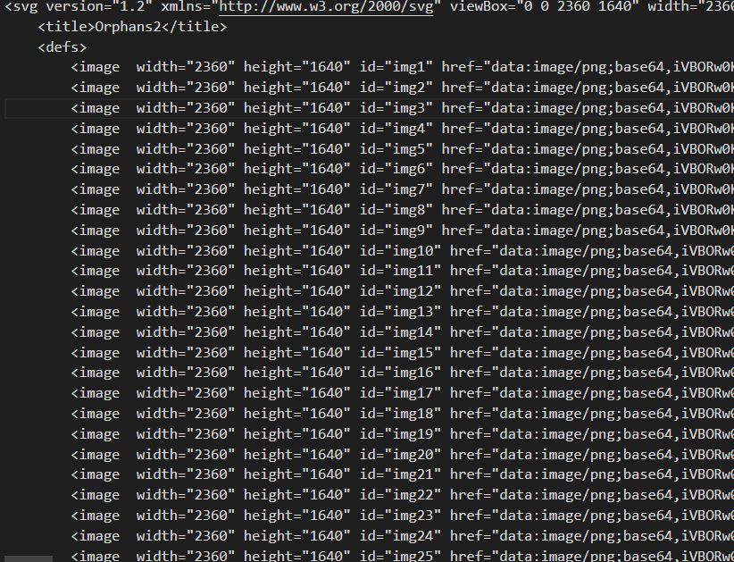

# Wont-somebody-think-of-the-children
## Description:
```
If Loab is back, we might need the council to help us out. The problem is that Anna sent Maya looking for them but she still hasn't come back. This is her last known location... Maybe you can help find her.

I'd go, but I really don't want to be around those spooky ghost orphans.
```

## Developper: Cyb0rgSw0rd https://github.com/alfredsimpson

Information: 
- svg file

If we open it with a text editor



There is like 33 image encoded in `base64`

With this snippet of code
```python
import re
import base64


with open('yeoldeorphanarium.svg', 'r') as file:
    svg_content = file.read()

image_data = re.findall(r'\s*<image\s+width="\d+"\s+height="\d+"\s+id="(.*?)"\s+href="data:image/png;base64,(.*?)"', svg_content)
for img_id, img_data in image_data:
    img_bytes = base64.b64decode(img_data)
    filename = f'{img_id}.png'
    with open(filename, 'wb') as img_file:
        img_file.write(img_bytes)
if not image_data:
    print("awww sh..")
else:
    print("Yay!")
```

I extracted the images

The 5th one was this

